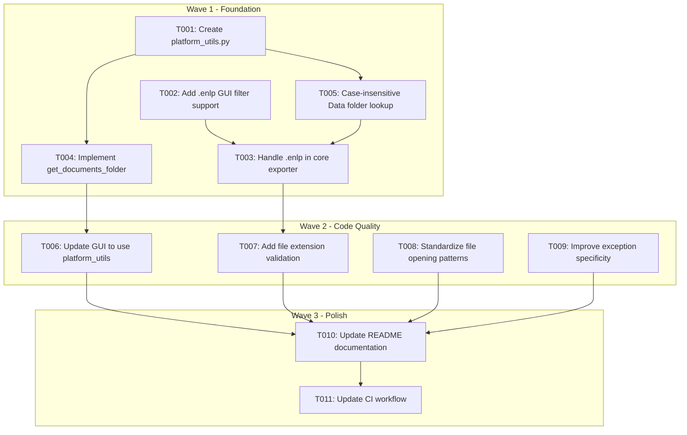

# Cross-Platform Compatibility Implementation Plan
## endnote-exporter

**Plan Created:** 2026-03-17
**Status:** READY FOR IMPLEMENTATION
**Recommended Approach:** Plan B (Balanced) with critical elements from Plan A (Conservative) - Testing Excluded

---

## Executive Summary

### Goals and Objectives

1. **Fix Critical Cross-Platform Issues**: Address hard-coded "Documents" folder and add .enlp macOS package support
2. **Improve Code Quality**: Standardize file operations, improve exception handling, add validation
3. **Enable Future Maintainability**: Create modular structure with platform abstraction layer
4. **Maintain Backward Compatibility**: No breaking changes to existing functionality

### Timeline Estimate

| Phase | Duration | Description |
|-------|----------|-------------|
| Wave 1 | 6-8 hours | Platform utilities, .enlp support, and critical fixes |
| Wave 2 | 4-6 hours | Code quality standardization |
| Wave 3 | 2-4 hours | Documentation updates |
| **Total** | **12-18 hours** | ~1.5-2.5 working days |

### Constraints and Dependencies

**Constraints:**
- No external dependencies beyond current (loguru, pyinstaller)
- Must maintain Python 3.12+ compatibility
- No breaking changes to exported XML format
- Must work with existing PyInstaller build process

**Dependencies:**
- No blocking dependencies on external teams
- All changes are self-contained within the repository

### Chosen Approach: Balanced with Conservative Elements - Justification

Based on comprehensive review, the recommended approach combines:
- **From Plan A (Conservative)**: .enlp macOS package support, case-insensitive folder lookup
- **From Plan B (Balanced)**: Platform abstraction layer, documentation updates

This provides:
1. **Complete macOS Support**: .enlp package handling is essential
2. **Best Risk/Reward Ratio**: Addresses all issues while maintaining acceptable risk
3. **Sustainable Development**: Creates foundation for long-term maintainability
4. **Resource Efficient**: Can be completed in 1.5-2.5 working days

---

## Critical Pain Points Identified

| Severity | Issue | Location | Impact |
|----------|-------|----------|--------|
| **Critical** | Only accepts `.enl` files, not `.enlp` | `gui.py:55` | macOS users blocked |
| **Critical** | Hard-coded "Documents" folder | `gui.py:45-47` | Fails on non-English Windows |
| **High** | Case-sensitive `.Data` folder lookup | `endnote_exporter.py:156` | Fails on Linux |
| **Medium** | Windows-only documentation | `README.md` | Confuses users |

---

## Dependency Graph



### Critical Path

**Critical Path:** T001 → T004 → T006 → T010 → T011

---

## Wave Planning

### Wave 1: Foundation (6-8 hours)
**Goal:** Create platform abstraction and fix critical blocking issues

| Task ID | Title | Dependencies | Effort |
|---------|-------|--------------|--------|
| T001 | Create platform_utils.py module | None | 1h |
| T002 | Add .enlp filter in GUI file dialog | None | 30m |
| T003 | Handle .enlp packages in core exporter | T002, T005 | 2h |
| T004 | Implement get_documents_folder | T001 | 2h |
| T005 | Case-insensitive Data folder lookup | T001 | 30m |

### Wave 2: Code Quality (4-6 hours)
**Goal:** Integrate platform utilities and improve code quality

| Task ID | Title | Dependencies | Effort |
|---------|-------|--------------|--------|
| T006 | Update GUI to use platform_utils | T004 | 1h |
| T007 | Add file extension validation | T003 | 1h |
| T008 | Standardize file opening patterns | None | 1h |
| T009 | Improve exception specificity | None | 1h |

### Wave 3: Polish (2-4 hours)
**Goal:** Documentation and CI updates

| Task ID | Title | Dependencies | Effort |
|---------|-------|--------------|--------|
| T010 | Update README documentation | T006, T007, T008, T009 | 30m |
| T011 | Update CI workflow | T010 | 1h |

---

## Detailed Task List

### T001: Create platform_utils.py Module

| Attribute | Value |
|-----------|-------|
| **ID** | T001 |
| **Title** | Create platform_utils.py module |
| **Dependencies** | None |
| **Files to Modify** | `platform_utils.py` (NEW) |
| **Complexity** | Low |
| **Estimated Time** | 1 hour |

**Description:**
Create a new module to centralize all platform-specific functionality.

**Implementation:**
```python
"""Platform-specific utilities for cross-platform compatibility."""
from pathlib import Path
import sys
import platform
from typing import Optional


def get_application_path() -> Path:
    """Get the application path, handling PyInstaller bundles."""
    if getattr(sys, 'frozen', False):
        return Path(sys.executable).parent
    return Path(__file__).parent


def normalize_path(path: Path) -> Path:
    """Normalize a path for the current platform."""
    try:
        return path.resolve()
    except OSError:
        return path.absolute()


def is_valid_path(path: Path) -> bool:
    """Check if a path is valid for the current platform."""
    try:
        path.resolve()
        return True
    except (OSError, ValueError):
        return False
```

**Acceptance Criteria:**
- [ ] Module file created
- [ ] Contains `get_application_path()` function
- [ ] Contains `normalize_path()` function
- [ ] Type hints on all public functions

---

### T002: Add .enlp Filter in GUI File Dialog

| Attribute | Value |
|-----------|-------|
| **ID** | T002 |
| **Title** | Add macOS .enlp package support in GUI file dialog |
| **Dependencies** | None |
| **Files to Modify** | `gui.py` (line 55) |
| **Complexity** | Low |
| **Estimated Time** | 30 minutes |

**Description:**
On macOS, EndNote libraries can be saved as packages with `.enlp` extension. The current GUI file dialog only allows `.enl` files, preventing macOS users from selecting their libraries.

**Current Code (Line 55):**
```python
filetypes=[("EndNote Library", "*.enl")],
```

**Proposed Change:**
```python
filetypes=[
    ("EndNote Library", "*.enl"),
    ("EndNote Library (macOS Package)", "*.enlp"),
    ("All Files", "*.*"),
],
```

**Acceptance Criteria:**
- [ ] GUI allows selection of both `.enl` and `.enlp` files
- [ ] Existing `.enl` behavior unchanged
- [ ] Works on all platforms

---

### T003: Handle .enlp Packages in Core Exporter

| Attribute | Value |
|-----------|-------|
| **ID** | T003 |
| **Title** | Handle .enlp packages in core exporter |
| **Dependencies** | T002, T005 |
| **Files to Modify** | `endnote_exporter.py` (after line 136) |
| **Complexity** | Medium |
| **Estimated Time** | 2 hours |

**Description:**
When a user selects a `.enlp` file on macOS, the actual `.enl` file and `.Data` folder are contained within the package (which is a directory structure). The exporter needs to detect and handle this.

**Technical Background:**
- `.enlp` is a macOS package/bundle
- Contains: `library.enl` (or similar) and `.Data` folder at root level
- On macOS, appears as single file in Finder
- On other platforms, appears as directory

**Implementation:**

Add helper function:
```python
def _resolve_enl_path(enl_file_path: Path) -> tuple[Path, Path]:
    """Resolve the actual .enl file and .Data folder path.

    Handles both standard .enl files and macOS .enlp packages.

    Args:
        enl_file_path: Path to .enl or .enlp file

    Returns:
        Tuple of (base_path, data_folder_path)
    """
    suffix = enl_file_path.suffix.lower()

    if suffix == '.enlp':
        # macOS package format - look for .enl inside
        package_dir = enl_file_path

        # Find .enl file inside package
        enl_files = list(package_dir.glob('*.enl'))
        if enl_files:
            actual_enl = enl_files[0]
            library_name = actual_enl.stem
            data_path = package_dir / f"{library_name}.Data"
            return package_dir, data_path
        else:
            # Fallback: try to find .Data folder directly
            data_folders = list(package_dir.glob('*.Data'))
            if data_folders:
                return package_dir, data_folders[0]
            raise FileNotFoundError(
                f"Could not find .enl file or .Data folder inside .enlp package: {enl_file_path}"
            )
    else:
        # Standard .enl format
        library_name = enl_file_path.stem
        data_path = enl_file_path.parent / f"{library_name}.Data"
        return enl_file_path.parent, data_path
```

Modify `_export` method (lines 148-157):
```python
def _export(self, enl_file_path: Path, output_file: Path):
    # Resolve actual paths (handles .enlp packages)
    base_path, data_path = _resolve_enl_path(enl_file_path)

    # For .enlp, we need the library name from inside the package
    if enl_file_path.suffix.lower() == '.enlp':
        enl_files = list(enl_file_path.glob('*.enl'))
        library_name = enl_files[0].stem if enl_files else enl_file_path.stem
    else:
        library_name = enl_file_path.stem

    output_path = (
        base_path / f"{library_name}_zotero_export.xml"
        if output_file is None
        else output_file
    )
    # Use case-insensitive lookup for database path
    db_path = data_path / "sdb" / "sdb.eni"
    # ... rest of method unchanged
```

**Acceptance Criteria:**
- [ ] `.enl` files work exactly as before
- [ ] `.enlp` packages on macOS are correctly parsed
- [ ] Clear error message if package structure is invalid
- [ ] No changes to XML output format

---

### T004: Implement get_documents_folder

| Attribute | Value |
|-----------|-------|
| **ID** | T004 |
| **Title** | Implement get_documents_folder with platform-specific detection |
| **Dependencies** | T001 |
| **Files to Modify** | `platform_utils.py` |
| **Complexity** | Medium |
| **Estimated Time** | 2 hours |

**Description:**
Implement a robust, platform-aware function to detect the user's Documents folder. This addresses the critical issue where the hard-coded "Documents" name fails on non-English Windows systems.

**Implementation:**
```python
def get_documents_folder() -> Path:
    """
    Get the platform-specific Documents folder.

    Uses platform-specific APIs where available:
    - Windows: SHGetFolderPath via ctypes
    - macOS/Linux: XDG standards with fallbacks

    Returns:
        Path to Documents folder, or user home as fallback.
    """
    if sys.platform == "win32":
        docs = _get_windows_documents_folder()
        if docs:
            return docs
    elif sys.platform == "darwin":
        docs = Path.home() / "Documents"
        if docs.exists():
            return docs

    # Linux and fallback
    xdg_docs = _get_xdg_documents_folder()
    if xdg_docs:
        return xdg_docs

    # Fallback chain for all platforms
    candidates = [
        Path.home() / "Documents",
        Path.home() / "Dokumenty",      # Polish
        Path.home() / "Documentos",     # Spanish/Portuguese
        Path.home() / "Dokumente",      # German
        Path.home() / "Documents",      # French
        Path.home() / "My Documents",   # Old Windows
        Path.home() / "docs",           # Some Linux
        Path.home(),
    ]

    for candidate in candidates:
        if candidate.exists():
            return candidate

    return Path.home()


def _get_windows_documents_folder() -> Optional[Path]:
    """Get Windows Documents folder using SHGetFolderPath."""
    try:
        import ctypes
        from ctypes import wintypes

        SHGFP_TYPE_CURRENT = 0
        CSIDL_PERSONAL = 5  # My Documents

        buf = ctypes.create_unicode_buffer(wintypes.MAX_PATH)
        ctypes.windll.shell32.SHGetFolderPathW(
            0, CSIDL_PERSONAL, 0, SHGFP_TYPE_CURRENT, buf
        )
        result = Path(buf.value)
        if result.exists():
            return result
    except Exception:
        pass
    return None


def _get_xdg_documents_folder() -> Optional[Path]:
    """Get Linux Documents folder using XDG standards."""
    import os

    xdg_docs = os.environ.get("XDG_DOCUMENTS_DIR")
    if xdg_docs:
        path = Path(xdg_docs)
        if path.exists():
            return path

    config_home = os.environ.get("XDG_CONFIG_HOME", Path.home() / ".config")
    user_dirs_file = Path(config_home) / "user-dirs.dirs"

    if user_dirs_file.exists():
        try:
            with user_dirs_file.open("r", encoding="utf-8") as f:
                for line in f:
                    if line.startswith("XDG_DOCUMENTS_DIR="):
                        path_str = line.split("=", 1)[1].strip().strip('"')
                        if path_str.startswith("$HOME"):
                            path_str = str(Path.home()) + path_str[5:]
                        path = Path(path_str)
                        if path.exists():
                            return path
        except Exception:
            pass

    return None


def get_endnote_default_directory() -> Path:
    """Get the default EndNote library directory."""
    endnote_dir = get_documents_folder() / "EndNote"
    if endnote_dir.exists():
        return endnote_dir
    return get_documents_folder()
```

**Acceptance Criteria:**
- [ ] `get_documents_folder()` returns valid Path on all platforms
- [ ] Windows API method implemented with ctypes
- [ ] XDG standards implemented for Linux
- [ ] Fallback chain covers common localized folder names
- [ ] Always returns a valid Path (never None)

---

### T005: Case-Insensitive Data Folder Lookup

| Attribute | Value |
|-----------|-------|
| **ID** | T005 |
| **Title** | Implement case-insensitive Data folder lookup |
| **Dependencies** | T001 |
| **Files to Modify** | `platform_utils.py`, `endnote_exporter.py` (line 156) |
| **Complexity** | Low |
| **Estimated Time** | 30 minutes |

**Description:**
On case-sensitive filesystems (Linux, some macOS configurations), the hardcoded `.Data` folder lookup may fail if the actual folder uses different casing (e.g., `.data` or `.DATA`).

**Implementation in platform_utils.py:**
```python
def find_data_folder(base_path: Path, library_name: str) -> Optional[Path]:
    """Find the .Data folder with case-insensitive lookup.

    Args:
        base_path: Parent directory of the library
        library_name: Name of the library (without extension)

    Returns:
        Path to .Data folder, or None if not found
    """
    # Try exact match first (most common, preserves case on Windows)
    expected_path = base_path / f"{library_name}.Data"
    if expected_path.exists():
        return expected_path

    # Case-insensitive search for case-sensitive filesystems
    target_name = f"{library_name}.Data".lower()
    try:
        for item in base_path.iterdir():
            if item.is_dir() and item.name.lower() == target_name:
                return item
    except PermissionError:
        pass

    return None
```

**Usage in endnote_exporter.py:**
```python
from platform_utils import find_data_folder

# In _export method, replace line 156:
data_path = find_data_folder(base_path, library_name)
if data_path is None:
    error_msg = (
        f"Data folder not found for library '{library_name}'. "
        f"Expected '{library_name}.Data' in {base_path}. "
        f"Make sure the .Data folder exists alongside the .enl file."
    )
    logger.error(error_msg)
    raise FileNotFoundError(error_msg)
```

**Acceptance Criteria:**
- [ ] Exact case match works on all platforms
- [ ] Case-insensitive fallback works on Linux/macOS
- [ ] Clear error message if folder not found

---

### T006: Update GUI to Use Platform Abstraction

| Attribute | Value |
|-----------|-------|
| **ID** | T006 |
| **Title** | Update GUI to use new platform utilities |
| **Dependencies** | T004 |
| **Files to Modify** | `gui.py` (lines 45-47) |
| **Complexity** | Low |
| **Estimated Time** | 1 hour |

**Description:**
Replace the hard-coded "Documents" folder logic in gui.py with a call to the new platform_utils module.

**Current Code (lines 45-47):**
```python
default_endnote_dir = Path.home() / "Documents" / "EndNote"
default_endnote_dir = default_endnote_dir if default_endnote_dir.exists() else Path.home() / "Documents"
default_endnote_dir = default_endnote_dir if default_endnote_dir.exists() else Path.home()
```

**New Code:**
```python
from platform_utils import get_endnote_default_directory

# In select_file method:
default_endnote_dir = get_endnote_default_directory()
```

**Acceptance Criteria:**
- [ ] Import statement added for platform_utils
- [ ] Hard-coded paths removed from lines 45-47
- [ ] GUI file dialog opens to correct directory on all platforms
- [ ] Fallback to home directory works if Documents not found

---

### T007: Add File Extension Validation

| Attribute | Value |
|-----------|-------|
| **ID** | T007 |
| **Title** | Add file extension validation for input/output files |
| **Dependencies** | T003 |
| **Files to Modify** | `platform_utils.py`, `endnote_exporter.py` (line 140) |
| **Complexity** | Low |
| **Estimated Time** | 1 hour |

**Description:**
Add explicit validation of file extensions for both input (.enl/.enlp) and output (.xml) files.

**Implementation in platform_utils.py:**
```python
def validate_file_extension(path: Path, expected: str | list[str]) -> bool:
    """Validate that a file has the expected extension(s).

    Args:
        path: File path to validate
        expected: Expected extension(s) (with or without dot)

    Returns:
        True if extension matches (case-insensitive)
    """
    if isinstance(expected, str):
        expected = [expected]

    actual = path.suffix.lower()
    for exp in expected:
        exp = exp.lower()
        if not exp.startswith('.'):
            exp = '.' + exp
        if actual == exp:
            return True
    return False
```

**Usage in endnote_exporter.py:**
```python
from platform_utils import validate_file_extension

def export_references_to_xml(self, enl_file_path: Path, output_file: Path):
    """Main method to perform the database-to-XML conversion."""
    # Validate input file extension
    if not validate_file_extension(enl_file_path, ['.enl', '.enlp']):
        raise ValueError(
            f"Expected EndNote library file (.enl or .enlp), got '{enl_file_path.suffix}'. "
            f"Please select a valid EndNote library file."
        )

    # Validate output file extension
    if output_file and not validate_file_extension(output_file, '.xml'):
        logger.warning(
            f"Output file has unexpected extension '{output_file.suffix}'. "
            f"Expected '.xml'. Proceeding anyway."
        )
    # ... rest of method
```

**Acceptance Criteria:**
- [ ] `validate_file_extension()` function in platform_utils.py
- [ ] ValueError raised for non-.enl/.enlp input files
- [ ] Warning logged for non-.xml output files
- [ ] Case-insensitive extension comparison

---

### T008: Standardize File Opening Patterns

| Attribute | Value |
|-----------|-------|
| **ID** | T008 |
| **Title** | Standardize all file operations to use Path.open() |
| **Dependencies** | None |
| **Files to Modify** | `endnote_exporter.py` (lines 187, 247) |
| **Complexity** | Low |
| **Estimated Time** | 1 hour |

**Description:**
Replace all uses of built-in `open()` with `Path.open()` for consistency with pathlib best practices.

**Locations to Change:**
| Line | Current | New |
|------|---------|-----|
| 187 | `with open(comparisons_file, "a", encoding="utf-8")` | `with comparisons_file.open("a", encoding="utf-8")` |
| 247 | `with open(output_path, "w", encoding="utf-8")` | `with output_path.open("w", encoding="utf-8")` |

**Acceptance Criteria:**
- [ ] All file operations use `Path.open()` method
- [ ] No instances of built-in `open()` with Path objects

---

### T009: Improve Exception Specificity

| Attribute | Value |
|-----------|-------|
| **ID** | T009 |
| **Title** | Replace broad exception handling with specific types |
| **Dependencies** | None |
| **Files to Modify** | `gui.py` (line 77), `endnote_exporter.py` (multiple) |
| **Complexity** | Low |
| **Estimated Time** | 1 hour |

**Description:**
Replace broad `except Exception:` blocks with more specific exception types.

**Example in gui.py (line 75-78):**
```python
# Current:
try:
    line = line.strip().split(" | ", 2)[-1]
except Exception:
    continue

# New:
try:
    line = line.strip().split(" | ", 2)[-1]
except (IndexError, AttributeError) as e:
    logger.debug(f"Skipping malformed log line: {e}")
    continue
```

**Acceptance Criteria:**
- [ ] All broad `except Exception:` blocks reviewed
- [ ] Specific exception types used where possible
- [ ] Debug logging added for caught exceptions

---

### T010: Update README Documentation

| Attribute | Value |
|-----------|-------|
| **ID** | T010 |
| **Title** | Update README to reflect cross-platform support |
| **Dependencies** | T006, T007, T008, T009 |
| **Files to Modify** | `README.md` |
| **Complexity** | Low |
| **Estimated Time** | 30 minutes |

**Description:**
Update README for cross-platform support.

**Changes:**
- Update description from "Windows" to "Windows, macOS, and Linux"
- Add platform compatibility table
- Add platform-specific notes section
- Document .enlp support for macOS

**Example README changes:**
```markdown
# EndNote library exporter

A user-friendly desktop application for **Windows, macOS, and Linux** to quickly export...

## Supported Platforms

| Platform | Status | Notes |
|----------|--------|-------|
| Windows 10/11 | Fully Supported | Primary development platform |
| macOS 12+ | Fully Supported | Supports both .enl and .enlp formats |
| Linux | Fully Supported | Tested on Ubuntu/Debian |

## Platform-Specific Notes

### macOS
- Supports both `.enl` and `.enlp` (package) library formats
- The first run may require security exceptions in System Preferences

### Linux
- Requires Tkinter to be installed (usually `python3-tk` package)
- Respects XDG_DOCUMENTS_DIR if set
```

**Acceptance Criteria:**
- [ ] README reflects cross-platform support
- [ ] Platform notes added
- [ ] .enlp support documented

---

### T011: Update CI Workflow

| Attribute | Value |
|-----------|-------|
| **ID** | T011 |
| **Title** | Update CI workflow for multi-platform builds |
| **Dependencies** | T010 |
| **Files to Modify** | `.github/workflows/release.yml` |
| **Complexity** | Medium |
| **Estimated Time** | 1 hour |

**Description:**
Update the release workflow to ensure proper multi-platform builds.

**Changes Required:**
- Verify Python version matches pyproject.toml (3.12+)
- Ensure all new modules are included in PyInstaller build
- Update release notes to reflect cross-platform support

**Verification Points:**
- Confirm `platform_utils.py` is bundled correctly
- Test builds on all three platforms
- Verify no missing imports in frozen executables

**Acceptance Criteria:**
- [ ] CI builds successfully on Windows, macOS, Linux
- [ ] All new modules included in PyInstaller bundle
- [ ] Release notes updated

---

## Risk Assessment

| Risk | Likelihood | Impact | Mitigation |
|------|------------|--------|------------|
| .enlp structure varies by EndNote version | Low | Medium | Test with multiple versions; add logging |
| Case-insensitive lookup performance | Very Low | Low | Only runs when exact match fails |
| Localized folder names not covered | Low | Low | Easy to add more candidates |
| Breaking existing .enl functionality | Very Low | High | Manual regression testing before release |

**Overall Risk Level: LOW**

---

## Rollback Plan

### Complete Rollback
```bash
git checkout main
git branch -D feature/cross-platform-compatibility
```

### Partial Rollback
- .enlp support: Revert T002 and T003
- Platform utils: Remove platform_utils.py and revert imports

---

## Progress Tracking

| Task ID | Status | Notes | Completed Date |
|---------|--------|-------|----------------|
| T001 | COMPLETE | Create platform_utils.py | 2026-03-17 |
| T002 | COMPLETE | Add .enlp GUI filter | 2026-03-17 |
| T003 | COMPLETE | Handle .enlp in exporter | 2026-03-17 |
| T004 | COMPLETE | Implement get_documents_folder | 2026-03-17 |
| T005 | COMPLETE | Case-insensitive lookup | 2026-03-17 |
| T006 | COMPLETE | Update GUI to use platform_utils | 2026-03-17 |
| T007 | COMPLETE | Add file extension validation | 2026-03-17 |
| T008 | COMPLETE | Standardize file opening | 2026-03-17 |
| T009 | COMPLETE | Improve exception specificity | 2026-03-17 |
| T010 | COMPLETE | Update README | 2026-03-17 |
| T011 | COMPLETE | Update CI workflow | 2026-03-17 |

---

**Plan Completed:** 2026-03-17
**Implementation Completed:** 2026-03-17
**Status:** ALL TASKS COMPLETE
