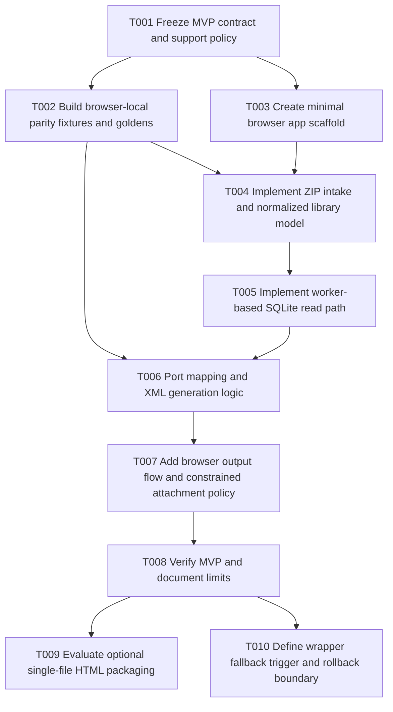

# Local Web Execution Plan A — Conservative

**Date:** 2026-03-18
**Status:** Proposed
**Planning stance:** Minimal change, low-risk sequencing, narrow MVP, browser-local first, wrappers as fallback only

## Executive summary

This plan recommends a **narrow browser-local MVP** implemented as a small static web application using plain HTML/CSS/JavaScript, with the current Python exporter retained as the **behavior oracle** during development. The primary supported input for the MVP should be **ZIP-based library intake** rather than raw folder selection. This keeps the browser contract simple, avoids early dependence on uneven directory-picker support, and limits the amount of new runtime infrastructure required.

The recommended technical shape is:

1. **Static browser app** with no server-side conversion path
2. **Small modular JavaScript codebase**, not a framework-heavy frontend rewrite
3. **Worker-based conversion flow** for heavy processing
4. **SQLite WebAssembly** only where required to read `sdb/sdb.eni`
5. **ZIP-first input contract** for MVP
6. **Immediate XML download** as the only output requirement
7. **Explicitly reduced attachment semantics** in browser mode
8. **Optional single-file HTML packaging** only after the multi-file browser build is working and supportable
9. **Electron/Tauri retained only as future fallback options** if browser constraints prove unacceptable

This plan intentionally avoids:

- hosted upload/service architecture
- broad cross-browser promises in the first milestone
- raw folder-selection as a required MVP feature
- deep refactoring of the existing desktop exporter before parity fixtures exist
- wrapper adoption as the default path

The primary product objective is not to reproduce every desktop behavior in the first iteration. The primary objective is to deliver a **credible local-processing web MVP** with constrained inputs, deterministic output parity for supported cases, and limited impact on the current repository.

## Scope and explicit constraints

### In scope

- browser-local conversion using plain HTML/CSS/JavaScript
- modular multi-file static app as the primary delivery shape
- ZIP upload as the primary supported input shape for MVP
- worker-based processing to keep the UI responsive
- SQLite WASM for browser-side DB reads if required by the fixture-backed implementation
- XML download in the browser
- parity testing against approved outputs from the current Python exporter
- browser-specific support language that starts conservatively
- post-MVP feasibility check for **limited** single-file HTML packaging

### Out of scope for MVP

- hosted backend or API
- account system, persistence service, or job queue
- direct parity with desktop absolute PDF path behavior
- guaranteed support for raw folder selection in all browsers
- Electron/Tauri implementation work
- broad UI redesign or desktop UI rewrite
- monorepo or large frontend framework adoption

### Initial support assumptions

- **Primary tested browser:** Chromium-class browser
- **Primary input:** `.zip` containing supported EndNote library layout
- **Output:** Zotero-compatible XML download
- **Attachment behavior:** reduced/explicitly documented browser-mode behavior, not desktop-style absolute-path emission
- **Single-file HTML:** experimental and non-primary

## Recommended approach

The conservative approach is to treat the browser-local feature as a **parallel, isolated product surface** inside the existing repository.

The recommended sequencing is:

1. Freeze the browser-local contract before implementation.
2. Create a parity harness from the existing Python exporter.
3. Build a minimal static browser app in a separate directory.
4. Implement only ZIP normalization first.
5. Add SQLite WASM and mapping/XML logic in a worker.
6. Ship a constrained Chromium-first MVP.
7. Evaluate optional single-file packaging only after the multi-file version passes fixture-backed verification.
8. Escalate to a wrapper only if documented browser constraints block the product goals.

This preserves the current desktop app and keeps rollback cost low.

## Task breakdown

### Task summary table

| ID | Title | Dependencies | Estimated effort | Risk | Summary |
|---|---|---|---:|---|---|
| T001 | Freeze MVP contract and support policy | None | 1-2 days | Low | Define supported inputs, browser scope, attachment policy, and non-goals. |
| T002 | Build browser-local parity fixtures and goldens | T001 | 2-3 days | Medium | Use the Python exporter as the reference implementation for supported cases. |
| T003 | Create minimal browser app scaffold | T001 | 1-2 days | Low | Add isolated static app structure without touching desktop flow. |
| T004 | Implement ZIP intake and normalized library model | T002, T003 | 3-4 days | Medium | Support ZIP-first library ingestion and prepare a browser-neutral internal model. |
| T005 | Implement worker-based SQLite read path | T004 | 3-5 days | Medium | Read `sdb/sdb.eni` in-browser using SQLite WASM and return normalized rows. |
| T006 | Port mapping and XML generation logic for supported fields | T002, T005 | 4-6 days | High | Recreate the core export behavior for supported cases using JS. |
| T007 | Add browser output flow, warnings, and constrained attachment policy | T006 | 2-3 days | Medium | Download XML, surface warnings, and explicitly avoid unsafe path behavior. |
| T008 | Verify MVP in supported browsers and document limits | T007 | 2-3 days | Medium | Run fixture-backed verification and publish a conservative support matrix. |
| T009 | Evaluate optional single-file HTML packaging | T008 | 1-2 days | Medium | Test whether packaging remains supportable without expanding the contract. |
| T010 | Define wrapper fallback trigger and rollback boundary | T008 | 1 day | Low | Document when to stop pushing browser-only and when wrappers become justified. |

### Detailed tasks

#### T001 — Freeze MVP contract and support policy

**Dependencies:** None
**Estimated effort:** 1-2 days
**Risk:** Low

**Description**

Define the browser-local MVP contract before implementation begins. The most important decisions are:

- ZIP is the primary supported input for MVP
- raw folder selection is not required for initial release
- browser mode does not promise desktop-style absolute PDF paths
- Chromium-class browsers are the initial support target
- the product is local-processing, with no backend conversion path
- single-file HTML is explicitly experimental and not the default delivery mode

**Files to modify/create**

- `docs/local-web-execution/contracts.md` *(new)*
- `docs/local-web-execution/support-matrix.md` *(new)*
- `docs/local-web-execution/privacy.md` *(new)*
- `README.md` *(update only after the contract is stable)*

**Acceptance criteria**

- One written MVP contract exists
- One support matrix exists
- Attachment behavior for browser mode is explicitly defined
- Non-goals and fallback conditions are documented

#### T002 — Build browser-local parity fixtures and goldens

**Dependencies:** T001
**Estimated effort:** 2-3 days
**Risk:** Medium

**Description**

Create a shared fixture/golden harness using the existing Python exporter as the reference implementation. This is required before any meaningful JS port work. The conservative plan uses a **small, deterministic** fixture set rather than a broad corpus.

Recommended initial fixture set:

- one supported ZIP-wrapped library representing `.enlp`
- one supported ZIP-wrapped library representing `.enl` + `.Data`
- one missing-DB failure case
- one unsupported/malformed package case
- one attachment-present case with explicit browser-mode expectations

**Files to modify/create**

- `testing/browser-local/fixtures/...` *(new)*
- `testing/browser-local/goldens/...` *(new)*
- `testing/browser-local/fixture_manifest.json` *(new)*
- `docs/local-web-execution/testing-strategy.md` *(new)*

**Acceptance criteria**

- Supported fixture set is committed
- Golden outputs are committed or reproducibly generated
- Expected failure classes are documented
- Browser-local development can be validated against fixed outputs

#### T003 — Create minimal browser app scaffold

**Dependencies:** T001
**Estimated effort:** 1-2 days
**Risk:** Low

**Description**

Create a small static browser application in a separate directory. The conservative plan prefers **plain browser modules** rather than a framework-heavy frontend stack.

Suggested layout:

```text
web/
├── index.html
├── styles.css
├── src/
│   ├── main.js
│   ├── ui.js
│   ├── state.js
│   ├── normalize-zip.js
│   ├── export-worker.js
│   ├── sqlite-reader.js
│   ├── map-record.js
│   ├── build-xml.js
│   └── download.js
└── vendor/
```

**Files to modify/create**

- `web/index.html` *(new)*
- `web/styles.css` *(new)*
- `web/src/main.js` *(new)*
- `web/src/ui.js` *(new)*
- `web/src/state.js` *(new)*

**Acceptance criteria**

- Static app loads locally from a normal dev server
- UI can accept ZIP input and show placeholder progress state
- No desktop runtime files are required to change at this stage

#### T004 — Implement ZIP intake and normalized library model

**Dependencies:** T002, T003
**Estimated effort:** 3-4 days
**Risk:** Medium

**Description**

Implement ZIP-based ingestion and normalize the selected archive into a browser-local internal model. This task should not attempt every possible input shape. It should handle only the shapes explicitly frozen in T001.

The normalized model should include:

- library identifier
- relative file map
- resolved database entry for `sdb/sdb.eni`
- resolved PDF subtree metadata if present
- warnings produced during normalization

This model becomes the boundary between input handling and conversion logic.

**Files to modify/create**

- `web/src/normalize-zip.js` *(new)*
- `web/src/library-model.js` *(new)*
- `web/src/path-utils.js` *(new, optional)*
- `docs/local-web-execution/contracts.md` *(update if normalization rules need clarification)*

**Acceptance criteria**

- Supported ZIP fixtures normalize deterministically
- Malformed archives produce structured errors
- The model no longer depends on browser UI details after normalization

#### T005 — Implement worker-based SQLite read path

**Dependencies:** T004
**Estimated effort:** 3-5 days
**Risk:** Medium

**Description**

Implement a worker-based SQLite read path for `sdb/sdb.eni`. This is the minimum technical concession required by the current data model. The conservative plan keeps this dependency narrow and isolated.

Responsibilities:

- load database bytes from the normalized library model
- run the equivalent of the required `refs` and `file_res` queries
- return normalized rows to the worker pipeline
- keep heavy work off the main thread

**Files to modify/create**

- `web/src/export-worker.js` *(new or expand)*
- `web/src/sqlite-reader.js` *(new)*
- `web/vendor/` *(new, for packaged browser dependencies as needed)*
- `docs/local-web-execution/testing-strategy.md` *(update with DB-layer verification cases)*

**Acceptance criteria**

- Supported fixture DBs can be opened in-browser
- Required rows are returned for the supported cases
- Main-thread UI remains responsive during conversion

#### T006 — Port mapping and XML generation logic for supported fields

**Dependencies:** T002, T005
**Estimated effort:** 4-6 days
**Risk:** High

**Description**

Port the minimum supported subset of mapping/XML generation behavior from the current Python exporter into browser JS. The Python implementation remains the oracle for supported fixture cases.

This task should prioritize:

- reference type mapping
- core bibliographic fields
- contributors
- dates
- titles/periodical fields
- keywords/notes needed for parity in the fixture set
- XML sanitization
- deterministic output shape for supported records

The conservative plan does **not** attempt to reproduce every edge case on day one. It reproduces the behaviors required by the approved fixtures and explicitly classifies unsupported cases.

**Files to modify/create**

- `web/src/map-record.js` *(new)*
- `web/src/build-xml.js` *(new)*
- `web/src/xml-utils.js` *(new)*
- `docs/local-web-execution/contracts.md` *(update with any intentionally unsupported field classes)*

**Acceptance criteria**

- Supported fixtures produce XML matching approved expectations
- Unsupported cases fail clearly rather than silently drifting
- Output generation is deterministic across repeated runs

#### T007 — Add browser output flow, warnings, and constrained attachment policy

**Dependencies:** T006
**Estimated effort:** 2-3 days
**Risk:** Medium

**Description**

Complete the browser UX for the narrow MVP:

- start conversion
- show progress / success / failure
- surface warnings
- download XML
- document the browser-mode attachment policy

The conservative recommendation is:

- do **not** emit desktop-style absolute PDF paths in browser mode
- either omit PDF links in browser mode or emit clearly limited relative metadata if verified safe and useful
- return explicit warnings when attachment fidelity differs from desktop behavior

**Files to modify/create**

- `web/src/ui.js` *(update)*
- `web/src/download.js` *(new)*
- `web/src/attachment-policy.js` *(new)*
- `docs/local-web-execution/privacy.md` *(update if storage/download behavior needs clarification)*
- `docs/local-web-execution/user-guide.md` *(new)*

**Acceptance criteria**

- Users can download the generated XML from the browser
- Warnings are visible and not buried in logs
- Browser-mode attachment behavior is explicit and documented

#### T008 — Verify MVP in supported browsers and document limits

**Dependencies:** T007
**Estimated effort:** 2-3 days
**Risk:** Medium

**Description**

Verify the narrow MVP against supported fixtures and publish clear support limitations. The conservative plan should not claim more browser support than is actually tested.

Verification should cover:

- Chromium-class browser success path
- failure handling for malformed archives
- output parity for supported fixtures
- attachment warning behavior
- performance sanity on representative small/medium fixtures

**Files to modify/create**

- `docs/local-web-execution/support-matrix.md` *(update)*
- `docs/local-web-execution/troubleshooting.md` *(new)*
- `docs/local-web-execution/testing-strategy.md` *(update with verification matrix)*
- `README.md` *(small update once the browser MVP is real)*

**Acceptance criteria**

- Supported browser/runtime matrix is published
- Known limitations are documented
- The browser-local MVP is demonstrably usable for the approved fixture set

#### T009 — Evaluate optional single-file HTML packaging

**Dependencies:** T008
**Estimated effort:** 1-2 days
**Risk:** Medium

**Description**

Evaluate whether the browser-local app can be packaged as a **limited single-file HTML artifact** without breaking the product contract or creating an unmaintainable support burden.

This task is intentionally an evaluation task, not a commitment.

Acceptance should require all of the following:

- the artifact works under the intended launch model
- required runtime assets can be packaged cleanly enough
- support wording remains honest
- the single-file variant does not become the only supported form

If those conditions are not met, the outcome should be a documented rejection of single-file packaging for MVP.

**Files to modify/create**

- `docs/local-web-execution/distribution/single-html.md` *(new)*
- `web/dist/` *(new, only if packaging is feasible)*

**Acceptance criteria**

- A go/no-go decision on single-file packaging is documented
- Support language for this option is conservative and explicit

#### T010 — Define wrapper fallback trigger and rollback boundary

**Dependencies:** T008
**Estimated effort:** 1 day
**Risk:** Low

**Description**

Document when wrappers become justified and how browser-local work can be stopped or redirected without destabilizing the repo.

The wrapper fallback should trigger only if one or more of the following remain unresolved after MVP verification:

- browser runtime cannot support required fixture classes
- performance is unacceptable on realistic library sizes
- attachment requirements cannot be met within browser constraints
- support burden from browser capability differences becomes too high

This task does **not** begin wrapper implementation.

**Files to modify/create**

- `docs/local-web-execution/fallback-decision.md` *(new)*
- `docs/local-web-execution/rollback.md` *(new)*

**Acceptance criteria**

- Wrapper escalation criteria are written
- Browser-local rollback boundary is written
- Desktop product remains unaffected by unfinished browser-local work

## Dependency graph



### Critical path

The critical path is:

**T001 → T002 → T004 → T005 → T006 → T007 → T008**

This path is intentionally narrow. It produces a usable browser-local MVP without introducing server infrastructure or wrapper complexity.

## Estimated effort by phase

| Phase | Included tasks | Estimated total |
|---|---|---:|
| Contract and fixture baseline | T001-T002 | 3-5 days |
| Minimal browser app and normalization | T003-T004 | 4-6 days |
| SQLite and conversion core | T005-T006 | 7-11 days |
| UX, verification, and support docs | T007-T008 | 4-6 days |
| Optional packaging and fallback docs | T009-T010 | 2-3 days |
| **Total** | **T001-T010** | **20-31 days** |

This estimate assumes one engineer working mostly sequentially. The plan is intentionally conservative and should not be compressed by broadening the first milestone.

## Pros and cons versus more ambitious options

### Pros

- Lowest operational risk because there is no backend
- Minimal impact on the current desktop application
- Narrow repository expansion relative to a full platform rewrite
- Clear rollback boundary because browser-local work can remain isolated in `web/` and docs
- Uses the current Python exporter as a verified oracle instead of rewriting blindly
- Avoids committing to Electron/Tauri before browser feasibility is actually tested
- Keeps the first product promise simple: upload supported ZIP, convert locally, download XML

### Cons

- Narrow initial browser support, likely Chromium-first
- Reduced attachment fidelity relative to the current desktop app
- ZIP-first MVP is less convenient than ideal folder-selection UX
- Single-file HTML may be rejected after evaluation
- Some Python logic must still be ported into JS for supported cases
- If browser limits prove too restrictive, additional wrapper work may still be needed later

### Comparison with a balanced plan

Compared with a balanced plan, this plan:

- delays broader input support
- delays raw folder-selection UX
- delays wrapper exploration
- reduces early architectural ambition
- increases confidence that each completed step is independently useful

### Comparison with an aggressive plan

Compared with an aggressive plan, this plan:

- avoids a full shared-core rearchitecture up front
- avoids a framework-heavy frontend rewrite
- avoids multi-runtime platform sprawl
- avoids promising a universal browser/local-file story before capability testing exists

## Projected files to modify or create

### New documentation

- `docs/local-web-execution/contracts.md`
- `docs/local-web-execution/support-matrix.md`
- `docs/local-web-execution/privacy.md`
- `docs/local-web-execution/testing-strategy.md`
- `docs/local-web-execution/user-guide.md`
- `docs/local-web-execution/troubleshooting.md`
- `docs/local-web-execution/distribution/single-html.md`
- `docs/local-web-execution/fallback-decision.md`
- `docs/local-web-execution/rollback.md`

### New browser-local app surface

- `web/index.html`
- `web/styles.css`
- `web/src/main.js`
- `web/src/ui.js`
- `web/src/state.js`
- `web/src/normalize-zip.js`
- `web/src/library-model.js`
- `web/src/export-worker.js`
- `web/src/sqlite-reader.js`
- `web/src/map-record.js`
- `web/src/build-xml.js`
- `web/src/xml-utils.js`
- `web/src/download.js`
- `web/src/attachment-policy.js`
- `web/vendor/*` *(only as required)*

### New test/fixture assets

- `testing/browser-local/fixtures/...`
- `testing/browser-local/goldens/...`
- `testing/browser-local/fixture_manifest.json`

### Existing files that may need limited updates

- `README.md`
- potentially `.gitignore` if browser build artifacts are introduced later

## Testing strategy

The conservative testing strategy is fixture-first and parity-first.

### 1. Reference-output validation

Use the current Python exporter to define approved output for supported fixtures. The browser-local implementation must match those expectations for the fields and behaviors declared in scope.

### 2. Supported fixture classes

Minimum initial set:

- supported ZIP-wrapped `.enlp`
- supported ZIP-wrapped `.enl` + `.Data`
- malformed ZIP
- missing `sdb/sdb.eni`
- attachment-present case with documented browser-mode expectation

### 3. Browser verification

Minimum required verification:

- Chromium-class browser
- ZIP upload success path
- XML download success path
- malformed-archive failure path
- deterministic output for approved fixtures

### 4. Non-goal for MVP testing

Not required for MVP:

- universal raw folder-selection verification
- Firefox/Safari parity claims beyond explicitly documented best-effort investigation
- wrapper integration tests
- hosted-service tests

### 5. Packaging verification for single-file HTML

If T009 proceeds, test separately:

- whether the artifact launches under the intended delivery model
- whether the ZIP-based conversion flow still works
- whether support language remains accurate

A failed packaging evaluation is an acceptable outcome.

## Risk assessment

### Overall plan risk

**Overall risk: Medium**

The plan is conservative, but browser-local SQLite and parity-port work remain non-trivial.

### Primary risks

1. **Mapping parity risk — High**
   The Python exporter contains dense transformation logic. Narrowing scope through fixtures reduces this risk but does not remove it.

2. **Browser runtime risk — Medium**
   SQLite/WASM and ZIP handling are feasible, but runtime behavior must be verified on the actual support target.

3. **Attachment-policy mismatch risk — Medium**
   Browser mode cannot safely inherit desktop absolute-path semantics. This requires explicit user-facing documentation.

4. **Single-file packaging risk — Medium**
   It may not remain supportable once runtime assets and worker needs are considered.

5. **Scope creep risk — Medium**
   The main threat to this plan is broadening the first milestone to include raw folder support, broad browser compatibility, or wrapper implementation.

### Risk mitigation

- freeze a narrow contract first
- keep ZIP as the primary input
- keep the browser app isolated from the desktop app
- use parity fixtures before broadening scope
- make single-file HTML optional and reject it if the support cost is too high
- document wrapper fallback criteria instead of implementing wrappers early

## Rollback plan

### Rollback principles

- browser-local work remains isolated in new directories wherever possible
- desktop exporter behavior remains the stable fallback
- parity fixtures and documentation are retained even if implementation work pauses
- wrapper work is not started during this plan, which keeps rollback simple

### Rollback by phase

#### After T001-T002

If the browser-local contract or fixture work exposes unacceptable scope or unsupported library layouts:

- stop implementation before app code begins
- keep the contract and fixture documentation as research assets
- continue shipping desktop only

#### After T003-T005

If ZIP normalization or browser SQLite proves unreliable:

- remove or shelve the `web/` prototype
- retain fixture/golden assets
- retain support/fallback documentation
- reassess wrapper fallback without having destabilized desktop code

#### After T006-T008

If parity or performance remains unacceptable:

- stop at the documented browser-local prototype
- mark browser-local as experimental only
- retain the fallback-decision document
- evaluate wrapper-only continuation as a separate plan

#### For T009 single-file packaging

If packaging is fragile or requires misleading support claims:

- reject single-file packaging for MVP
- keep the multi-file browser app as the only supported web artifact

### Explicit fallback decision

If rollback is required, the default product state returns to:

- current desktop application as the only supported implementation
- browser-local research artifacts preserved
- wrapper exploration deferred to a separate follow-on plan

## Completion criteria for this plan

This conservative plan is complete when:

1. the browser-local MVP contract is frozen and documented
2. supported fixtures and goldens exist
3. a small browser-local static app can accept supported ZIP input
4. browser-local conversion works for the approved fixture set
5. XML can be downloaded locally
6. support limitations are documented honestly
7. optional single-file packaging has a documented go/no-go decision
8. wrapper fallback criteria are documented without becoming the primary path

## Recommendation

Proceed with the browser-local initiative as a **ZIP-first, browser-local, static-web MVP**. Keep the implementation isolated, keep the scope narrow, use the Python exporter as the parity oracle, and delay both wrapper work and single-file packaging commitments until the constrained MVP is verified.
