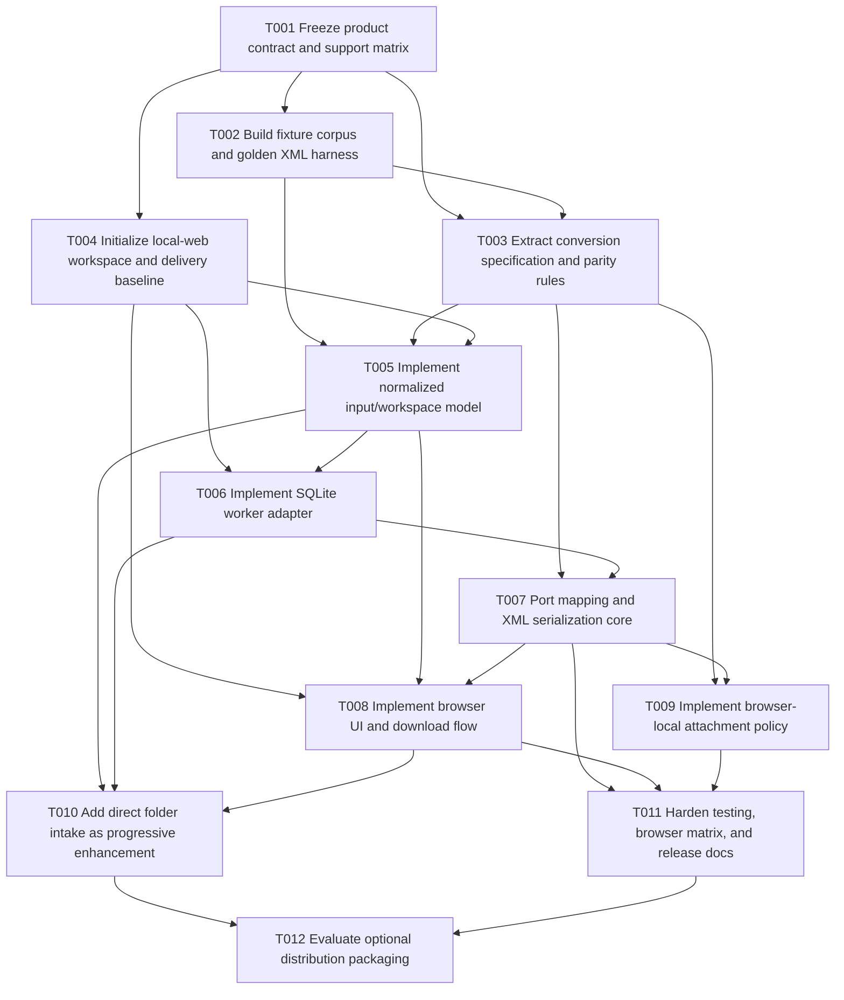

# Plan B — Balanced Implementation Plan for Browser-Local EndNote Conversion

**Date:** 2026-03-18
**Status:** Proposed
**Scope:** Planning only. No implementation changes are included in this document.

## Executive summary

This plan recommends a **browser-local, client-side web application** as the primary new architecture for EndNote-to-Zotero conversion, with a **moderate refactor** of the current project boundaries and a **significant architectural evolution** away from a desktop-path-centric runtime.

The recommended source architecture is:

- **TypeScript-based browser application** with modern bundling/tooling for maintainability and WASM asset handling
- **Web Worker-based conversion pipeline** to keep heavy parsing and SQLite work off the UI thread
- **SQLite WASM adapter** for reading `sdb/sdb.eni` client-side
- **ZIP-first and `.enlp`/package upload support** for MVP, with direct folder selection as a progressive enhancement rather than the baseline contract
- **Shared parity corpus and golden-output harness** anchored to the current Python exporter before deep porting begins
- **Explicit attachment policy** for browser-local mode instead of preserving desktop absolute path behavior by default

This is a balanced strategy because it does not assume a full clean-slate rewrite, but it also does not attempt to preserve the current Python runtime model inside the browser. The current Python exporter should be treated as the **behavioral oracle** and migration reference, not as the long-term browser runtime.

### Primary recommendation

Proceed with a **modular browser app** as the canonical implementation, using:

- **Vite + TypeScript** for source architecture and build ergonomics
- **SQLite WASM or equivalent in a worker** for local database access
- **ZIP / archive-first ingestion** for broad compatibility
- **Single-file packaging only as a later distribution mode**, produced from the canonical multi-file source build if it remains technically credible
- **Electron/Tauri only as escalation paths** if browser constraints around directory access, attachment path fidelity, or large-library performance prove unacceptable in practice

### What this plan explicitly avoids

This plan does **not** recommend:

- Pyodide/Python-in-browser as the primary architecture
- a single loose HTML file as the source architecture
- wrapper-first implementation before browser-local feasibility is validated
- public promises of universal raw folder selection or desktop-equivalent absolute PDF path fidelity in MVP

## Target architecture

### Canonical architecture

```text
Browser UI (TypeScript)
  ├─ input adapters
  │   ├─ zip/package upload
  │   ├─ .enlp upload
  │   └─ optional directory-handle intake (progressive enhancement)
  ├─ worker bridge
  │   └─ conversion worker
  │       ├─ archive/package normalization
  │       ├─ SQLite WASM adapter
  │       ├─ EndNote row extraction
  │       ├─ record mapping
  │       ├─ attachment policy application
  │       └─ XML serialization
  ├─ result model
  │   ├─ counts
  │   ├─ warnings
  │   ├─ attachment policy used
  │   └─ XML blob/string
  └─ download/export adapter
```

### Recommended technical choices

#### Source architecture

- **Vite + TypeScript**
- Native ES module structure in source
- Dedicated **Web Worker** for conversion
- Browser UI kept deliberately small and operationally simple

#### SQLite strategy

- Use **SQLite WASM / similar client-side SQLite execution** as the default technical direction
- Prefer a solution that can load an existing SQLite DB from bytes and run in a worker
- Start with the simplest viable worker-based mode for imported DB bytes; do not make OPFS-backed persistence mandatory for MVP
- Treat deeper persistence optimization as a later enhancement, not a gating requirement

#### Attachment strategy

For browser-local MVP, do **not** attempt to preserve the current desktop contract of resolved absolute local PDF paths in all cases.

Recommended MVP policy:

- preserve bibliographic conversion parity
- emit warnings when attachment links cannot be represented safely
- support a browser-local attachment mode such as:
  - omit PDF links, or
  - emit source-relative metadata only
- keep desktop absolute-path behavior as legacy desktop behavior, not as the default browser-local contract

## MVP vs later enhancements

### MVP scope

The MVP should deliver:

1. browser-local conversion with **no server-side upload required for core conversion**
2. archive-first ingestion:
   - `.zip` as the primary supported intake shape
   - `.enlp` accepted if it can be normalized predictably
3. SQLite DB access in-browser via WASM or similar client-side execution
4. parity-oriented export of Zotero-compatible XML for representative supported fixtures
5. explicit warnings/results surface in the browser UI
6. downloadable XML artifact
7. tested support wording for a limited browser matrix

### Post-MVP enhancements

These should be deferred until the browser-local core is stable:

1. direct folder selection via browser APIs as a progressive enhancement
2. deeper local persistence or caching via OPFS/IndexedDB
3. single-file bundled distribution, if technically supportable without misleading capability claims
4. wrapper packaging:
   - **Tauri preferred** if a packaged native shell becomes necessary for smaller footprint
   - **Electron acceptable** if faster wrapper implementation and testability are more important than binary size
5. advanced attachment mapping modes and companion-manifest export
6. performance hardening for larger real-world libraries

## Task breakdown

| ID | Task | Description | Dependencies | Estimated effort | Risk |
|---|---|---|---|---|---|
| T001 | Freeze product contract and support matrix | Define MVP inputs, browser support, attachment semantics, offline/local-only wording, and explicit exclusions. | None | 1-2 days | Medium |
| T002 | Build fixture corpus and golden XML harness | Create deterministic `.enl`, `.enlp`, `.zip`, malformed, and edge-case fixtures; generate approved outputs from the current Python exporter. | T001 | 2-4 days | Medium |
| T003 | Extract conversion specification and parity rules | Document reference-type mapping, field rules, XML structure, allowed differences, and browser-local attachment policy. | T001, T002 | 1-3 days | Medium |
| T004 | Initialize local-web workspace and delivery baseline | Create browser app workspace, build tooling, worker structure, lint/test configuration, and CI skeleton. | T001 | 1-2 days | Low |
| T005 | Implement normalized input/workspace model | Build canonical local-workspace representation for `.zip` and `.enlp`, with explicit validation and warnings. | T002, T003, T004 | 3-5 days | High |
| T006 | Implement SQLite worker adapter | Load `sdb/sdb.eni` client-side via SQLite WASM or similar, execute required queries, and return structured rows. | T004, T005 | 3-5 days | High |
| T007 | Port mapping and XML serialization core | Recreate Python exporter semantics in runtime-neutral TypeScript modules and verify parity on approved fixtures. | T002, T003, T006 | 4-7 days | High |
| T008 | Implement browser UI and download flow | Add minimal browser UX for input selection, progress, result summaries, warnings, and XML download. | T004, T005, T007 | 2-4 days | Medium |
| T009 | Implement browser-local attachment policy | Add explicit attachment mode handling, warning surfaces, and parity expectations for browser-local exports. | T003, T007 | 2-3 days | High |
| T010 | Add direct folder intake as progressive enhancement | Add directory-handle based intake where browser support is sufficient; retain archive-first fallback. | T005, T006, T008 | 2-4 days | Medium |
| T011 | Harden testing, browser matrix, and release docs | Add browser automation, fixture-driven integration tests, support docs, privacy docs, and troubleshooting guidance. | T007, T008, T009 | 3-5 days | Medium |
| T012 | Evaluate optional distribution packaging | Assess and optionally implement single-file bundling and wrapper packaging as follow-on distribution modes. | T010, T011 | 3-6 days | Medium |

## Dependency graph



### Critical path

The likely critical path is:

**T001 → T002 → T003 → T005 → T006 → T007 → T008 → T011**

This path is critical because:

- the browser-local contract and parity expectations must be frozen before porting
- the normalization model and SQLite worker determine technical feasibility
- the mapping/XML port is the core correctness risk
- the release should not be considered real until browser-matrix tests and support docs exist

## Detailed task notes

### T001 — Freeze product contract and support matrix

**Objective**

Establish the browser-local MVP contract before implementation.

**Key outputs**

- supported input shapes for MVP
- supported browser matrix
- explicit statement on whether direct folder selection is baseline or progressive enhancement
- browser-local attachment policy for MVP
- privacy/offline/local-only wording
- definition of warnings, partial success, and unsupported cases

**Files to modify/create**

- `README.md`
- `docs/local-web-execution/contracts.md` *(new)*
- `docs/local-web-execution/support-matrix.md` *(new)*
- `docs/local-web-execution/privacy.md` *(new)*

### T002 — Build fixture corpus and golden XML harness

**Objective**

Create the parity foundation before deep implementation work.

**Key outputs**

- deterministic fixture set for supported and unsupported layouts
- approved XML outputs produced from the current Python exporter where appropriate
- documented allowed differences for browser-local mode

**Files to modify/create**

- `testing/fixtures/` *(new subtree)*
- `testing/golden/` *(new subtree)*
- `testing/fixture-manifest.md` *(new)*
- `tests/` or `testing/harness/` *(new, depending on final project layout)*

### T003 — Extract conversion specification and parity rules

**Objective**

Make the Python exporter semantics explicit enough to port safely.

**Key outputs**

- documented reference-type mapping
- field transformation rules
- XML shape contract
- attachment policy differences by runtime
- parity rules and accepted deviations

**Files to modify/create**

- `docs/local-web-execution/conversion-spec.md` *(new)*
- `docs/local-web-execution/attachment-policy.md` *(new)*
- `docs/local-web-execution/parity-rules.md` *(new)*

### T004 — Initialize local-web workspace and delivery baseline

**Objective**

Create a production-realistic browser-local source architecture.

**Recommended structure**

```text
web/
├── index.html
├── package.json
├── tsconfig.json
├── vite.config.ts
├── src/
│   ├── main.ts
│   ├── app/
│   ├── adapters/
│   ├── core/
│   ├── worker/
│   └── types/
└── tests/
```

**Files to modify/create**

- `web/package.json` *(new)*
- `web/tsconfig.json` *(new)*
- `web/vite.config.ts` *(new)*
- `web/index.html` *(new)*
- `web/src/main.ts` *(new)*
- `web/src/worker/export-worker.ts` *(new)*
- `.github/workflows/ci.yml` *(new or update existing)*

### T005 — Implement normalized input/workspace model

**Objective**

Normalize browser-supplied input into one canonical in-memory model.

**Key outputs**

- library identification and validation
- support for ZIP-first and predictable `.enlp` handling
- explicit error classes for missing DB, malformed layout, and unsupported packages
- warning accumulation during normalization

**Files to modify/create**

- `web/src/core/normalize-library.ts` *(new)*
- `web/src/core/library-types.ts` *(new)*
- `web/src/adapters/browser-input.ts` *(new)*
- `web/src/core/errors.ts` *(new)*

### T006 — Implement SQLite worker adapter

**Objective**

Read the EndNote database client-side in a worker without blocking the UI.

**Key outputs**

- database load from bytes
- required query execution for `refs` and attachment mappings
- structured row output for the mapping layer
- initial feasibility checks for memory/performance on representative fixtures

**Files to modify/create**

- `web/src/worker/sqlite-adapter.ts` *(new)*
- `web/src/worker/query-endnote.ts` *(new)*
- `web/src/worker/export-worker.ts` *(update)*
- `web/src/types/query-results.ts` *(new)*

### T007 — Port mapping and XML serialization core

**Objective**

Recreate the Python exporter’s behavior in portable browser-side modules.

**Key outputs**

- record-mapping modules with parity tests
- XML serialization and sanitization modules
- structured `ExportResult` model including counts and warnings

**Files to modify/create**

- `web/src/core/map-record.ts` *(new)*
- `web/src/core/reference-type-map.ts` *(new)*
- `web/src/core/export-xml.ts` *(new)*
- `web/src/core/sanitize.ts` *(new)*
- `web/src/types/export-result.ts` *(new)*

### T008 — Implement browser UI and download flow

**Objective**

Provide a minimal but production-realistic browser UX.

**Key outputs**

- input selection/upload flow
- progress state and busy-state handling
- result summary and warning presentation
- XML download

**Files to modify/create**

- `web/src/app/state.ts` *(new)*
- `web/src/app/controller.ts` *(new)*
- `web/src/adapters/browser-output.ts` *(new)*
- `web/src/ui/*.ts` *(new)*
- `web/src/styles.css` *(new)*

### T009 — Implement browser-local attachment policy

**Objective**

Replace implicit desktop absolute-path behavior with explicit runtime policy.

**Key outputs**

- attachment-mode implementation for browser-local exports
- user-visible warnings when attachment links are omitted or degraded
- parity rules that isolate intentional browser-local divergence

**Files to modify/create**

- `web/src/core/attachment-policy.ts` *(new)*
- `docs/local-web-execution/attachment-policy.md` *(update)*
- `web/tests/attachment-policy.spec.ts` *(new)*

### T010 — Add direct folder intake as progressive enhancement

**Objective**

Improve UX on supported browsers without making folder APIs the core product contract.

**Key outputs**

- optional directory-handle flow
- graceful fallback to archive upload on unsupported browsers
- support-matrix updates documenting capability differences

**Files to modify/create**

- `web/src/adapters/directory-input.ts` *(new)*
- `web/src/adapters/browser-input.ts` *(update)*
- `docs/local-web-execution/support-matrix.md` *(update)*
- `docs/local-web-execution/troubleshooting.md` *(new)*

### T011 — Harden testing, browser matrix, and release docs

**Objective**

Convert the prototype into a supportable product candidate.

**Key outputs**

- unit, integration, and browser automation coverage
- browser matrix results
- user docs, privacy docs, and support docs
- explicit known limitations and unsupported scenarios

**Files to modify/create**

- `web/tests/` *(new subtree)*
- `playwright.config.*` *(new)*
- `.github/workflows/web-ci.yml` *(new)*
- `docs/local-web-execution/user-guide.md` *(new)*
- `docs/local-web-execution/troubleshooting.md` *(update)*
- `docs/local-web-execution/release-ops.md` *(new)*

### T012 — Evaluate optional distribution packaging

**Objective**

Add optional distribution modes only after the browser-local core is validated.

**Decision order**

1. assess whether a **single-file build artifact** is technically supportable without misleading users
2. if browser constraints remain unacceptable, evaluate a **thin wrapper**
3. prefer **Tauri** for smaller packaged footprint if the team accepts extra tooling complexity
4. prefer **Electron** if implementation speed and automation maturity dominate

**Files to modify/create**

- `docs/local-web-execution/distribution/single-html.md` *(new)*
- `docs/local-web-execution/distribution/tauri.md` *(new)*
- `docs/local-web-execution/distribution/electron.md` *(new)*
- wrapper workspace files *(new, only if justified by evidence)*

## Files to modify/create

### Existing files likely to be updated

- `README.md`
- `.github/workflows/*`
- `pyproject.toml` *(only if Python-side parity tooling is expanded)*
- `testing/` assets and harness metadata

### New documentation files likely to be added

- `docs/local-web-execution/contracts.md`
- `docs/local-web-execution/support-matrix.md`
- `docs/local-web-execution/privacy.md`
- `docs/local-web-execution/conversion-spec.md`
- `docs/local-web-execution/attachment-policy.md`
- `docs/local-web-execution/parity-rules.md`
- `docs/local-web-execution/user-guide.md`
- `docs/local-web-execution/troubleshooting.md`
- `docs/local-web-execution/release-ops.md`
- `docs/local-web-execution/distribution/*.md`

### New implementation files likely to be added

- `web/` application workspace
- browser worker and core conversion modules under `web/src/`
- web-focused test harness under `web/tests/`
- Playwright/browser automation configuration

## Testing strategy

### 1. Parity-first testing

Build the test program around a shared fixture corpus and approved XML outputs.

Required fixture classes:

- minimal successful `.enl`
- minimal successful `.enlp`
- zipped successful package
- malformed package
- missing DB
- no-PDF variant
- mixed-case `.Data` directory cases
- representative larger/stress fixtures

### 2. Layered test approach

#### Unit tests

- normalization helpers
- SQLite query adapter behavior
- record mapping logic
- XML sanitization and serialization
- attachment policy modes

#### Integration tests

- full in-browser conversion on representative fixtures
- archive normalization + DB read + XML generation pipeline
- warning behavior for degraded attachment handling

#### Browser automation

- input selection/upload flow
- conversion completion state
- downloaded XML artifact verification
- browser matrix runs for supported browsers

### 3. Acceptance gates

The MVP should not be treated as complete until:

- approved fixtures pass parity validation
- browser UI produces downloadable XML on supported browsers
- warnings are structured and documented
- support and privacy docs match actual runtime behavior

### 4. Packaging validation

For post-MVP packaging work:

- single-file build must be tested in every claimed execution mode
- wrapper builds must include launch smoke tests and artifact verification
- packaging must not silently expand the support matrix beyond what is documented

## Risk assessment

### High-risk areas

1. **SQLite client-side feasibility for real-world libraries**
   - browser memory and worker integration may be adequate for small-to-medium fixtures but weak for large libraries
2. **Porting correctness of the Python mapping logic**
   - `_build_record_dict()` behavior is dense and easy to under-port
3. **Attachment semantics**
   - browser-local runtime cannot safely inherit the desktop absolute-path contract unchanged
4. **Browser capability drift**
   - directory-handle APIs and local-file execution semantics vary materially by browser

### Medium-risk areas

1. **Single-file packaging feasibility**
   - the source app may bundle to one file only under narrow caveats
2. **Support-language drift**
   - product messaging can easily over-promise if folder selection or offline claims are not constrained
3. **Wrapper escalation complexity**
   - Electron/Tauri can solve runtime issues but add packaging/tooling burden

### Low-risk areas

1. **Minimal browser UI shell**
   - the UI requirements are operationally simple relative to the conversion core
2. **ZIP-first intake UX**
   - archive-first input is the simplest broad-compatibility browser contract

## Pros and cons vs other approaches

### Versus a more conservative approach

**Pros**

- establishes a maintainable browser-native codebase rather than an exploratory spike only
- resolves the core runtime question directly with worker + SQLite WASM
- creates a reusable foundation for multiple future distribution modes
- avoids long-term dependence on experimental Python-in-browser runtime behavior

**Cons**

- requires meaningful upfront porting effort
- introduces a new web workspace and tooling stack
- demands stronger parity and test investment before visible feature completeness

### Versus a more aggressive approach

**Pros**

- keeps scope controlled around one canonical browser-local source architecture
- avoids premature wrapper-first expansion and multi-runtime sprawl
- defers single-file and native-shell packaging until evidence justifies them
- limits architectural risk while still making substantive progress

**Cons**

- may preserve some temporary dual-maintenance burden between Python reference logic and browser-local implementation
- may not fully solve large-library/native-path fidelity concerns in the first release

### Versus Pyodide/Python-in-browser as the main path

**Pros**

- smaller and more browser-native long-term runtime
- fewer assumptions about mounting desktop-like filesystems in the browser
- cleaner separation between conversion semantics and browser runtime concerns

**Cons**

- lower direct runtime code reuse from the Python exporter
- requires more deliberate porting and parity validation

### Versus wrapper-first delivery

**Pros**

- preserves the zero-install/local-processing product goal
- avoids immediate native packaging and update complexity
- keeps privacy messaging simple for MVP

**Cons**

- weaker native path fidelity and browser capability guarantees
- may eventually require a wrapper anyway for edge-case libraries or path-sensitive attachment behavior

## Rollback plan

### Rollback principle

Maintain rollback independence between:

1. the existing Python desktop exporter
2. the new browser-local workspace
3. optional packaging/distribution experiments

### Phase rollback guidance

#### T001-T003 rollback

- Revert only the new browser-local docs/contracts if assumptions are invalidated.
- Keep fixture research and conversion-spec notes where still useful.

#### T004-T009 rollback

- If the browser-local implementation proves infeasible or too unstable, disable or archive the `web/` workspace without touching the current Python desktop app.
- Preserve the fixture corpus and parity harness as durable assets.
- Preserve documentation of browser-local findings to avoid rediscovering the same constraints later.

#### T010-T012 rollback

- If direct folder intake causes support instability, remove it while keeping archive-first conversion.
- If single-file packaging is misleading or brittle, drop it as a supported mode and retain the canonical multi-file build.
- If wrapper experiments create excessive maintenance burden, remove wrapper workspaces without affecting the canonical browser build or the desktop Python app.

### Product rollback options

If MVP browser-local feasibility is weaker than expected:

1. reduce the public contract to archive-first support only
2. keep the browser implementation as experimental/private-preview while parity hardening continues
3. escalate to a thin wrapper only if measured evidence shows browser limitations are unacceptable

## Recommended execution sequence

### Wave 1 — Contracts and parity guardrails

- T001
- T002
- T003

### Wave 2 — Workspace setup and browser-local technical core

- T004
- T005
- T006

### Wave 3 — Conversion correctness and user-facing MVP

- T007
- T008
- T009

### Wave 4 — Compatibility improvements and shipping hardening

- T010
- T011

### Wave 5 — Optional distribution expansion

- T012

## Final recommendation

Adopt a **browser-native, worker-based, SQLite-WASM-assisted implementation** as the canonical source architecture for local web execution.

Treat the current Python exporter as the **compatibility oracle**, not as the long-term browser runtime. Keep the MVP narrow: archive-first intake, explicit browser-local attachment policy, downloadable XML, and fixture-backed parity gates. Defer direct folder support, single-file packaging, and Electron/Tauri wrappers until the browser-local core is proven against realistic fixtures and support expectations.
