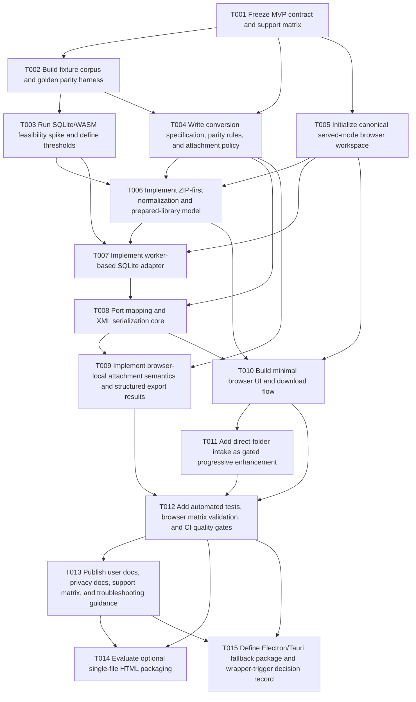

# Local Web Execution Consolidated Implementation Plan

**Date:** 2026-03-18
**Status:** Proposed consolidated plan
**Scope:** Planning only — no implementation changes are included in this document

## Executive Summary

### Goals and objectives

This initiative targets a **browser-local / client-side** EndNote conversion workflow that executes on the user’s device by default, without introducing a hosted conversion service as the primary runtime.

The goals are:

1. **Deliver a credible local-processing web experience** for EndNote-to-Zotero conversion without requiring server-side upload of the user’s library for the core workflow.
2. **Preserve behavioral fidelity** to the current Python exporter for supported cases by using the existing desktop implementation as the parity oracle.
3. **Separate runtime concerns from conversion semantics** so that browser-local delivery, optional single-file packaging, and native wrapper fallbacks can all share the same conversion specification.
4. **Avoid over-promising browser capabilities** by making ZIP-first intake, served-mode runtime expectations, attachment semantics, and browser support tiers explicit before implementation.
5. **Maintain rollback independence** so the current Python desktop application remains unaffected if browser-local work stalls, narrows, or is deferred.

### Chosen approach with justification from reviews

**Chosen approach: hybrid, browser-local-first architecture**

The recommended plan combines:

- **Plan B’s implementation architecture**:
  - browser-native TypeScript application
  - worker-based conversion pipeline
  - SQLite/WASM for client-side database access
  - formal conversion specification and parity rules
  - structured testing and support documentation
- **Plan A’s delivery discipline**:
  - ZIP-first MVP contract
  - Chromium-first support posture
  - direct folder selection treated as progressive enhancement, not baseline support
  - explicit de-scoping of desktop-style absolute attachment-path fidelity in browser mode
  - single-file HTML treated as optional packaging only after the served multi-file build is proven
  - Electron/Tauri treated as fallback or follow-on distribution options, not the starting point

### Justification from reviews

The reviews converge on the same conclusion:

- **Review 1** recommends **Plan B as the better foundation**, but narrowed by **Plan A’s contract discipline**, especially around ZIP-first intake, Chromium-first support, and delaying single-file/wrapper commitments.
- **Review 2** reaches the same practical recommendation and adds two critical constraints:
  - the canonical browser runtime for MVP must be **served mode**, not `file://`
  - wrapper escalation must be driven by **measured thresholds**, not preference

The consolidated conclusion is therefore:

> Build a **browser-native, worker-based, SQLite/WASM-assisted** implementation as the canonical local-web source architecture, but constrain the MVP to **served multi-file delivery**, **ZIP-first intake**, **documented browser-local attachment semantics**, and **capability-based support promises**.

### Explicit positioning of the option families

#### Browser-native local execution

This is the **primary path**. The browser-local application is the canonical source architecture because it best matches the initiative goal of no-install or low-friction local processing.

#### WASM use where needed

WASM is **not the product**, but it is **required infrastructure** for realistic browser-local SQLite access. SQLite/WASM in a worker is the recommended default technical direction. Pyodide remains a spike-only option, not the primary implementation model.

#### Single-file HTML

Single-file HTML is an **optional packaging experiment**, not the baseline architecture. It should only be considered after the served multi-file browser application is functioning, tested, and supportable. It must not be assumed as the MVP runtime unless proven technically credible and supportable.

#### Electron/Tauri

Electron and Tauri are **fallback or follow-on local distribution options**, not the default plan. They become relevant only if measured browser limitations make native file semantics, performance, or attachment fidelity non-negotiable.

### Timeline estimate

Estimated effort for one engineer working mostly sequentially:

- **Wave 1 — contracts, parity foundation, feasibility spike:** 1.5-2.5 weeks
- **Wave 2 — canonical browser workspace and core normalization/SQLite pipeline:** 2-3 weeks
- **Wave 3 — mapping, XML emission, browser result flow, attachment policy:** 2-3 weeks
- **Wave 4 — browser hardening, tests, docs, support matrix:** 1.5-2.5 weeks
- **Wave 5 — optional packaging and fallback decision package:** 1-2 weeks
- **Total realistic range:** **8-13 weeks**

Estimated effort for a small team executing in parallel:

- **5-8 weeks** for a fixture-backed, supportable browser-local MVP
- **+1-2 weeks** if optional single-file evaluation and wrapper decision records are expected for first release readiness

### Constraints and dependencies

#### Constraints

1. The current repository is a **Python desktop application**, not an existing browser codebase.
2. The current exporter is **SQLite-first** and assumes a real filesystem layout:
   - `.enl` + sibling `.Data/`
   - `.enlp` package layout
   - `sdb/sdb.eni`
   - `PDF/` attachment subtree
3. The current exporter emits **absolute local PDF paths**, which are valid for desktop but not portable as-is to browser-local execution.
4. The codebase currently has **no first-party automated parity harness** and no browser runtime infrastructure.
5. Browser directory selection is **not a universal browser capability**; `showDirectoryPicker()` is secure-context-only, user-activation-gated, Chromium-supported, and unavailable in Firefox/Safari.
6. Browser-local SQLite is feasible, but it is **WASM + worker + memory-envelope dependent**.
7. `file://` is **not a credible baseline runtime promise** for a worker/WASM-based application.

#### Dependencies

1. Agreement on **support matrix language** before public claims are made.
2. Agreement on **browser-local attachment behavior** before parity acceptance is finalized.
3. A shared **fixture corpus and golden/parity harness** produced from the current Python exporter.
4. An early **SQLite/WASM feasibility gate** against realistic small/medium/stress fixtures.
5. A browser build/runtime that assumes **served execution** over localhost/HTTPS.

## Dependency Graph

### Critical path

The likely critical path is:

**T001 → T002 → T003 → T006 → T007 → T008 → T009 → T010 → T012 → T013**

This path is critical because:

- the project must freeze the browser-local contract before implementation drift begins
- parity fixtures and feasibility evidence must exist before major porting work
- SQLite/WASM viability is the dominant technical gate for browser-local execution
- normalization, mapping, XML emission, and attachment semantics are the correctness core
- the initiative should not be considered release-ready until tests and support documentation are aligned with actual runtime behavior

## Wave Planning

### Wave 1 — Contracts, parity guardrails, and feasibility gate

**Objective:** Define the product contract, build the parity baseline, and prove that browser-local SQLite/WASM is viable enough to justify the browser-first path.

Included tasks:

- **T001** Freeze MVP contract and support matrix
- **T002** Build fixture corpus and golden parity harness
- **T003** Run SQLite/WASM feasibility spike and define thresholds
- **T004** Write conversion specification, parity rules, and attachment policy

**Exit criteria:**

- MVP contract is frozen
- served-mode vs `file://` posture is explicit
- attachment semantics are documented
- parity oracle and approved fixture corpus exist
- SQLite/WASM feasibility passes agreed thresholds, or the plan escalates to wrapper fallback review

### Wave 2 — Canonical browser workspace and ingestion core

**Objective:** Stand up the production-realistic browser workspace and implement the normalized library model needed for all later conversion work.

Included tasks:

- **T005** Initialize canonical served-mode browser workspace
- **T006** Implement ZIP-first normalization and prepared-library model
- **T007** Implement worker-based SQLite adapter

**Exit criteria:**

- browser application runs in served mode
- supported ZIP fixtures normalize deterministically
- SQLite worker can open `sdb/sdb.eni` and return the required rows for supported fixtures

### Wave 3 — Conversion correctness and browser-local result semantics

**Objective:** Recreate the conversion behavior for supported cases and define the user-visible browser-local output contract.

Included tasks:

- **T008** Port mapping and XML serialization core
- **T009** Implement browser-local attachment semantics and structured export results
- **T010** Build minimal browser UI and download flow

**Exit criteria:**

- approved fixtures produce expected XML or approved divergence
- browser-local attachment behavior is explicit and tested
- XML can be downloaded locally with visible warnings and structured results

### Wave 4 — Hardening, support matrix verification, and documentation

**Objective:** Convert the implementation from a technical prototype into a supportable product candidate.

Included tasks:

- **T011** Add direct-folder intake as gated progressive enhancement
- **T012** Add automated tests, browser matrix validation, and CI quality gates
- **T013** Publish user docs, privacy docs, support matrix, and troubleshooting guidance

**Exit criteria:**

- browser support tiers are backed by tests
- direct-folder support, if added, remains clearly capability-gated and non-baseline
- privacy, local-processing, and troubleshooting docs match actual behavior

### Wave 5 — Optional packaging and fallback strategy

**Objective:** Evaluate distribution extensions only after the core browser-local runtime is proven.

Included tasks:

- **T014** Evaluate optional single-file HTML packaging
- **T015** Define Electron/Tauri fallback package and wrapper-trigger decision record

**Exit criteria:**

- single-file HTML has a documented go/no-go decision
- wrapper fallback criteria are measurable and documented
- packaging work does not alter the canonical served multi-file support contract unless explicitly approved

## Detailed Task List

### T001 — Freeze MVP contract and support matrix

- **Dependencies:** None
- **Files to modify/create:**
  - `docs/local-web-execution/contracts.md` *(new)*
  - `docs/local-web-execution/support-matrix.md` *(new)*
  - `docs/local-web-execution/privacy.md` *(new)*
  - `README.md` *(update later, after contract approval)*
- **Description:**
  - Define the MVP product contract for browser-local conversion.
  - Establish that the canonical browser runtime is **served mode** over localhost/HTTPS.
  - Explicitly state that `file://` is **not supported for MVP**.
  - Freeze support tiers for browsers and features:
    - ZIP-first intake as baseline
    - direct folder selection as progressive enhancement only
    - browser-local attachment semantics as intentionally different from desktop absolute-path behavior
  - Define the public support-matrix vocabulary: **supported**, **best effort**, **experimental**, **unsupported**.
- **Complexity:** Medium
- **Acceptance criteria:**
  - A written MVP contract exists.
  - Served-mode vs `file://` expectations are explicit.
  - Browser support tiers and non-goals are documented.
  - Attachment behavior is defined as a product policy, not left implicit.

### T002 — Build fixture corpus and golden parity harness

- **Dependencies:** T001
- **Files to modify/create:**
  - `testing/browser-local/fixtures/` *(new)*
  - `testing/browser-local/golden/` *(new)*
  - `testing/browser-local/fixture-manifest.json` *(new)*
  - `testing/browser-local/README.md` *(new)*
- **Description:**
  - Build deterministic fixtures representing the supported and expected-failure library shapes.
  - Include at minimum:
    - supported `.zip` containing `.enl` + `.Data`
    - supported `.zip` containing `.enlp`-equivalent structure
    - missing-DB failure case
    - malformed archive case
    - attachment-present case
    - mixed-case `.Data` lookup case
    - at least one larger stress fixture for performance validation
  - Generate approved outputs using the current Python exporter where parity is required.
- **Complexity:** Medium
- **Acceptance criteria:**
  - Fixture corpus is committed and documented.
  - Golden outputs or approved comparator results exist.
  - Failure classes are explicitly classified.
  - Browser-local work has an objective parity foundation.

### T003 — Run SQLite/WASM feasibility spike and define thresholds

- **Dependencies:** T002
- **Files to modify/create:**
  - `docs/local-web-execution/feasibility.md` *(new)*
  - `docs/local-web-execution/performance-thresholds.md` *(new)*
- **Description:**
  - Validate the browser-local database path using worker-based SQLite/WASM against the approved fixtures.
  - Measure small/medium/stress fixture behavior.
  - Define measurable continuation thresholds for:
    - maximum supported archive size for MVP
    - acceptable conversion latency envelope
    - unacceptable memory-failure behavior
    - escalation conditions for wrapper fallback
- **Complexity:** High
- **Acceptance criteria:**
  - SQLite/WASM can load the representative supported fixtures in a worker.
  - Continuation thresholds are documented.
  - Browser-first execution remains justified, or wrapper review is triggered.

### T004 — Write conversion specification, parity rules, and attachment policy

- **Dependencies:** T001, T002
- **Files to modify/create:**
  - `docs/local-web-execution/conversion-spec.md` *(new)*
  - `docs/local-web-execution/parity-rules.md` *(new)*
  - `docs/local-web-execution/attachment-policy.md` *(new)*
- **Description:**
  - Extract the behavioral contract from the Python exporter into explicit documents.
  - Split parity into runtime-aware classes:
    - **must match**: core field mapping, record inclusion/exclusion, XML structural correctness for supported fields
    - **may differ but must be documented**: attachment-link representation, browser-specific warning surfaces
    - **explicitly unsupported in browser-local MVP**: desktop-style absolute filesystem path fidelity
  - Define the initial browser-local attachment mode.
- **Complexity:** Medium
- **Acceptance criteria:**
  - Conversion semantics are documented independently of runtime code.
  - Accepted browser-local divergences are explicit.
  - Attachment policy is precise enough to stabilize tests and user messaging.

### T005 — Initialize canonical served-mode browser workspace

- **Dependencies:** T001
- **Files to modify/create:**
  - `web/package.json` *(new)*
  - `web/tsconfig.json` *(new)*
  - `web/vite.config.ts` *(new)*
  - `web/index.html` *(new)*
  - `web/src/main.ts` *(new)*
  - `web/src/worker/export-worker.ts` *(new)*
- **Description:**
  - Create the canonical browser-local workspace using a minimal but maintainable TypeScript + Vite structure.
  - Reserve explicit boundaries for:
    - UI/app control
    - browser adapters
    - normalized library model
    - worker-based conversion core
  - Establish the served-mode baseline and avoid designing around `file://` execution.
- **Complexity:** Medium
- **Acceptance criteria:**
  - The browser workspace builds and runs under a local server.
  - Worker infrastructure is wired into the source layout.
  - The source tree clearly distinguishes runtime adapters from conversion logic.

### T006 — Implement ZIP-first normalization and prepared-library model

- **Dependencies:** T003, T004, T005
- **Files to modify/create:**
  - `web/src/core/normalize-library.ts` *(new)*
  - `web/src/core/library-types.ts` *(new)*
  - `web/src/core/errors.ts` *(new)*
  - `web/src/adapters/browser-input.ts` *(new)*
- **Description:**
  - Implement the canonical prepared-library model for browser-supplied input.
  - Normalize supported archives into a single internal representation that includes:
    - library identity
    - file map / relative paths
    - resolved database bytes or DB entry
    - attachment subtree metadata
    - normalization warnings
  - Explicitly handle only approved shapes for MVP.
- **Complexity:** High
- **Acceptance criteria:**
  - Supported ZIP fixtures normalize deterministically.
  - Unsupported or malformed archives fail with structured errors.
  - Conversion logic no longer depends on UI-specific input details after normalization.

### T007 — Implement worker-based SQLite adapter

- **Dependencies:** T003, T005, T006
- **Files to modify/create:**
  - `web/src/worker/sqlite-adapter.ts` *(new)*
  - `web/src/worker/query-endnote.ts` *(new)*
  - `web/src/types/query-results.ts` *(new)*
  - `web/src/worker/export-worker.ts` *(update)*
- **Description:**
  - Implement the client-side database path using SQLite/WASM in a worker.
  - Run the required queries for references and attachment mappings.
  - Return structured rows to the mapping layer without blocking the UI thread.
- **Complexity:** High
- **Acceptance criteria:**
  - Supported fixture DBs can be read in-browser.
  - Required query results are returned consistently.
  - Worker execution keeps the UI responsive.

### T008 — Port mapping and XML serialization core

- **Dependencies:** T004, T007
- **Files to modify/create:**
  - `web/src/core/map-record.ts` *(new)*
  - `web/src/core/reference-type-map.ts` *(new)*
  - `web/src/core/export-xml.ts` *(new)*
  - `web/src/core/sanitize.ts` *(new)*
  - `web/src/types/export-result.ts` *(new)*
- **Description:**
  - Recreate the Python exporter’s mapping and XML emission behavior in runtime-neutral TypeScript modules.
  - Preserve the approved semantics for supported fields and fixtures.
  - Keep output deterministic and testable.
- **Complexity:** High
- **Acceptance criteria:**
  - Supported fixtures match approved XML or approved divergence rules.
  - Core bibliographic field mapping is stable and deterministic.
  - XML generation is isolated from browser UI code.

### T009 — Implement browser-local attachment semantics and structured export results

- **Dependencies:** T004, T008
- **Files to modify/create:**
  - `web/src/core/attachment-policy.ts` *(new)*
  - `web/src/core/build-export-result.ts` *(new)*
  - `docs/local-web-execution/attachment-policy.md` *(update as needed)*
- **Description:**
  - Implement the attachment contract defined in Wave 1.
  - Replace implicit desktop path behavior with explicit browser-local modes.
  - Produce structured result objects containing counts, warnings, attachment mode used, and XML output.
- **Complexity:** High
- **Acceptance criteria:**
  - Browser-local exports never emit undocumented desktop-style absolute paths.
  - Result objects expose warnings and counts explicitly.
  - Attachment divergence from desktop mode is visible and documented.

### T010 — Build minimal browser UI and download flow

- **Dependencies:** T005, T006, T008, T009
- **Files to modify/create:**
  - `web/src/app/state.ts` *(new)*
  - `web/src/app/controller.ts` *(new)*
  - `web/src/adapters/browser-output.ts` *(new)*
  - `web/src/ui/` *(new subtree)*
  - `web/src/styles.css` *(new)*
- **Description:**
  - Build a minimal browser-local UX that supports:
    - ZIP input selection
    - visible progress and busy states
    - result summaries and warnings
    - XML download
  - Keep the UX intentionally narrow and non-framework-heavy.
- **Complexity:** Medium
- **Acceptance criteria:**
  - Users can run the supported flow end-to-end in the browser.
  - Warnings are visible in the UI rather than buried in logs.
  - Downloaded XML is the artifact under test.

### T011 — Add direct-folder intake as gated progressive enhancement

- **Dependencies:** T010
- **Files to modify/create:**
  - `web/src/adapters/directory-input.ts` *(new)*
  - `web/src/adapters/browser-input.ts` *(update)*
  - `docs/local-web-execution/support-matrix.md` *(update)*
- **Description:**
  - Add directory-handle based intake only after the ZIP-first flow is stable.
  - Capability-gate the feature to supported browsers and contexts.
  - Preserve ZIP-first intake as the baseline supported path.
- **Complexity:** Medium
- **Acceptance criteria:**
  - Direct-folder support is clearly capability-gated.
  - Unsupported browsers retain a usable ZIP-first flow.
  - No public claim implies that raw folder intake is universal.

### T012 — Add automated tests, browser matrix validation, and CI quality gates

- **Dependencies:** T009, T010, T011
- **Files to modify/create:**
  - `web/tests/` *(new subtree)*
  - `playwright.config.ts` *(new)*
  - `.github/workflows/web-ci.yml` *(new)*
  - `.github/workflows/ci.yml` *(new or update existing)*
- **Description:**
  - Add layered validation:
    - unit tests for normalization, mapping, XML, and attachment policy
    - integration tests for the conversion pipeline
    - browser automation for supported flows
  - Validate the support matrix across the claimed browsers and runtime features.
- **Complexity:** High
- **Acceptance criteria:**
  - Approved fixtures pass automated validation.
  - Browser-matrix coverage exists for the claimed support tiers.
  - CI enforces the defined quality gates.

### T013 — Publish user docs, privacy docs, support matrix, and troubleshooting guidance

- **Dependencies:** T012
- **Files to modify/create:**
  - `docs/local-web-execution/user-guide.md` *(new)*
  - `docs/local-web-execution/troubleshooting.md` *(new)*
  - `docs/local-web-execution/release-ops.md` *(new)*
  - `README.md` *(update as appropriate)*
- **Description:**
  - Publish the documentation needed to support a real browser-local release candidate.
  - Explicitly distinguish:
    - local processing
    - offline-capable behavior
    - `file://` launch behavior
    - browser support tiers
  - Document privacy posture, known limitations, and troubleshooting guidance.
- **Complexity:** Medium
- **Acceptance criteria:**
  - Documentation matches actual runtime behavior.
  - Support language is capability-based and conservative.
  - Privacy and attachment semantics are clearly disclosed.

### T014 — Evaluate optional single-file HTML packaging

- **Dependencies:** T012, T013
- **Files to modify/create:**
  - `docs/local-web-execution/distribution/single-html.md` *(new)*
  - `web/dist/` *(new, only if evaluation passes)*
- **Description:**
  - Evaluate whether the served multi-file browser application can be packaged into a single-file HTML artifact without creating an unsupportable runtime contract.
  - Treat this as a go/no-go evaluation with a default bias toward rejection unless proven otherwise.
- **Complexity:** Medium
- **Acceptance criteria:**
  - A written go/no-go decision exists.
  - Any supported single-file mode has explicit constraints.
  - Failure to support single-file packaging does not alter the canonical browser-local plan.

### T015 — Define Electron/Tauri fallback package and wrapper-trigger decision record

- **Dependencies:** T012, T013
- **Files to modify/create:**
  - `docs/local-web-execution/distribution/electron.md` *(new)*
  - `docs/local-web-execution/distribution/tauri.md` *(new)*
  - `docs/local-web-execution/fallback-decision.md` *(new)*
  - `docs/local-web-execution/rollback.md` *(new)*
- **Description:**
  - Document when a native local wrapper becomes justified.
  - Explicitly compare Electron and Tauri as follow-on distribution modes.
  - Recommended positioning:
    - **Electron** if implementation speed and automation maturity dominate
    - **Tauri** if smaller runtime footprint and stricter native capability scoping dominate
  - Do not begin wrapper implementation in this plan.
- **Complexity:** Medium
- **Acceptance criteria:**
  - Wrapper trigger criteria are measurable.
  - Electron/Tauri are positioned as fallback/follow-on options, not baseline architecture.
  - Rollback boundaries are explicit.

## Risk Areas

### Potential conflicts

1. **Browser-local fidelity vs browser capability reality**
   - Product expectations may drift toward native file semantics that browsers do not provide reliably.

2. **ZIP-first discipline vs pressure for raw folder support**
   - There is a predictable risk of expanding the MVP to support direct folder ingestion before the baseline path is hardened.

3. **Python parity vs runtime-specific divergence**
   - Without explicit parity rules, review discussions may stall over attachment-path differences or other browser-specific output decisions.

4. **Served-mode baseline vs single-file expectations**
   - Users or stakeholders may assume that “local processing” implies “double-clickable local HTML.” That assumption is unsafe.

5. **SQLite/WASM feasibility vs broader architectural investment**
   - If the browser-local DB path performs poorly on realistic fixtures, early architectural work can become sunk effort unless continuation thresholds are explicit.

6. **Support-matrix drift**
   - Browser support claims can outpace actual test evidence, especially for folder selection and launch-mode behavior.

### Mitigation strategies

1. **Freeze the contract early**
   - Support tiers, launch mode, intake modes, and attachment semantics must be written before implementation scope expands.

2. **Use fixture-backed parity rules**
   - Approved fixtures and parity classes prevent accidental debates over undocumented behavior.

3. **Make SQLite/WASM a formal go/no-go gate**
   - The feasibility spike must be able to stop or redirect the plan.

4. **Keep ZIP-first intake as the baseline supported path**
   - Folder selection remains a gated enhancement.

5. **Keep the browser workspace isolated**
   - The current desktop application remains stable while the browser-local initiative evolves.

6. **Use capability-based support language**
   - Document support by intake mode, browser capability, and runtime mode rather than browser names alone.

### Rollback procedures

1. Preserve the current Python desktop application as the unaffected fallback product surface.
2. Keep fixture and parity artifacts even if the browser-local implementation is rolled back.
3. If SQLite/WASM feasibility fails, stop after Wave 1 and convert the findings into a wrapper-fallback decision rather than forcing browser-local implementation.
4. If direct-folder support proves unstable, remove it while retaining ZIP-first browser-local support.
5. If optional single-file packaging is fragile, reject it and keep the served multi-file browser build as the only supported browser-local form.

## Testing Strategy

### Unit tests

Required unit-test coverage should include:

- archive normalization helpers
- prepared-library model validation
- error classification for malformed inputs
- SQLite query adapter behavior
- record mapping rules
- XML sanitization and serialization
- attachment policy modes
- structured export-result generation

### Integration tests

Required integration-test coverage should include:

- supported `.zip` containing `.enl` + `.Data`
- supported `.zip` containing `.enlp`-equivalent structure
- missing-DB failure path
- malformed archive rejection
- attachment-present case under documented browser-local semantics
- browser worker pipeline: normalize → query → map → emit XML

### E2E / smoke tests

#### Browser-local baseline

- Chromium-class served-mode success path
- XML download artifact verification
- malformed-input error UX
- warning surface verification

#### Browser matrix validation

- Chromium: baseline supported path
- Firefox/WebKit: validate the documented support tier, especially ZIP upload and served-mode behavior
- direct-folder flows only in browsers where the support matrix explicitly claims them

#### Optional packaging validation

- single-file HTML, if evaluated, must have separate smoke validation under its exact claimed launch model
- wrapper packaging, if later pursued, must have separate launch and artifact verification per runtime

### Quality gates

The following gates should be required before claiming browser-local MVP readiness:

1. Contract, parity, and attachment semantics documents are complete.
2. Approved fixtures pass automated validation.
3. SQLite/WASM feasibility thresholds remain within the approved envelope.
4. Browser support tiers are backed by actual automated or reproducible manual validation.
5. Documentation matches actual runtime behavior, including served-mode vs `file://` distinctions.
6. Any optional packaging mode has a separate documented support contract.

## Progress Tracking Section

| Task ID | Status | Notes | Completed Date |
|---|---|---|---|
| T001 | PENDING | Freeze MVP contract, served-mode baseline, support tiers, and attachment policy. | |
| T002 | PENDING | Build deterministic fixtures and golden parity corpus from the Python exporter. | |
| T003 | PENDING | Validate SQLite/WASM feasibility and define continuation thresholds. | |
| T004 | PENDING | Write conversion spec, parity rules, and runtime-aware attachment policy. | |
| T005 | PENDING | Initialize the canonical served-mode browser workspace. | |
| T006 | PENDING | Implement ZIP-first normalization and prepared-library model. | |
| T007 | PENDING | Implement worker-based SQLite adapter. | |
| T008 | PENDING | Port mapping and XML serialization core. | |
| T009 | PENDING | Implement browser-local attachment semantics and structured export results. | |
| T010 | PENDING | Build minimal browser UI and download flow. | |
| T011 | PENDING | Add direct-folder intake as gated progressive enhancement. | |
| T012 | PENDING | Add automated tests, browser matrix validation, and CI quality gates. | |
| T013 | PENDING | Publish user docs, privacy docs, support matrix, and troubleshooting guidance. | |
| T014 | PENDING | Evaluate optional single-file HTML packaging. | |
| T015 | PENDING | Define Electron/Tauri fallback criteria and wrapper decision record. | |

## Rollback Plan

### Wave 1 rollback

- If contract or feasibility work shows browser-local execution is not credible, stop after Wave 1.
- Preserve:
  - support-matrix draft
  - parity fixtures and goldens
  - attachment-policy analysis
  - feasibility findings
- Convert the result into a documented decision to remain desktop-only or move to wrapper-first planning.

### Wave 2 rollback

- If the browser workspace, normalization layer, or SQLite worker proves unstable, remove or archive the `web/` implementation workspace.
- Retain fixtures, specs, and feasibility docs.
- Keep the desktop application unchanged.

### Wave 3 rollback

- If mapping parity or browser-local attachment semantics are unacceptable, stop short of public release.
- Preserve the conversion spec and parity rules.
- Reassess whether the limitation is:
  - acceptable browser-local scope reduction, or
  - a wrapper-trigger event

### Wave 4 rollback

- If the support matrix cannot be backed by reproducible validation, downgrade the browser-local initiative to experimental/private preview.
- Remove unsupported claims before release.
- Drop direct-folder support if it creates disproportionate support risk.

### Wave 5 rollback

- If optional single-file packaging is fragile, reject it formally and keep the served multi-file build as the only browser-local delivery mode.
- If wrapper decision work shows Electron/Tauri would be required, stop short of implementation and initiate a separate wrapper-specific plan.

### Feature-flag / staged rollout considerations

Even though this initiative does not rely on server-side feature flags, staged rollout still applies:

1. **Internal/private preview stage**
   - ZIP-first flow only
   - served-mode only
   - Chromium only if necessary

2. **Limited public preview**
   - publish support matrix and privacy documentation
   - maintain clear experimental labels for non-baseline features

3. **General availability consideration**
   - only after automated validation and documentation support the claimed runtime behavior

Direct-folder support, single-file HTML packaging, and wrapper options should each be treated as **separate rollout decisions**, not bundled into the baseline browser-local release.

## Final recommendation

Proceed with a **hybrid browser-local implementation plan**:

1. **Canonical runtime:** browser-native TypeScript application, executed in served mode.
2. **Core technical strategy:** worker-based conversion pipeline with SQLite/WASM where needed.
3. **Baseline product contract:** ZIP-first intake, explicit browser-local attachment semantics, XML download, capability-based support matrix.
4. **Parity strategy:** current Python exporter remains the behavioral oracle for approved fixtures.
5. **Optional packaging:** single-file HTML evaluated later, not assumed.
6. **Fallback path:** Electron/Tauri only if browser-local execution fails measurable thresholds for runtime fidelity, performance, or supportability.

This approach provides the best balance of feasibility, correctness, user privacy posture, and future extensibility while explicitly rejecting unsupported assumptions about browser folder access, `file://` execution, and desktop attachment-path fidelity.
