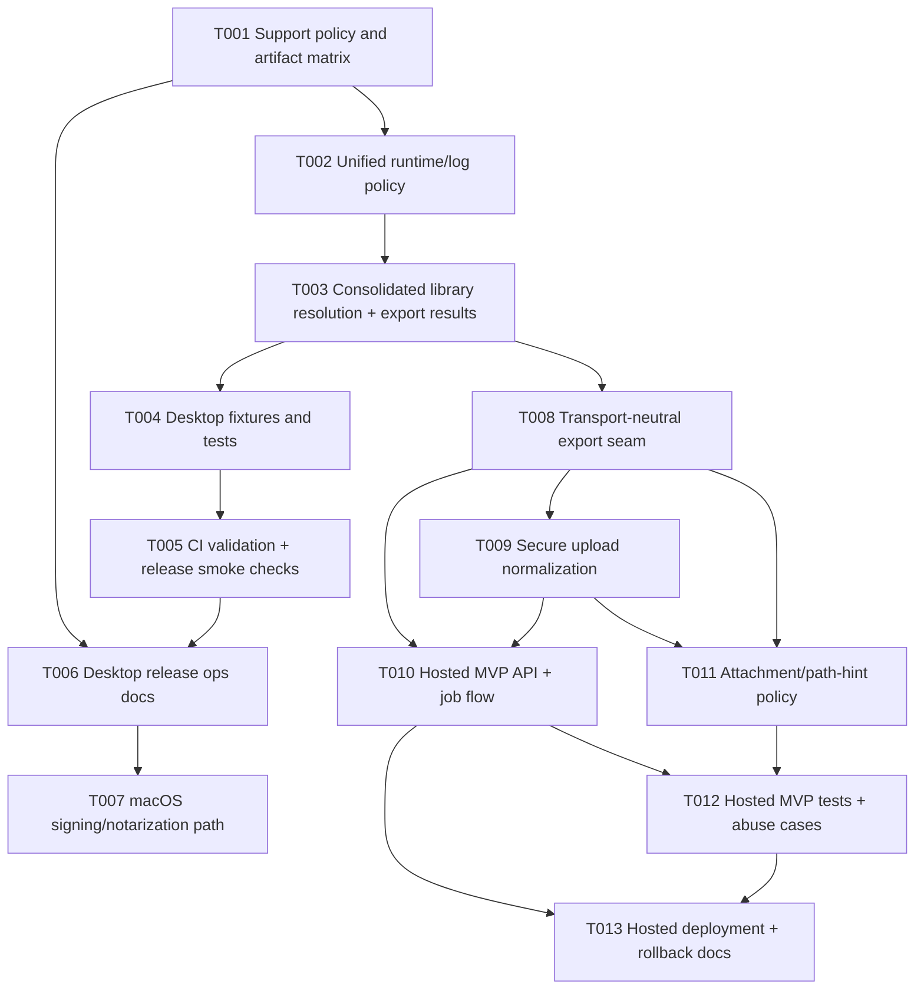

# Plan A: Conservative Approach for Desktop Hardening and Hosted Web MVP

## Executive summary

This conservative plan treats the initiative as **two linked but intentionally decoupled tracks**:

- **Goal A:** strengthen the existing desktop app and release process with minimal architectural disruption
- **Goal B:** build a **small, security-conscious hosted MVP** that reuses the exporter core instead of reimagining the product stack

The plan deliberately avoids a broad rewrite. It preserves the current repo shape (thin `gui.py`, core logic in `endnote_exporter.py`, platform helpers in `platform_utils.py`, PyInstaller release flow in `.github/workflows/release.yml`) and introduces only the minimum new seams required to support reliable binaries and a hosted web path.

### Conservative strategy in one sentence

**Stabilize and verify the desktop flow first, then expose the exporter behind a narrowly scoped upload-and-convert web service that accepts controlled inputs, uses isolated temp workspaces, and keeps attachment handling deliberately conservative.**

### Why this approach is conservative

- Reuses the existing exporter instead of replacing it
- Keeps desktop and hosted concerns separated
- Prioritizes **test coverage, packaging validation, and docs/runbooks** before deeper feature work
- Limits the hosted MVP surface area to reduce archive-handling, path-handling, and security risk
- Treats macOS signing/notarization as an incremental release-ops enhancement rather than a prerequisite for all code changes

### Outcome targets

#### Goal A

- Reliable Windows 10/11 binaries
- Reliable macOS Intel + Apple Silicon binary distribution with a clear path from unsigned builds to signed/notarized releases
- Optional Linux builds with explicit best-effort support language unless validation proves stronger claims
- Cross-platform behavior verified by executable tests and release smoke checks

#### Goal B

- Hosted MVP that accepts **`.zip`, `.enlp`, or normalized uploaded library content** in a controlled way
- Source path hint treated as **metadata only**, never as server filesystem access
- Downloadable XML result generated by the existing exporter logic behind a safer service boundary
- Strict upload limits, isolated temp workspace processing, deterministic cleanup, and low operational complexity

---

## Planning stance and scope boundaries

### In scope

- Minimal-risk desktop correctness and release-quality improvements
- Secret-gated or manually operated macOS signing/notarization path
- Small extraction of reusable exporter seams needed for hosted use
- Hosted MVP with restricted input handling and conservative attachment behavior
- Automated tests, smoke checks, and deployment/runbook documentation

### Out of scope

- Full rewrite into a package-based multi-module architecture
- Rich web product UI, multi-tenant account systems, or large-scale cloud architecture
- Direct server-side access to client filesystem paths
- Re-hosting PDFs in MVP
- Broad refactor of unrelated exporter behavior

---

## Task breakdown

| ID | Title | Goal | Dependencies | Effort | Risk | Description | Files to modify / create |
|---|---|---|---|---|---|---|---|
| T001 | Lock support policy and artifact matrix | A | — | 0.5 day | Low | Decide and document the official support bar for Windows, macOS Intel/Apple Silicon, and Linux; define canonical artifact names and whether Linux is best-effort or fully supported. | Modify: `README.md`, `CLAUDE.md`, `.github/workflows/release.yml`; Create: `docs/platform-and-web-port/desktop-release-matrix.md` |
| T002 | Unify runtime path and log policy | A | T001 | 0.5–1 day | Medium | Remove the current mismatch between GUI and exporter log locations by introducing one shared runtime/log path policy used by both desktop entrypoints. | Modify: `gui.py`, `endnote_exporter.py`, `platform_utils.py`; Optional create: `runtime_utils.py` |
| T003 | Consolidate library resolution and export result reporting | A, B | T002 | 1 day | Medium | De-duplicate `.enlp` handling, centralize prepared-library resolution, and return structured export counts (seen/exported/skipped/warnings) without changing the core XML mapping rules. | Modify: `endnote_exporter.py`, `platform_utils.py`, `gui.py` |
| T004 | Add deterministic desktop fixtures and tests | A | T003 | 1–1.5 days | Medium | Add a small automated test suite covering `.Data` lookup, `.enl` / `.enlp` resolution, representative export success, and known failure cases. Keep fixtures intentionally tiny. | Create: `tests/test_platform_utils.py`, `tests/test_exporter_paths.py`, `tests/test_export_flow.py`, `tests/fixtures/...`; Modify: `pyproject.toml` |
| T005 | Add CI validation and release smoke checks | A | T004 | 0.5–1 day | Medium | Add lint/type/test gates on push/PR and post-build artifact smoke validation in release builds. Verify binary/app presence and minimal launch/export behavior per OS. | Modify: `.github/workflows/release.yml`; Optional create: `.github/workflows/ci.yml`, `testing/smoke_check.py` |
| T006 | Add desktop release operations documentation | A | T001, T005 | 0.5 day | Low | Consolidate release instructions, QA checklist, artifact expectations, macOS Intel/Apple Silicon notes, and Linux support wording into one operator-facing doc. | Create: `docs/platform-and-web-port/desktop-release-ops.md`; Modify: `README.md` |
| T007 | Add conservative macOS signing/notarization path | A | T006 | 1 day | Medium | Introduce a manual or secret-gated signing/notarization path so macOS releases can graduate from “works with Gatekeeper bypass” to easier-to-run binaries without blocking all other work. | Modify: `.github/workflows/release.yml`; Create: `docs/platform-and-web-port/macos-signing-notarization.md` |
| T008 | Extract a transport-neutral export seam | B | T003 | 1 day | Medium | Introduce a minimal prepared-library/export-result seam that lets desktop and hosted runtimes call the exporter without duplicating GUI/file-dialog assumptions. Avoid large module restructuring. | Modify: `endnote_exporter.py`; Optional create: `service_models.py` |
| T009 | Implement secure upload normalization | B | T008 | 1–1.5 days | High | Add strict intake/extraction logic for hosted processing: accept controlled upload types, reject unsafe archives, enforce size/file-count limits, normalize input into a temp workspace, and clean up after processing. For MVP, prefer archive/package inputs over arbitrary raw folder reconstruction on the server. | Create: `service_api.py` or `web_api.py`, `upload_utils.py` or `service_utils.py`, `tests/test_upload_normalization.py` |
| T010 | Build hosted MVP API and job flow | B | T008, T009 | 1–2 days | High | Add a minimal HTTP service for upload, status, and download. Use a single-process background worker or bounded background task model for low operational complexity. Keep storage local/ephemeral first. | Create: `service_api.py`, `tests/test_service_api.py`, `docs/platform-and-web-port/web-mvp-runbook.md`; Modify: `pyproject.toml` |
| T011 | Define conservative attachment and path-hint policy | B | T008, T009 | 0.5 day | High | Define how PDFs behave in hosted mode. Conservative default: do not expose server-local paths; either omit hosted PDF URLs in XML or rewrite them from user-supplied path hint metadata only. | Modify: `endnote_exporter.py`, `README.md`; Create: `docs/platform-and-web-port/attachment-policy.md`, `tests/test_attachment_policy.py` |
| T012 | Add hosted MVP tests and abuse-case coverage | B | T010, T011 | 1 day | High | Add tests for happy-path upload/download plus high-risk cases: traversal attempts, invalid layout, oversize archive rejection, cleanup behavior, and path-hint non-execution. | Create: `tests/test_service_api.py`, `tests/test_upload_security.py`, `tests/test_attachment_policy.py` |
| T013 | Add deployment and rollback runbooks for hosted MVP | B | T010, T012 | 0.5 day | Medium | Document local deployment, reverse-proxy/body-size settings, TTL cleanup, environment variables, failure handling, and rollback procedure for the hosted MVP. | Create: `docs/platform-and-web-port/web-deployment.md`, `.env.example` if needed |

---

## Recommended implementation waves

### Wave 1 — Desktop stability baseline

- T001 Lock support policy and artifact matrix
- T002 Unify runtime path and log policy
- T003 Consolidate library resolution and export result reporting

### Wave 2 — Verification and release quality

- T004 Add deterministic desktop fixtures and tests
- T005 Add CI validation and release smoke checks
- T006 Add desktop release operations documentation
- T007 Add conservative macOS signing/notarization path

### Wave 3 — Hosted MVP seam extraction

- T008 Extract a transport-neutral export seam
- T009 Implement secure upload normalization
- T011 Define conservative attachment and path-hint policy

### Wave 4 — Hosted MVP delivery and hardening

- T010 Build hosted MVP API and job flow
- T012 Add hosted MVP tests and abuse-case coverage
- T013 Add deployment and rollback runbooks for hosted MVP

---

## Dependency graph

### Critical path

The lowest-risk critical path is:

**T001 → T002 → T003 → T004 → T005 → T008 → T009 → T010 → T012 → T013**

This sequence ensures the project does not add hosted behavior before the existing exporter and desktop release path are measurable and stable.

---

## Estimated effort summary

| Area | Tasks | Estimated effort |
|---|---|---:|
| Desktop baseline hardening | T001–T003 | 2–2.5 days |
| Test/CI/release quality | T004–T007 | 3–3.5 days |
| Hosted MVP core | T008–T011 | 3–5 days |
| Hosted hardening/docs | T012–T013 | 1.5 days |
| **Total** | **T001–T013** | **9.5–12.5 days** |

### Staffing note

This estimate assumes one engineer working sequentially with existing repo familiarity and no major surprises in Apple signing credentials or fixture acquisition.

---

## Files to modify / create

### Existing files likely to change

- `endnote_exporter.py` — keep as export core; add minimal prepared-library/export-result seam; attachment policy support; de-duplicate `.enlp` logic
- `gui.py` — consume shared runtime/log policy and improved export result reporting
- `platform_utils.py` — own more of the platform/path resolution logic cleanly
- `.github/workflows/release.yml` — add validation, smoke checks, and optional secret-gated signing/notarization
- `pyproject.toml` — add conservative test/runtime dependencies required for validation and hosted MVP
- `README.md` — fix stale run instructions, clarify support matrix, document hosted MVP limits and attachment behavior
- `CLAUDE.md` — keep developer commands and architecture notes aligned

### New files likely to be created

- `tests/test_platform_utils.py`
- `tests/test_exporter_paths.py`
- `tests/test_export_flow.py`
- `tests/test_upload_normalization.py`
- `tests/test_service_api.py`
- `tests/test_upload_security.py`
- `tests/test_attachment_policy.py`
- `tests/fixtures/...`
- `testing/smoke_check.py` or equivalent tiny smoke runner
- `runtime_utils.py` *(only if shared runtime path logic does not fit cleanly in `platform_utils.py`)*
- `service_api.py` *(preferred small hosted entrypoint file)*
- `upload_utils.py` or `service_utils.py`
- `docs/platform-and-web-port/desktop-release-matrix.md`
- `docs/platform-and-web-port/desktop-release-ops.md`
- `docs/platform-and-web-port/macos-signing-notarization.md`
- `docs/platform-and-web-port/attachment-policy.md`
- `docs/platform-and-web-port/web-mvp-runbook.md`
- `docs/platform-and-web-port/web-deployment.md`
- `.env.example` *(only if Goal B introduces environment-driven config)*

### Conservative file-structure rule

Prefer **a few new top-level Python modules** over introducing a large package tree. This matches the current repo style and reduces migration risk.

---

## Risk assessment

### Overall risk by track

| Track | Risk | Why |
|---|---|---|
| Goal A desktop hardening | Low–Medium | Existing architecture already supports desktop export; biggest risk is packaging/runtime-path drift and incomplete validation |
| Goal A macOS easy-to-run binaries | Medium | Technical path is known, but Apple signing/notarization introduces credentials, release-ops, and CI-secret complexity |
| Goal B hosted MVP | Medium–High | Exporter reuse is realistic, but untrusted uploads, archive safety, cleanup, and attachment semantics materially raise risk |

### Highest-risk items and mitigations

| Risk area | Level | Why it matters | Conservative mitigation |
|---|---|---|---|
| Archive extraction and unsafe uploads | High | Hosted uploads can introduce traversal, oversized archives, malformed layouts, and bad SQLite content | Restrict accepted inputs, enforce size/file-count limits, isolate per-job temp directories, reject unsupported layouts early |
| Attachment/path behavior in hosted mode | High | Absolute server paths are unsafe and useless to users | Default to omit hosted PDF paths or rewrite from metadata-only path hint; never expose server-local paths |
| macOS signing/notarization ops | Medium | CI and release friction can delay delivery | Make signing secret-gated or manual first; do not block desktop hardening on full automation |
| Exporter regressions during seam extraction | Medium | `endnote_exporter.py` is dense and multi-responsibility | Keep seam extraction incremental, preserve public behavior, cover with fixtures and regression tests before further change |
| Linux support messaging drift | Low | Mismatch between docs and validation can confuse users | Freeze support language early in T001 and only strengthen claims when tests justify it |

---

## Pros / cons versus more ambitious approaches

### Pros of this conservative plan

- Lowest change surface in the exporter core
- Preserves current repository layout and mental model
- Builds confidence through tests and release validation before adding hosted behavior
- Avoids premature infrastructure choices for Goal B
- Makes macOS distribution better incrementally instead of coupling all progress to notarization automation
- Reduces hosted security exposure by narrowing the MVP input contract and attachment behavior

### Cons of this conservative plan

- Slower path to a polished hosted product
- Leaves some structural debt in `endnote_exporter.py` in place longer
- Hosted MVP may feel intentionally narrow (for example, limited input contract and conservative PDF handling)
- May require a second round of architecture work if hosted usage expands materially
- Single-process or low-infra hosted MVP will not be the final scalability model

### Compared with a balanced approach

A balanced plan would likely:

- Extract the export core into a cleaner package boundary earlier
- Introduce a more explicit service layer and stronger web runtime separation sooner
- Potentially automate macOS signing/notarization fully in the first pass
- Add a more complete hosted stack earlier

This conservative plan rejects that in favor of fewer moving parts and lower regression risk.

### Compared with an aggressive approach

An aggressive plan would likely:

- Reorganize the repo into a multi-package architecture
- Build a fully async/cloud-native service with queue, object storage, and separate frontend/backend apps
- Replace or deeply refactor the exporter core
- Treat desktop and web as peers under a new architecture

This conservative plan intentionally avoids that. The goal is safe progress, not maximum architectural elegance. Boring is beautiful here.

---

## Testing strategy

### Goal A desktop testing

#### Unit tests

- `platform_utils.py`
  - case-insensitive `.Data` lookup
  - Linux XDG documents lookup
  - Windows documents fallback behavior via monkeypatching
  - extension validation
- `endnote_exporter.py`
  - `.enl` / `.enlp` resolution
  - missing `.Data` / missing DB failure behavior
  - export result counts and warning reporting

#### Integration tests

- export tiny `.enl` fixture to XML
- export tiny `.enlp` fixture to XML
- verify XML structure or compare against known-good XML via existing comparison utility where practical

#### Release smoke checks

- verify built artifact exists for each matrix target
- Windows/Linux: executable launches or completes a tiny smoke export
- macOS: app bundle exists, is zipped correctly, and passes basic artifact sanity checks
- If signing/notarization is configured, verify the signed path separately

### Goal B hosted MVP testing

#### Unit tests

- archive member validation
- temp workspace normalization
- path-hint treated as metadata only
- attachment omission/rewrite policy

#### Integration tests

- upload → normalize → export → download XML
- invalid archive rejection
- unsupported layout rejection
- cleanup of temp/artifact directories

#### Security-focused abuse tests

- path traversal in zip members
- excessive file count rejection
- excessive extracted size rejection
- malformed `.enlp` / `.zip` rejection
- attempt to use source path hint as server path access must fail by design

### Quality gates

- Run lint, type check, and tests on every change set touching export or platform code
- Require artifact smoke validation before tagged release publication
- Do not merge hosted MVP work without archive/security tests in place

---

## Rollback plan

### Desktop rollback

#### Rollback unit

Rollback by wave, not by isolated lines:

- **Wave 1 rollback:** revert T001–T003 if desktop regressions appear in runtime paths, logging, or `.enlp` resolution
- **Wave 2 rollback:** disable new CI/release smoke steps if workflow instability blocks releases; keep tests in-tree even if CI enforcement is briefly relaxed
- **Wave 2 macOS rollback:** if signing/notarization steps fail unpredictably, keep the unsigned release path available behind a documented fallback

#### Safe fallback state

A safe fallback desktop release still includes:

- unified runtime/log policy if stable
- better tests and smoke checks if stable
- documented unsigned macOS fallback if notarization is not yet reliable

### Hosted MVP rollback

#### Rollback unit

- Keep Goal B code behind a separate runtime entrypoint (`service_api.py` or equivalent)
- If hosted issues arise, disable the hosted deployment without affecting the desktop app
- Revert T010–T013 first while preserving T008 if the extracted seam is already valuable to desktop/tests

#### Operational rollback

- Disable upload endpoints
- Delete temp/artifact storage for failed deployments
- Roll back to the prior container/service version
- Preserve desktop release pipeline independently

### Rollback design principle

The desktop app must remain shippable even if hosted MVP work is paused or reverted.

---

## Acceptance criteria by track

### Goal A is done when

- Windows and macOS artifacts are built reproducibly with smoke validation
- macOS Intel and Apple Silicon distribution path is documented and tested at the chosen support level
- Linux support wording matches actual verification level
- GUI and exporter use one runtime/log policy
- `.enlp` resolution is no longer duplicated
- Desktop tests cover key path-resolution and export scenarios

### Goal B MVP is done when

- A hosted user can submit an accepted upload and download XML successfully
- The service processes uploads only inside isolated temp workspaces
- Path hint is metadata-only and never used for server-side file access
- Hosted XML does not leak server-local absolute paths
- Security/abuse tests cover traversal and size-limit rejection
- Hosted deployment can be disabled or rolled back without affecting desktop shipping

---

## Final recommendation

Implement this initiative **desktop-first, verification-first, and service-second**.

1. **Stabilize the existing desktop app and release pipeline** with shared runtime policy, fixture-backed tests, and smoke-checked binaries.
2. **Improve macOS distribution incrementally** by adding a manual or secret-gated signing/notarization path instead of making full automation a prerequisite.
3. **Build the hosted port as a deliberately narrow MVP** that reuses the exporter core, accepts controlled inputs, uses isolated temp workspaces, and defaults to conservative attachment behavior.

This plan is intentionally not glamorous. It is meant to reduce surprises, preserve the current architecture where it still serves the project well, and create a stable foundation for either later balanced evolution or a larger hosted investment.
