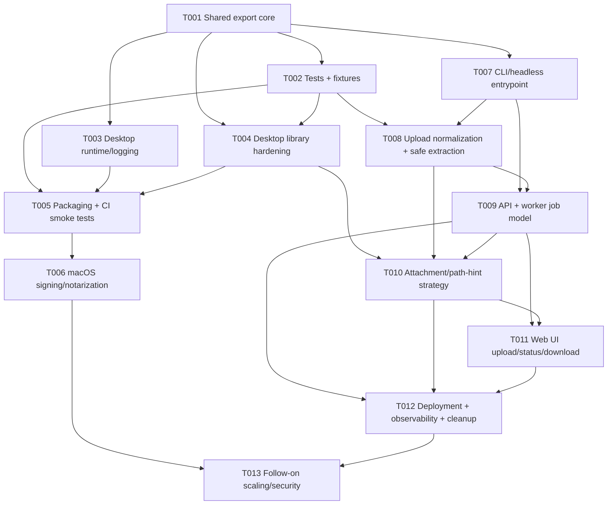

# Plan B: Balanced Implementation Plan for Desktop Hardening + Hosted Web Port

**Date:** 2026-03-18
**Planning stance:** Balanced — comprehensive refactor where justified, moderate risk, significant improvements, some architectural evolution
**Recommended timeline:** 6-8 weeks for MVPs across both goals, plus 2-4 additional weeks for follow-on hardening
**Overall recommendation:** Proceed with a shared-core refactor that preserves the current desktop app while introducing a production-realistic hosted service as a separate runtime boundary.

---

## Executive summary

This balanced plan treats the initiative as **two linked tracks with one shared foundation**:

- **Goal A:** harden the existing desktop app for Windows 10/11, macOS Intel, macOS Apple Silicon, and optional Linux, while improving packaging, artifact verification, and release operations.
- **Goal B:** launch a hosted web-based port that accepts an EndNote folder, `.zip`, or `.enlp` plus an optional path hint and returns downloadable Zotero-compatible XML.

The key research conclusion is that the repository already contains a **valuable reusable export engine**, but it is currently wrapped in desktop-local assumptions:

- local filesystem input/output
- native file dialogs
- shared local logs/comparison files
- absolute local PDF paths in XML
- optimistic `.enlp` directory handling

A conservative plan would patch the desktop app and postpone the hosted port architecture. An aggressive plan would rewrite the codebase into a new service-first or multi-package system. This balanced plan instead recommends:

1. **Extract a runtime-neutral export core** from the current desktop-first flow.
2. **Preserve the Tkinter app** as the desktop adapter and keep PyInstaller as the packaging path.
3. **Add a CLI/service boundary** so the same export engine can power both desktop and hosted workflows.
4. **Build Goal B as an API + worker service**, not as a synchronous HTTP wrapper around the current GUI-era code.
5. **Use a production-realistic MVP** for Goal B: asynchronous jobs, temporary extracted workspaces, structured results, XML download artifacts, and explicit attachment/path-hint policy.

This is the best risk/reward balance because it removes the biggest architectural blocker once, improves desktop quality meaningfully, and avoids a destabilizing rewrite.

---

## Recommended architecture

### Shared foundation

Refactor the existing code into a shared export pipeline with these responsibilities:

- **runtime config / logging**
- **library normalization** (`.enl`, `.enlp`, extracted archives, path validation)
- **SQLite extraction**
- **record mapping + XML generation**
- **attachment policy**
- **structured export result reporting**

### Goal A runtime boundary

Continue shipping the desktop app as:

- `gui.py` (or a thin desktop entrypoint replacement)
- PyInstaller-built binaries for:
  - Windows 10/11
  - macOS Intel + Apple Silicon via Universal2
  - Linux best-effort artifact

### Goal B runtime boundary

Build the hosted service as:

- **FastAPI API** for upload, status, and download
- **background worker** for extraction + export jobs
- **temp workspace per job** for uploaded content
- **short-lived output artifact** for downloadable XML
- **small web UI** (server-rendered or lightweight frontend) for folder/archive upload, status, and download

### Attachment/path-hint policy for Goal B

For the hosted MVP, treat the path hint as **output metadata only**, never as a server path to access.

Recommended policy:

- if PDFs are present in the uploaded library, validate them inside the extracted workspace
- emit `pdf-urls` using the supplied path hint as a client-side base path rewrite when possible
- if the hint is missing or attachment paths cannot be mapped safely, omit the `pdf-urls` entry and return a warning in the job result
- do **not** expose server-local absolute paths in XML

This preserves usefulness without leaking server filesystem details.

---

## MVP and follow-on phases

### Goal A MVP

- consistent runtime/logging behavior between GUI and export core
- hardened `.enl` / `.enlp` / `.Data` resolution
- structured export results with accurate success/skip counts
- automated tests for path handling and representative export fixtures
- release smoke tests for Windows, macOS, and Linux
- clearer support policy and release documentation

### Goal A follow-on

- macOS Developer ID signing, notarization, and stapling
- optional Windows code signing
- stronger packaged-app smoke tests
- optional Linux packaging improvements (AppImage or tarball polish)

### Goal B MVP

- shared export core callable headlessly
- upload intake for `.zip` and `.enlp`
- browser folder upload supported by packaging selected folders client-side before upload
- background job processing
- downloadable XML artifact
- path hint support for attachment path rewriting
- short-lived temp storage + cleanup
- minimal operator-facing observability and failure reporting

### Goal B follow-on

- object storage for artifacts
- per-job container isolation
- auth / rate limiting / quotas
- richer status UI and admin visibility
- optional attachment manifest or bundle export
- multi-instance worker scaling

---

## Task breakdown

| ID | Goal | Task | Description | Dependencies | Est. effort | Risk |
|---|---|---|---|---|---|---|
| T001 | Shared | Extract shared export core and runtime config | Split the current monolithic export flow into runtime config, library normalization, export service, XML serialization, and structured result objects while preserving current public behavior. | — | 3-4 days | Medium |
| T002 | Shared | Add automated test harness and fixtures | Introduce `pytest`-style tests, small deterministic fixtures, XML regression checks, and cross-platform path tests. Clarify current ambiguous `.enlp` fixture behavior. | T001 | 2-3 days | Medium |
| T003 | Goal A | Unify desktop runtime paths, logging, and result reporting | Remove GUI/core log path divergence, stop using log-file scraping as the warning API, and surface accurate exported/skipped/warning counts to the desktop UI. | T001 | 2-3 days | Medium |
| T004 | Goal A | Harden desktop library detection and export correctness | Consolidate `.enlp` resolution, strengthen `.Data` lookup, validate DB layout, and ensure desktop export remains robust on Windows/macOS/Linux filesystems. | T001, T002 | 2-3 days | Medium |
| T005 | Goal A | Improve packaging, CI smoke tests, and artifact policy | Add build verification after PyInstaller, verify packaged launch/export smoke paths, align artifact naming, and clarify Linux support as best-effort if needed. | T002, T003, T004 | 2-3 days | Medium |
| T006 | Goal A | Add macOS signing/notarization release ops | Add optional but production-ready Developer ID signing, notarization, stapling, CI secret handling, and release runbook updates. | T005 | 3-5 days | High |
| T007 | Shared / Goal B | Add CLI/headless service entrypoint | Introduce a non-GUI entrypoint that the worker and future operators can invoke without Tkinter or local save dialogs. | T001 | 1-2 days | Low |
| T008 | Goal B | Build upload normalization and safe workspace extraction | Accept archive/package uploads, reconstruct a canonical extracted workspace, validate structure, reject unsafe archives, and prepare normalized input for the shared export core. | T001, T002, T007 | 4-5 days | High |
| T009 | Goal B | Create API + worker job model | Add asynchronous job creation, status tracking, background execution, structured result metadata, and XML artifact lifecycle. | T007, T008 | 3-4 days | Medium |
| T010 | Goal B | Implement hosted attachment/path-hint strategy | Apply the path hint as metadata-only output rewriting, omit unsafe path output, and return warnings when attachment mapping is incomplete. | T004, T008, T009 | 2-3 days | Medium |
| T011 | Goal B | Build web upload/download UI | Add a small hosted UI for folder/`.zip`/`.enlp` upload, progress/status, error messaging, and XML download. Folder upload should normalize to archive upload at the client boundary for MVP. | T009, T010 | 3-4 days | Medium |
| T012 | Goal B | Deployment, observability, cleanup, and production hardening | Add deployment manifests/config, TTL cleanup, request/job logging, metrics, alerting basics, rate limits, and operator runbooks. | T009, T010, T011 | 4-5 days | Medium |
| T013 | Follow-on | Scale and security hardening phase | Add object storage, per-job isolation/containerization, auth, quotas, richer admin tooling, and optional attachment bundle features. | T006, T012 | 4-7 days | Medium |

### Critical path

The critical path is:

**T001 → T002 → T008 → T009 → T010 → T011 → T012**

That path delivers the hosted MVP while keeping desktop hardening in sync via T003-T006.

---

## Dependency graph

---

## Files to modify / create

This balanced plan assumes the repo remains a single codebase, but evolves from a flat desktop utility into a small shared-core + adapters layout.

### Existing files to modify

- `endnote_exporter.py`
  - reduce to compatibility wrapper or thin composition layer
  - migrate reusable logic into smaller modules
- `gui.py`
  - consume structured export results instead of reading logs for warnings
  - keep desktop UI thin
- `platform_utils.py`
  - retain platform-specific path helpers; possibly add or consolidate normalization helpers
- `pyproject.toml`
  - add test/runtime dependencies for the new service and test harness
  - add CLI/script entrypoints
- `README.md`
  - correct stale run instructions
  - split desktop usage from hosted-service usage
  - clarify Linux support level
- `.github/workflows/release.yml`
  - add lint/test/smoke-test gates and optional signing/notarization steps

### New shared-core files/directories to create

- `runtime_config.py` — canonical runtime paths, log locations, temp directories, environment settings
- `export_service.py` — headless export orchestration returning structured results
- `library_bundle.py` — normalized library/workspace model
- `attachment_policy.py` — desktop vs hosted attachment output strategies
- `models.py` or `export_models.py` — result dataclasses / typed models
- `cli.py` — headless entrypoint for desktop automation and worker use
- `exceptions.py` — focused domain exceptions

### New test files/directories to create

- `tests/unit/test_platform_utils.py`
- `tests/unit/test_library_bundle.py`
- `tests/unit/test_attachment_policy.py`
- `tests/integration/test_export_enl.py`
- `tests/integration/test_export_enlp.py`
- `tests/integration/test_xml_regression.py`
- `tests/release/test_packaged_smoke.py`
- `tests/fixtures/...` for minimal representative `.enl` / `.enlp` / XML fixtures

### New hosted-service files/directories to create

- `web/app.py` — API application entrypoint
- `web/api/routes/jobs.py` — upload/status/download endpoints
- `web/services/uploads.py` — upload intake and validation
- `web/services/extraction.py` — safe extraction and workspace preparation
- `web/services/jobs.py` — job orchestration and result persistence
- `web/worker.py` — background worker entrypoint
- `web/storage.py` — temp artifact and optional object storage abstraction
- `web/templates/` or `web/static/` — lightweight upload/status/download UI
- `deployment/` — deployment config, environment examples, cleanup/ops scripts
- `docs/platform-and-web-port/ops/` — release and hosted-service runbooks

---

## Wave plan

### Wave 1 — Shared foundation

- T001 Shared export core and runtime config
- T002 Test harness and fixtures
- T007 CLI/headless entrypoint

**Outcome:** reusable export engine with tests and a non-GUI boundary.

### Wave 2 — Desktop hardening MVP

- T003 Desktop runtime/logging/result cleanup
- T004 Desktop library detection hardening
- T005 Packaging + CI smoke tests

**Outcome:** higher-confidence desktop binaries with clearer behavior across supported platforms.

### Wave 3 — Hosted MVP

- T008 Upload normalization + safe extraction
- T009 API + worker jobs
- T010 Attachment/path-hint strategy
- T011 Web UI

**Outcome:** hosted service that can process uploads safely and return downloadable XML.

### Wave 4 — Production polish

- T006 macOS signing/notarization
- T012 Deployment/observability/cleanup

**Outcome:** stronger release and hosted production readiness.

### Wave 5 — Follow-on scale/security

- T013 Follow-on scaling/security features

**Outcome:** operational maturity once real usage patterns are known.

---

## Risk assessment

### Overall risk profile

| Area | Risk | Why |
|---|---|---|
| Shared-core refactor | Medium | Existing logic is valuable but concentrated in one large module; careful extraction is needed to avoid regressions. |
| Desktop compatibility | Medium | Path/layout fixes are straightforward, but frozen-mode behavior and Tkinter packaging can still surprise. |
| macOS signing/notarization | High | Operationally sensitive, certificate-driven, and dependent on Apple Developer assets and CI secret handling. |
| Hosted upload normalization | High | Untrusted archive handling, `.enlp` ambiguity, and workspace safety are the hardest new technical surface. |
| Hosted job system | Medium | Standard architecture, but requires careful cleanup, structured results, and concurrency-safe behavior. |
| Attachment/path-hint behavior | Medium | Product policy matters as much as code; the wrong default will either confuse users or leak server internals. |
| Linux binaries | Low-Medium | Best handled as best-effort to avoid blocking Windows/macOS quality. |

### Top mitigation strategies

1. Keep the current module-level `export_references_to_xml(...)` wrapper until the new core is proven.
2. Introduce regression fixtures before large refactors.
3. Gate Goal B behind a separate runtime and deployment boundary so desktop shipping is not blocked by web work.
4. Treat archive extraction and SQLite parsing as isolated job work, not inline API logic.
5. Make macOS signing optional-by-configuration at first, but design the workflow so it can become the primary release path.

---

## Pros and cons vs other approaches

### Compared with a conservative plan

**Pros**
- avoids duplicated desktop/web logic by extracting the shared core early
- creates a real path to Goal B instead of accumulating desktop-only fixes
- adds better tests, CI, and structured result handling
- improves release quality materially rather than cosmetically

**Cons**
- more upfront effort than targeted desktop fixes
- higher initial refactor risk
- requires some repo structure growth and additional dependencies

### Compared with an aggressive plan

**Pros**
- preserves the existing desktop app and release motion
- avoids a full rewrite of XML mapping logic that already works
- smaller blast radius and faster MVP delivery
- less operational complexity than introducing a heavy frontend or total package reorg

**Cons**
- the legacy module will still exist in transitional form for a while
- the hosted UI may be intentionally simple rather than highly polished
- some deeper architectural cleanup is deferred to follow-on phases

### Why this balanced plan wins

It addresses the root cause identified in the research — **the exporter is reusable, but its runtime contract is too local-disk-shaped** — without discarding the current desktop product or overcommitting to a rewrite.

---

## Testing strategy

### Shared-core tests

- unit tests for path normalization, `.Data` lookup, `.enlp` resolution, and attachment policy
- fixture-based tests for representative `.enl` and `.enlp` layouts
- XML regression tests using deterministic approved outputs and the existing comparison utility where practical
- structured export result tests verifying total/exported/skipped/warnings counts

### Goal A tests

- desktop integration tests for `.enl` and `.enlp` export
- platform-aware path tests:
  - Windows localized Documents
  - Linux XDG Documents
  - case-sensitive `.Data` lookup
  - paths with spaces / non-ASCII characters
- PyInstaller smoke tests on CI artifacts
- manual release checklist for:
  - Windows 10/11
  - macOS Intel
  - macOS Apple Silicon
  - Linux best-effort launch/export

### Goal B tests

- safe archive extraction tests:
  - traversal rejection
  - oversized archive rejection
  - malformed layout rejection
- upload normalization tests for `.zip`, `.enlp`, and browser-folder upload flow
- API integration tests for upload → process → status → download
- worker/job cleanup tests
- path-hint rewriting tests ensuring the hint is metadata-only and never used as a server filesystem path
- observability tests for structured warnings/failures

### CI quality gates

**Pull requests / pushes**
- lint
- format check
- type check
- unit + integration tests

**Release tags**
- full test suite
- PyInstaller build matrix
- packaged smoke tests
- optional signing/notarization
- artifact publish only after verification passes

---

## Rollback plan

### Rollback principles

- preserve the existing desktop entrypoint until the new shared core is stable
- ship Goal B as a separate deployment boundary so it can be disabled independently
- avoid irreversible migrations in MVP phases

### Wave-specific rollback

#### Wave 1 rollback

If shared-core extraction causes regressions:

- keep `endnote_exporter.py` as the authoritative implementation
- revert extracted modules while preserving test fixtures
- retain new tests that still reflect valid current behavior

#### Wave 2 rollback

If desktop hardening or packaging changes fail:

- revert to the last known-good PyInstaller workflow
- keep smoke tests even if some refactor changes are rolled back
- ship Windows/macOS first and mark Linux artifacts temporarily unavailable rather than blocking releases

#### Wave 3 rollback

If the hosted MVP has correctness or operational issues:

- disable upload UI and API routes without affecting desktop code paths
- retain CLI/shared-core work, which remains useful for future retries
- delete temp artifacts/jobs and redeploy with the hosted runtime turned off

#### Wave 4 rollback

If signing/notarization or deployment hardening causes release issues:

- fall back to unsigned desktop artifacts while keeping the release runbook updates
- revert deployment-specific changes separately from shared-core logic

#### Data rollback posture for Goal B

- use ephemeral temp workspaces by default
- apply TTL cleanup to uploaded files and generated XML artifacts
- do not persist uploads long-term in MVP
- store minimal metadata needed to report job status and failure reasons

---

## Recommended delivery order

1. **Start with T001 + T002** so later work has a safer foundation.
2. **Deliver T003-T005** to raise desktop confidence quickly.
3. **Add T007-T011** to reach the hosted MVP without contaminating the desktop runtime.
4. **Implement T006 and T012** once the desktop and hosted MVPs are working end-to-end.
5. **Schedule T013 only after real-world usage validates the MVP assumptions.**

---

## Definition of done

This plan is considered successfully implemented when:

### Goal A

- desktop exports behave consistently on Windows 10/11 and macOS Intel/Apple Silicon
- Linux builds are explicitly supported as best-effort or validated to the chosen support bar
- packaging and release artifacts are smoke-tested automatically
- documentation matches reality for run instructions, support policy, and release behavior
- macOS signing/notarization is either operational or clearly documented as an optional follow-on path

### Goal B

- a hosted user can upload a folder/`.zip`/`.enlp`, provide a path hint, and download XML
- uploads are processed in isolated temp workspaces with cleanup
- the exporter runs headlessly through the shared core
- attachment handling is explicit, safe, and documented
- job results expose success, skipped records, warnings, and download availability

---

## Final recommendation

Choose this balanced plan.

It delivers the biggest practical improvement per unit of risk:

- **desktop quality goes up meaningfully**
- **hosted delivery becomes realistic**
- **the existing export engine is reused instead of rewritten**
- **the repo evolves, but does not explode into needless complexity**

In short: extract the core, harden the desktop path, ship a worker-based hosted MVP, and reserve full-scale platform/service polish for follow-on waves.
