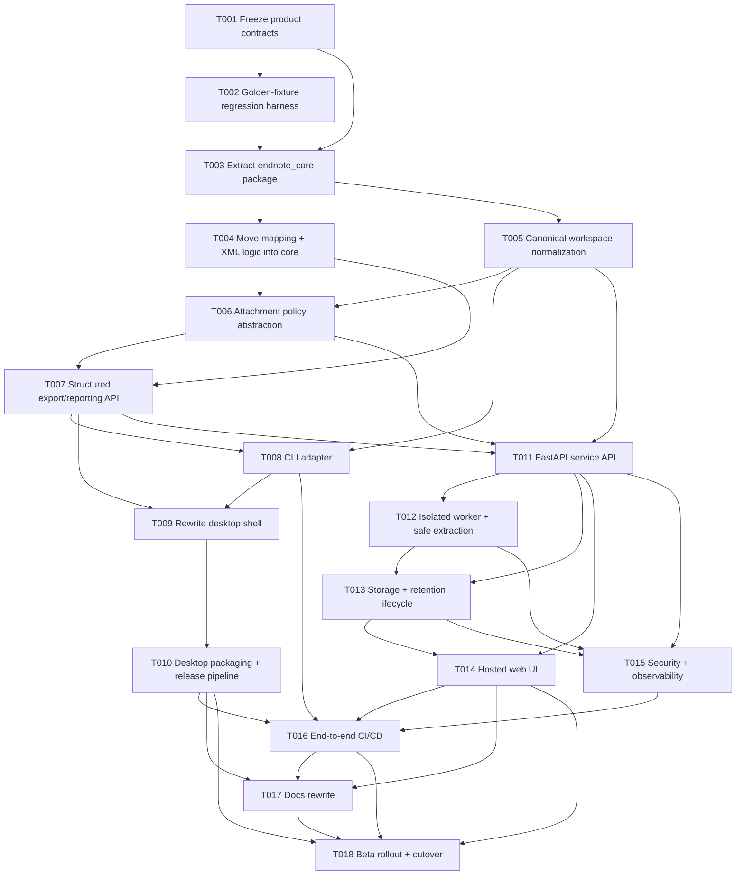

# Plan C: Aggressive Platform + Web Port Re-architecture

**Initiative:** Platform and Web Port
**Date:** 2026-03-18
**Planning stance:** High ambition / high reward
**Overall risk:** High
**Overall effort:** 75-105 engineer-days (roughly 12-18 weeks for 1 engineer, or 5-8 weeks for a small parallel team)

---

## Executive summary

This plan treats the current repository as the seed of a **multi-surface product**, not just a small desktop script. The aggressive approach is to split the system into three clean layers:

1. **Shared core library** for EndNote parsing, workspace normalization, export rules, attachment policy, and structured results
2. **Modern desktop shell** for Windows/macOS first, optional Linux second
3. **Hosted web service** with upload normalization, isolated workers, downloadable XML artifacts, and a dedicated web UI

The current codebase already contains a reusable transformation heart in `endnote_exporter.py`, but the research shows that it is wrapped in local-disk assumptions, shared logging side effects, GUI-only flows, and desktop-only PDF path semantics. This plan resolves that by intentionally re-architecting around a transport-neutral export core.

### Recommended end state

- `endnote_exporter.py` becomes legacy-compatible or is retired after parity is achieved
- desktop UI moves off Tkinter to a modern shell with better packaging ergonomics
- desktop and hosted service both call the same Python core
- upload safety, archive extraction, retention, and attachment handling become first-class product decisions
- Windows 10/11 and macOS Intel/Apple Silicon become first-class release targets
- Linux remains best-effort and is added only after Windows/macOS are stable

### Why this plan is aggressive

Compared with a conservative or balanced plan, this approach is willing to:

- replace the current desktop shell
- introduce a package-based repo structure
- define an explicit API/service model for hosted processing
- add queue/worker isolation for untrusted uploads
- separate attachment policy from export logic
- invest in signing/notarization and artifact smoke testing

The payoff is that Goal A and Goal B stop fighting each other. Instead of bolting web behavior onto a desktop utility, both surfaces are built on the same reusable core.

---

## Target architecture

### Proposed repository shape

```text
endnote-exporter/
├── packages/
│   └── endnote_core/
│       ├── pyproject.toml
│       └── src/endnote_core/
│           ├── __init__.py
│           ├── models.py
│           ├── errors.py
│           ├── runtime.py
│           ├── workspace/
│           │   ├── normalize.py
│           │   ├── inspect.py
│           │   └── attachments.py
│           ├── sources/
│           │   ├── enl.py
│           │   ├── enlp.py
│           │   └── zip_bundle.py
│           ├── db/
│           │   ├── client.py
│           │   └── queries.py
│           ├── export/
│           │   ├── service.py
│           │   ├── mapping.py
│           │   ├── xml_writer.py
│           │   └── policies.py
│           └── compare/
│               └── xml_compare.py
├── apps/
│   ├── desktop/
│   │   ├── pyproject.toml
│   │   └── src/endnote_desktop/
│   │       ├── main.py
│   │       ├── app.py
│   │       ├── state.py
│   │       ├── views/
│   │       └── services/
│   ├── service/
│   │   ├── pyproject.toml
│   │   └── src/endnote_service/
│   │       ├── main.py
│   │       ├── api/
│   │       ├── jobs/
│   │       ├── storage/
│   │       └── security/
│   └── web/
│       ├── package.json
│       └── src/
│           ├── app/
│           ├── components/
│           └── lib/
├── tests/
│   ├── fixtures/
│   ├── unit/
│   ├── integration/
│   ├── security/
│   ├── desktop/
│   └── web/
├── .github/workflows/
│   ├── core.yml
│   ├── desktop-release.yml
│   └── service-deploy.yml
├── README.md
└── docs/
```

### Architectural boundaries

#### 1. Shared core library

The core library owns:

- `.enl`, `.enlp`, and `.zip` normalization
- case-insensitive `.Data` discovery
- SQLite reads and schema-specific extraction
- record mapping and XML generation
- attachment policies
- structured export result objects
- parity comparison utilities for regression testing

It must **not** own:

- Tkinter, Qt, or web UI concerns
- user file dialogs
- HTTP request/response handling
- cloud storage vendor details
- shared global log files

#### 2. Desktop shell

The desktop shell owns:

- local file selection and UX
- progress UI and error display
- platform-specific defaults for local browsing
- local export mode and optional “path hint” mode
- signed/notarized release packaging

#### 3. Hosted service

The hosted service owns:

- upload intake
- archive inspection and safe extraction
- isolated job execution
- retention and cleanup policies
- status/download APIs
- optional authentication, rate limiting, and abuse protection

#### 4. Web UI

The web UI owns:

- file upload UX
- path hint UX and validation guidance
- progress/status views
- download experience
- privacy/retention messaging

---

## Task breakdown

| ID | Task | Description | Dependencies | Est. effort | Risk | Files to modify / create |
|---|---|---|---|---:|---|---|
| T001 | Freeze product contracts | Write ADRs for supported inputs, attachment policy modes, parity goals, supported OS matrix, and hosted retention/security constraints. | — | 3-4d | High | Create `docs/platform-and-web-port/adrs/*`, update `README.md`, update `docs/platform-and-web-port/research/00_setup.md` |
| T002 | Build golden-fixture regression harness | Create deterministic `.enl`, `.enlp`, and `.zip` fixtures plus golden XML outputs to lock current behavior before refactoring. | T001 | 3-5d | Medium | Create `tests/fixtures/**`, `tests/integration/test_golden_exports.py`, possibly refactor `XMLComparator` out of `endnote_exporter.py` |
| T003 | Extract `endnote_core` package skeleton | Create package structure for runtime-neutral models, errors, export result objects, workspace normalization, and XML services. | T001, T002 | 4-6d | High | Create `packages/endnote_core/**`, update root `pyproject.toml` |
| T004 | Move mapping + XML logic into core | Lift reusable logic from `endnote_exporter.py` into `endnote_core.export.*` without changing output semantics. | T003 | 6-8d | High | Modify `endnote_exporter.py`; create `packages/endnote_core/src/endnote_core/export/{mapping.py,xml_writer.py,service.py}` |
| T005 | Implement canonical workspace normalization | Add one normalization pipeline for raw `.enl`, unpacked `.enlp`, and uploaded `.zip` into a prepared workspace model. | T003 | 5-7d | High | Create `packages/endnote_core/src/endnote_core/workspace/**`, `sources/{enl.py,enlp.py,zip_bundle.py}`; modify `platform_utils.py` or absorb into core |
| T006 | Introduce attachment policy abstraction | Separate desktop absolute-path behavior from hosted “omit”, “rewrite from hint”, and future hosted-URL policies. | T004, T005 | 4-5d | High | Create `packages/endnote_core/src/endnote_core/export/policies.py`; modify mapping/service code |
| T007 | Add structured export/reporting API | Replace tuple return values with structured result objects including exported/skipped counts, warnings, artifacts, and diagnostics. | T004, T006 | 3-4d | Medium | Modify `endnote_exporter.py`, create `packages/endnote_core/src/endnote_core/models.py` |
| T008 | Add CLI adapter over the core | Create a non-GUI CLI entrypoint for parity checks, smoke tests, automation, and hosted-worker reuse. | T005, T007 | 2-3d | Medium | Create `packages/endnote_core/src/endnote_core/__main__.py` or `apps/cli/**`; update docs |
| T009 | Rewrite desktop shell on PySide6 | Replace Tkinter with a modern desktop shell that talks only to the core/CLI-facing service boundary. | T007, T008 | 7-10d | High | Create `apps/desktop/**`; retire or shim `gui.py` |
| T010 | Rebuild desktop packaging and release pipeline | Move from current PyInstaller-only flow to a modern packaging pipeline with per-OS smoke tests, macOS signing/notarization, Windows code signing if available, and Linux best-effort artifacts. | T009 | 6-8d | High | Replace `.github/workflows/release.yml` with split workflows; create installer scripts/specs; update docs |
| T011 | Build FastAPI service API | Implement upload, job status, diagnostics, and download endpoints around the shared core. | T005, T006, T007 | 5-7d | High | Create `apps/service/src/endnote_service/api/**`, `main.py`, service config files |
| T012 | Add isolated worker + safe extraction pipeline | Introduce job execution workers with per-job temp workspaces, archive safety checks, and cleanup hooks. | T011 | 6-8d | High | Create `apps/service/src/endnote_service/jobs/**`, `security/**`, `storage/**` |
| T013 | Add storage, retention, and artifact lifecycle | Implement raw-upload storage, generated XML artifact storage, TTL cleanup, and audit-safe metadata. | T011, T012 | 4-6d | High | Create `apps/service/src/endnote_service/storage/**`, infra/config files |
| T014 | Build hosted web UI | Create a modern web UI for upload, path hint, job progress, error handling, and artifact download. | T011, T013 | 6-8d | Medium | Create `apps/web/**` |
| T015 | Add service security + observability | Add rate limiting, request validation, content limits, job metrics, per-job logs, and operator-visible tracing. | T011, T012, T013 | 4-6d | High | Create `apps/service/src/endnote_service/security/**`, telemetry/config files |
| T016 | Establish end-to-end CI/CD | Add matrix pipelines for core tests, desktop release artifacts, service deploy checks, and web build/test gates. | T008, T010, T014, T015 | 5-7d | High | Create/replace `.github/workflows/{core.yml,desktop-release.yml,service-deploy.yml,web.yml}` |
| T017 | Rewrite user/developer/ops documentation | Refresh README, contributor setup, desktop release operations, hosted service runbooks, privacy/retention docs, and migration notes. | T010, T014, T016 | 3-5d | Medium | Modify `README.md`, `CLAUDE.md`; create `docs/desktop-release.md`, `docs/hosted-service.md`, `docs/privacy-retention.md` |
| T018 | Beta rollout + cutover strategy | Ship desktop beta channel, hosted beta environment, measure parity failures, then cut over surfaces in stages. | T010, T014, T016, T017 | 4-6d | Medium | Create `docs/platform-and-web-port/rollout.md`; modify release docs/workflows |

### Notes on task effort

- Estimates assume the plan is executed carefully with real validation, not just code movement.
- Tasks T004-T006 and T009-T013 are the main critical path.
- Goal A can ship before Goal B **only** if T003-T010 are finished and parity is validated.
- Goal B should not ship before T011-T017 are complete; otherwise the service becomes a file-upload liability with a nicer logo.

---

## Dependency graph



### Critical path

The most likely critical path is:

`T001 -> T002 -> T003 -> T004 -> T006 -> T007 -> T009 -> T010 -> T016 -> T017 -> T018`

For Goal B, the parallel critical path is:

`T001 -> T002 -> T003 -> T005 -> T006 -> T007 -> T011 -> T012 -> T013 -> T015 -> T016 -> T017 -> T018`

---

## Waves of execution

### Wave 1 — lock behavior before surgery

- T001 Freeze product contracts
- T002 Build golden-fixture regression harness
- T003 Extract `endnote_core` package skeleton

**Outcome:** refactor with guardrails rather than good intentions.

### Wave 2 — create the reusable heart

- T004 Move mapping + XML logic into core
- T005 Implement canonical workspace normalization
- T006 Introduce attachment policy abstraction
- T007 Add structured export/reporting API
- T008 Add CLI adapter over the core

**Outcome:** desktop and hosted surfaces now share one real export engine.

### Wave 3 — ship desktop like a product, not a script

- T009 Rewrite desktop shell on PySide6
- T010 Rebuild desktop packaging and release pipeline

**Outcome:** Goal A reaches a modern, supportable, distributable form.

### Wave 4 — build the hosted platform

- T011 Build FastAPI service API
- T012 Add isolated worker + safe extraction pipeline
- T013 Add storage, retention, and artifact lifecycle
- T014 Build hosted web UI
- T015 Add service security + observability

**Outcome:** Goal B becomes an actual hosted service instead of “the desktop app, but through HTTP somehow.”

### Wave 5 — industrialize and roll out

- T016 Establish end-to-end CI/CD
- T017 Rewrite documentation
- T018 Beta rollout + cutover strategy

**Outcome:** usable release trains, operator docs, and a reversible path to adoption.

---

## Files to modify / create

### Existing files likely to be modified

- `endnote_exporter.py` — convert into compatibility shim or progressively retire
- `gui.py` — freeze, shim, or remove after desktop shell replacement
- `platform_utils.py` — either slim into compatibility wrappers or absorb into `endnote_core.workspace`
- `pyproject.toml` — convert from single-app project metadata to workspace/packaging root metadata
- `.github/workflows/release.yml` — replace with split core/desktop/service/web pipelines
- `README.md` — rewrite around desktop + hosted product surfaces
- `CLAUDE.md` — update architecture and dev commands

### Major new directories/files

#### Core package

- `packages/endnote_core/pyproject.toml`
- `packages/endnote_core/src/endnote_core/models.py`
- `packages/endnote_core/src/endnote_core/errors.py`
- `packages/endnote_core/src/endnote_core/runtime.py`
- `packages/endnote_core/src/endnote_core/workspace/normalize.py`
- `packages/endnote_core/src/endnote_core/workspace/inspect.py`
- `packages/endnote_core/src/endnote_core/workspace/attachments.py`
- `packages/endnote_core/src/endnote_core/db/client.py`
- `packages/endnote_core/src/endnote_core/db/queries.py`
- `packages/endnote_core/src/endnote_core/export/service.py`
- `packages/endnote_core/src/endnote_core/export/mapping.py`
- `packages/endnote_core/src/endnote_core/export/xml_writer.py`
- `packages/endnote_core/src/endnote_core/export/policies.py`
- `packages/endnote_core/src/endnote_core/compare/xml_compare.py`

#### Desktop app

- `apps/desktop/pyproject.toml`
- `apps/desktop/src/endnote_desktop/main.py`
- `apps/desktop/src/endnote_desktop/app.py`
- `apps/desktop/src/endnote_desktop/state.py`
- `apps/desktop/src/endnote_desktop/views/*`
- `apps/desktop/src/endnote_desktop/services/*`

#### Hosted service

- `apps/service/pyproject.toml`
- `apps/service/src/endnote_service/main.py`
- `apps/service/src/endnote_service/api/routes.py`
- `apps/service/src/endnote_service/api/schemas.py`
- `apps/service/src/endnote_service/jobs/worker.py`
- `apps/service/src/endnote_service/jobs/executor.py`
- `apps/service/src/endnote_service/storage/artifacts.py`
- `apps/service/src/endnote_service/storage/uploads.py`
- `apps/service/src/endnote_service/security/archive_validation.py`
- `apps/service/src/endnote_service/security/limits.py`
- `apps/service/src/endnote_service/config.py`

#### Web UI

- `apps/web/package.json`
- `apps/web/src/app/*`
- `apps/web/src/components/*`
- `apps/web/src/lib/api.ts`

#### Test assets

- `tests/fixtures/enl/*`
- `tests/fixtures/enlp/*`
- `tests/fixtures/zips/*`
- `tests/fixtures/golden_xml/*`
- `tests/unit/test_workspace_normalization.py`
- `tests/unit/test_attachment_policies.py`
- `tests/integration/test_core_export_parity.py`
- `tests/integration/test_cli_export.py`
- `tests/security/test_zip_traversal.py`
- `tests/security/test_upload_limits.py`
- `tests/desktop/test_desktop_smoke.py`
- `tests/web/test_service_jobs.py`

#### Documentation / operations

- `docs/desktop-release.md`
- `docs/hosted-service.md`
- `docs/privacy-retention.md`
- `docs/platform-and-web-port/rollout.md`
- `docs/platform-and-web-port/adrs/*.md`

---

## Risk assessment

### Overall assessment

This plan is **high risk** because it changes architecture, packaging, UI technology, release workflow, and runtime surfaces at the same time. The risk is justified only if the project truly wants to support both a polished desktop app and a hosted service with shared behavior.

### Primary risks and mitigations

| Risk | Level | Why it matters | Mitigation |
|---|---|---|---|
| Export parity regressions | High | Re-architecting the exporter could subtly change XML output | Lock current behavior with T002 golden fixtures and compare every refactor against them |
| Attachment policy mismatch | High | Goal A wants local path fidelity; Goal B cannot expose server paths | Define attachment modes in T001 and enforce them via T006 policy layer |
| Packaging complexity explosion | High | Desktop shell rewrite plus signing/notarization adds operational load | Ship desktop rewrite behind beta builds first; keep legacy release path available until T010 is stable |
| Hosted upload security | High | Untrusted archives + SQLite files are a real attack surface | Use isolated worker execution, archive validation, strict content limits, and TTL cleanup |
| Repo/tooling sprawl | Medium-High | Moving from one Python app to multi-surface workspace raises maintenance cost | Keep Python core authoritative; add only one web UI and one service stack; document setup clearly |
| Timeline overrun | High | This is a full product evolution, not a patch set | Deliver in waves; allow Goal A to complete before Goal B general availability |
| Team adoption friction | Medium | Contributors used to small scripts may dislike workspace complexity | Preserve compatibility shims and simple local commands for the common path |

### Task-specific risk hotspots

Highest-risk tasks:

- **T004** moving mapping/XML logic without changing output
- **T005** normalizing `.enl`, `.enlp`, and `.zip` into one canonical model
- **T006** attachment policy abstraction
- **T009** desktop shell rewrite
- **T010** packaging/signing/notarization
- **T012** safe archive extraction and isolated worker execution
- **T015** hosted service hardening

---

## Pros / cons vs other approaches

### Compared with a conservative approach

#### Pros

- Solves Goal B properly instead of treating web as an afterthought
- Removes the `endnote_exporter.py` “god file” problem rather than preserving it
- Establishes a long-term architecture with clear boundaries
- Enables modern desktop UX and better packaging discipline
- Makes testing and regression control much stronger

#### Cons

- Much more effort and coordination
- Higher chance of temporary regressions
- Introduces more tooling and repo structure complexity
- Requires operational maturity for hosted service rollout

### Compared with a balanced approach

#### Pros

- Better long-term separation between core, desktop, and hosted service
- Avoids painting the hosted service into a local-filesystem corner
- Creates a true product platform rather than a refactored utility
- Makes future features easier: batch jobs, hosted auth, reusable APIs, alternate UIs

#### Cons

- Slower time to first “done” milestone
- More disruptive to current contributor workflow
- More packaging and deployment surface area to maintain
- Requires product decisions early, especially around attachments and retention

### When this aggressive plan is the right choice

Choose this plan if the project intends to:

- actively support both desktop and hosted products
- invest in signed/distributable desktop binaries
- treat uploads, archives, and hosted processing as first-class product surfaces
- accept a larger initial rewrite cost in exchange for much better future maintainability

### When this plan is the wrong choice

Do **not** choose it if the real goal is simply:

- “make the current desktop app work a bit better cross-platform”, or
- “ship a low-traffic internal web wrapper as quickly as possible”

In those cases, the balanced plan is the better business decision.

---

## Testing strategy

This plan requires a much stronger test strategy than the repo currently has.

### 1. Behavior-locking parity tests

Before major refactors, create fixture-based tests that compare current output against approved golden XML.

Coverage must include:

- `.enl` + sibling `.Data`
- unpacked `.enlp`
- `.zip` containing supported layouts
- cases with PDFs
- cases with non-ASCII paths and metadata
- cases with partial-record failures

### 2. Core unit tests

Add unit coverage for:

- workspace normalization
- `.Data` discovery and case-insensitive lookups
- attachment policies
- XML sanitization and serialization
- structured result/report objects
- schema query adapters

### 3. Core integration tests

Add integration coverage for:

- end-to-end export from prepared workspace to XML string/file
- parity comparison against goldens
- CLI execution behavior
- warning/skipped-record reporting

### 4. Desktop tests

Add desktop-focused validation for:

- local file selection flows
- successful local export flow
- packaged artifact smoke tests on Windows and macOS
- macOS Intel and Apple Silicon artifact verification
- optional Linux smoke tests after Windows/macOS stability

### 5. Hosted service tests

Add service coverage for:

- upload -> normalize -> process -> download lifecycle
- invalid archive rejection
- size and content limits
- status polling and failure reporting
- TTL cleanup behavior
- artifact download permissions and expiry

### 6. Security tests

Add explicit adversarial cases for:

- zip path traversal
- absolute paths inside archives
- over-large extracted size
- too many files
- symlinks or unsupported archive members
- malformed SQLite/db path discovery

### 7. CI/CD quality gates

Minimum required gates:

- lint + format + type checks for Python packages
- unit/integration tests for core on Linux/macOS/Windows where practical
- desktop artifact build + smoke validation on release pipelines
- hosted API tests and web build checks on pull requests
- release promotion only after parity and smoke checks pass

---

## Rollback plan

Because this plan is intentionally disruptive, rollback must be designed from day one.

### Rollback principles

1. **Do not delete the current desktop path too early.** Keep the legacy Tkinter app shippable until the new desktop shell reaches parity.
2. **Keep the legacy exporter callable during the core extraction.** `endnote_exporter.py` should remain as a compatibility shim during transition.
3. **Ship Goal A and Goal B behind separate release channels.** Desktop beta and hosted beta should not block each other unnecessarily.
4. **Prefer additive migration over flag-day replacement.** Old and new entrypoints may coexist temporarily.

### Wave-by-wave rollback

#### Wave 1-2 rollback

If T003-T008 destabilize the export core:

- revert to the last tag where `endnote_exporter.py` owns the full flow
- keep the regression fixtures and tests
- continue shipping the legacy desktop app
- postpone service work until parity gaps are resolved

#### Wave 3 rollback (desktop)

If T009-T010 fail to meet desktop quality:

- continue releasing the legacy Tkinter build for Windows/macOS
- keep the new desktop shell in beta/nightly only
- keep core extraction work if parity is already stable
- decouple packaging/signing work from UI rewrite if needed

#### Wave 4 rollback (hosted service)

If T011-T015 expose unacceptable operational or security risk:

- keep the service private/internal-only
- disable public uploads and retain only desktop releases
- preserve the shared core and CLI, since they still improve desktop and future service viability
- treat the hosted UI as experimental until worker isolation and limits are proven

#### Full rollback trigger conditions

Consider falling back to the balanced plan if any of the following happen:

- golden parity remains unstable after T004-T007
- desktop rewrite materially delays Goal A beyond acceptable timelines
- signing/notarization effort overwhelms the team
- hosted security posture cannot be made acceptable with available time/resources

### Rollback assets to preserve

- release tags for pre-rearchitecture desktop versions
- fixture/golden XML sets
- compatibility wrappers in `endnote_exporter.py` and `gui.py`
- separate beta channels for desktop and hosted surfaces
- migration docs describing old vs new workflows

---

## Recommended decision

This aggressive plan is worth choosing **only if the project is serious about both**:

- a polished, supportable desktop application with high-quality binaries, and
- a real hosted web product that safely handles user uploads and returns dependable exports.

If that is the mission, the best long-term move is to invest in the shared core first, then build the desktop and hosted surfaces on top of it. That is more expensive now, but it prevents Goal B from becoming a brittle wrapper around desktop-era assumptions.

If the project instead wants the fastest route to better desktop compatibility with limited operational burden, the balanced plan remains the more pragmatic choice.
