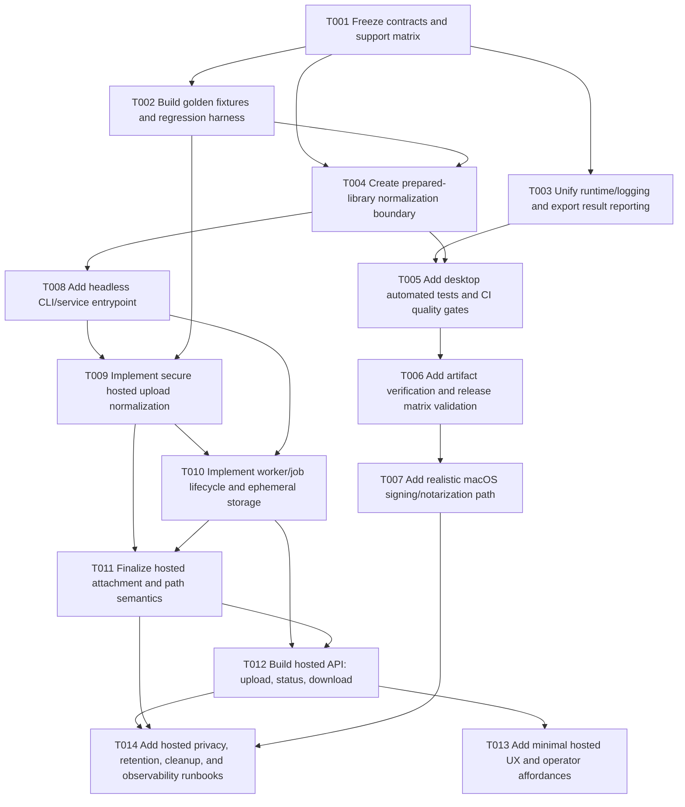

# Platform and Web Port Consolidated Implementation Plan

**Date:** 2026-03-18
**Status:** Proposed consolidated plan
**Scope:** Planning only — no implementation changes included in this document

## Executive Summary

This initiative has two linked goals:

- **Goal A — Desktop / platform / release hardening:** make the existing desktop exporter reliably shippable and supportable on Windows 10/11, macOS Intel, macOS Apple Silicon, and optional Linux, with special attention to artifact verification and realistic macOS signing/notarization operations.
- **Goal B — Hosted web port:** deliver a hosted workflow that accepts a supported EndNote upload shape (`.zip`, `.enlp`, and optionally browser-folder upload normalized at the client boundary), processes the library in an isolated job workspace, and returns Zotero-compatible XML without leaking server-local attachment paths.

### Goals and objectives

1. Preserve and improve the existing desktop product without destabilizing current export behavior.
2. Extract a shared, headless export boundary so desktop and hosted runtimes can reuse the same conversion logic.
3. Add enough testing, fixture coverage, and artifact verification to justify platform-support claims.
4. Design hosted processing around explicit privacy, retention, upload-safety, and attachment-path semantics rather than inheriting desktop-local assumptions.
5. Keep rollback independence: the desktop app must remain releasable even if hosted work is delayed or reverted.

### Chosen approach

**Chosen approach: hybrid strategy**

- **Base architecture:** **Plan B (balanced)**
- **Execution sequencing:** **Plan A (conservative)**
- **Up-front guardrails:** selected **Plan C (aggressive)** elements

In practice, this means:

- adopt **Plan B’s shared-core / headless-boundary / worker-based hosted design**
- execute it with **Plan A’s desktop-first ordering, narrow hosted MVP scope, and rollback isolation**
- add **Plan C’s contract-first discipline and golden-fixture regression harness** before deep refactors
- explicitly **reject Plan C’s desktop UI rewrite and package-tree explosion** for this phase

### Justification from reviews

The reviews converged on the same conclusion:

- **Review 1** recommended a hybrid centered on **Plan B**, explicitly calling for **Plan A’s sequencing discipline** and **Plan C’s contract and golden-fixture safeguards**, while rejecting PySide6 rewrite and major workspace expansion for now.
- **Review 2** also rated **Plan B** as the strongest plan overall, but stressed that it should be narrowed with **Plan A’s desktop-first hardening** and strengthened with **Plan C’s contract-first decisions** on privacy, retention, upload shapes, and attachment semantics.

### Timeline estimate

Estimated delivery for one engineer working mostly sequentially:

- **Phase 0-2 (desktop hardening + shared boundary):** 3-4 weeks
- **Phase 3 (hosted MVP core):** 2-3 weeks
- **Phase 4 (ops hardening, macOS signing path, hosted polish):** 2-3 weeks
- **Total MVP + release-ready hardening:** **7-10 weeks**

Estimated delivery for a small team executing in parallel:

- **4-6 weeks** for MVP-quality desktop hardening plus hosted MVP
- **+2 weeks** if fully automated macOS notarization, stronger hosted observability, and broader verification are required for first release

### Constraints and dependencies

#### Constraints

- The repo is currently a **small desktop-first Python application**, not a service platform.
- The exporter logic is reusable, but its runtime contract is still heavily **local-filesystem-shaped**.
- There is **no first-party automated test suite** yet.
- Current release automation builds artifacts, but does **not** yet provide full artifact smoke verification or macOS signing/notarization.
- Attachment handling currently emits **absolute local PDF paths**, which is acceptable on desktop but unsafe/useless for hosted output.

#### Dependencies

- Representative fixtures for `.enl`, `.enlp`, and zipped inputs
- Agreement on privacy/retention and attachment-policy contracts before Goal B ships
- Apple Developer credentials and release-ops ownership for realistic macOS signing/notarization
- CI capacity to run lint/type/test and packaged smoke verification
- A minimal hosted deployment target with temp storage, cleanup, and job isolation

## Dependency Graph

### Critical path

The likely critical path is:

**T001 → T002 → T004 → T008 → T009 → T010 → T011 → T012 → T014**

Why this path is critical:

- hosted delivery depends on freezing contracts first, especially **attachment behavior**, **upload shapes**, **partial-success semantics**, and **privacy/retention guarantees**
- the hosted path also depends on a true **headless export boundary**, not just desktop wrappers
- worker/job processing, attachment rewriting/omission rules, and operational cleanup are the highest-risk chain for Goal B

A secondary desktop path runs in parallel:

**T001 → T003 → T005 → T006 → T007**

This path is important, but less likely to dominate overall timeline unless Apple signing/notarization operations become the main blocker.

## Wave Planning

### Wave 1 — Contracts and safety rails

These tasks have no implementation dependencies and should start first.

- **T001** Freeze contracts and support matrix
- **T002** Build golden fixtures and regression harness

**Parallelization:** These can run in parallel once initiative scope is approved, with coordination around final fixture definitions and parity criteria.

### Wave 2 — Desktop reliability foundation + shared boundary prep

These depend on Wave 1 outputs and can partly run in parallel.

- **T003** Unify runtime/logging and export result reporting
- **T004** Create prepared-library normalization boundary

**Parallelization:** T003 and T004 can overlap after T001; T004 should consume T002 fixture outputs as soon as they exist.

### Wave 3 — Desktop verification and release quality

These depend on Wave 2.

- **T005** Add desktop automated tests and CI quality gates
- **T006** Add artifact verification and release matrix validation
- **T007** Add realistic macOS signing/notarization path

**Parallelization:** T005 and T006 can run in parallel after T003/T004; T007 should begin discovery in parallel with T006, but final implementation depends on artifact policy and release flow clarity.

### Wave 4 — Hosted core

These establish the real Goal B runtime.

- **T008** Add headless CLI/service entrypoint
- **T009** Implement secure hosted upload normalization
- **T010** Implement worker/job lifecycle and ephemeral storage
- **T011** Finalize hosted attachment and path semantics

**Parallelization:** T009 can begin once T008 is defined and fixture coverage exists; T011 should start as early policy work, but cannot be finalized until T009/T010 prove the practical artifact and path models.

### Wave 5 — Hosted delivery and operations

These finish the hosted MVP and make it supportable.

- **T012** Build hosted API: upload, status, download
- **T013** Add minimal hosted UX and operator affordances
- **T014** Add hosted privacy, retention, cleanup, and observability runbooks

**Parallelization:** T013 can trail T012 and remain intentionally small; T014 should begin drafting early but be finalized after real API/job behavior is known.

## Detailed Task List

### T001 — Freeze contracts and support matrix

- **Dependencies:** None
- **Files to modify/create:**
  - `README.md`
  - `CLAUDE.md`
  - `docs/platform-and-web-port/support-matrix.md` *(new)*
  - `docs/platform-and-web-port/contracts.md` *(new)*
- **Description:**
  - Define the canonical platform support bar for Windows 10/11, macOS Intel, macOS Apple Silicon, and Linux.
  - Freeze MVP hosted input shapes, attachment behavior expectations, privacy/retention constraints, and partial-success semantics.
  - Decide whether Linux is “best effort” or “fully supported” based on actual verification goals.
  - Align docs around one support matrix and one set of product promises.
- **Complexity:** Medium
- **Acceptance criteria:**
  - One authoritative support matrix exists.
  - Hosted upload types and attachment policy modes are explicitly documented.
  - README and maintainer docs no longer conflict on support scope.
  - Partial-success and warning semantics are defined for both desktop and hosted modes.

### T002 — Build golden fixtures and regression harness

- **Dependencies:** T001
- **Files to modify/create:**
  - `pyproject.toml`
  - `tests/fixtures/...` *(new)*
  - `tests/test_xml_regression.py` *(new)*
  - `tests/test_fixture_layouts.py` *(new)*
- **Description:**
  - Create tiny deterministic `.enl`, `.enlp`, and zipped fixtures.
  - Define golden XML outputs or comparator-based approved results.
  - Clarify which `.enlp` layouts are supported and which are expected to fail.
  - Use the harness to lock behavior before refactoring exporter seams.
- **Complexity:** Medium
- **Acceptance criteria:**
  - Approved fixtures exist for at least one supported `.enl`, one supported `.enlp`, and one zipped input scenario.
  - Regression tests fail on unintended XML drift.
  - Unsupported or malformed layouts are explicitly classified.

### T003 — Unify runtime/logging and export result reporting

- **Dependencies:** T001
- **Files to modify/create:**
  - `endnote_exporter.py`
  - `gui.py`
  - `platform_utils.py`
  - `runtime_config.py` *(new, optional if needed)*
- **Description:**
  - Eliminate the current GUI/core disagreement on log locations.
  - Replace log-file scraping as the warning API with structured export result reporting.
  - Ensure desktop success/failure/warning counts reflect reality, including skipped records.
- **Complexity:** Medium
- **Acceptance criteria:**
  - GUI and core use a single runtime/logging policy.
  - Export result includes total, exported, skipped, and warning counts.
  - Desktop UI no longer relies on mismatched log directories to infer success.

### T004 — Create prepared-library normalization boundary

- **Dependencies:** T001, T002
- **Files to modify/create:**
  - `endnote_exporter.py`
  - `platform_utils.py`
  - `library_bundle.py` *(new)*
  - `export_models.py` *(new, optional)*
- **Description:**
  - Consolidate `.enl`, `.enlp`, `.Data`, and DB path resolution into one prepared-library model.
  - Remove duplicated `.enlp` logic and make layout validation explicit.
  - Define the canonical normalized input structure that both desktop and hosted flows will use.
- **Complexity:** Medium
- **Acceptance criteria:**
  - One canonical library-normalization flow exists.
  - `.enlp` handling is no longer duplicated.
  - Prepared-library output includes enough information for both export and attachment handling.

### T005 — Add desktop automated tests and CI quality gates

- **Dependencies:** T003, T004
- **Files to modify/create:**
  - `pyproject.toml`
  - `.github/workflows/ci.yml` *(new or update existing workflows)*
  - `tests/test_platform_utils.py` *(new)*
  - `tests/test_export_paths.py` *(new)*
  - `tests/test_export_flow.py` *(new)*
- **Description:**
  - Add a real automated test suite for path handling, library normalization, export success, and representative failure cases.
  - Add lint/type/test gates for normal development changes.
- **Complexity:** Medium
- **Acceptance criteria:**
  - CI runs lint, type check, and automated tests.
  - Test coverage includes `.Data` lookup, `.enl` / `.enlp` handling, and export-flow validation.
  - Fixture-based regressions are part of normal validation.

### T006 — Add artifact verification and release matrix validation

- **Dependencies:** T005
- **Files to modify/create:**
  - `.github/workflows/release.yml`
  - `testing/smoke_check.py` *(new)*
  - `docs/platform-and-web-port/desktop-release-ops.md` *(new)*
- **Description:**
  - Upgrade release automation from “build artifacts” to “build and verify artifacts.”
  - Add Windows/macOS/Linux smoke validation, artifact naming consistency, and release checklist documentation.
  - Explicitly verify Windows and macOS artifacts before release publication.
- **Complexity:** Medium
- **Acceptance criteria:**
  - Release workflow runs artifact smoke checks before publishing.
  - Windows and macOS artifacts are verified as built, launchable, and minimally functional.
  - Linux artifact status is documented according to support policy.

### T007 — Add realistic macOS signing/notarization path

- **Dependencies:** T006
- **Files to modify/create:**
  - `.github/workflows/release.yml`
  - `docs/platform-and-web-port/macos-signing-notarization.md` *(new)*
- **Description:**
  - Define and implement a realistic macOS release path using manual or secret-gated signing/notarization first, then optional automation.
  - Document certificate ownership, notarization submission/stapling, validation, and fallback procedures.
- **Complexity:** High
- **Acceptance criteria:**
  - A documented manual or gated signing/notarization path exists.
  - Release docs explain unsigned fallback vs signed/notarized release behavior.
  - Validation steps for signed macOS artifacts are documented and reproducible.

### T008 — Add headless CLI/service entrypoint

- **Dependencies:** T004
- **Files to modify/create:**
  - `cli.py` *(new)*
  - `endnote_exporter.py`
  - `pyproject.toml`
- **Description:**
  - Introduce a non-GUI entrypoint that calls the prepared-library/export pipeline.
  - Make the exporter callable for smoke tests, operators, and future hosted workers without Tkinter.
- **Complexity:** Low
- **Acceptance criteria:**
  - A headless entrypoint exists and can process a supported library fixture.
  - Desktop UI remains a thin adapter rather than the only runtime boundary.
  - Hosted components can invoke the exporter without GUI dependencies.

### T009 — Implement secure hosted upload normalization

- **Dependencies:** T002, T008
- **Files to modify/create:**
  - `upload_utils.py` *(new)*
  - `service_models.py` *(new)*
  - `tests/test_upload_normalization.py` *(new)*
  - `tests/test_upload_security.py` *(new)*
- **Description:**
  - Accept the supported hosted upload shapes for MVP.
  - Inspect archives before extraction, reject unsafe members, enforce size/file-count limits, and normalize uploads into a per-job workspace.
  - Treat path hints as metadata, not server filesystem authority.
- **Complexity:** High
- **Acceptance criteria:**
  - Unsafe archives are rejected.
  - Supported uploads normalize into a canonical workspace.
  - Path hints are never used for server-side file access.
  - Abuse-case tests exist for traversal, oversized archives, and malformed layouts.

### T010 — Implement worker/job lifecycle and ephemeral storage

- **Dependencies:** T008, T009
- **Files to modify/create:**
  - `worker.py` *(new)*
  - `job_store.py` *(new)*
  - `tests/test_job_lifecycle.py` *(new)*
  - `.env.example` *(new, if needed)*
- **Description:**
  - Create the hosted execution model: job submission, background processing, per-job temp workspace, structured result persistence, artifact TTL, and cleanup.
  - Keep the first version operationally simple, but concurrency-safe enough for real use.
- **Complexity:** High
- **Acceptance criteria:**
  - Jobs can be submitted, tracked, completed, and cleaned up.
  - Raw uploads, extracted workspaces, and XML artifacts follow explicit TTL/deletion rules.
  - Logging and diagnostics are isolated per job.

### T011 — Finalize hosted attachment and path semantics

- **Dependencies:** T009, T010
- **Files to modify/create:**
  - `attachment_policy.py` *(new)*
  - `endnote_exporter.py`
  - `tests/test_attachment_policy.py` *(new)*
  - `docs/platform-and-web-port/attachment-policy.md` *(new)*
- **Description:**
  - Replace desktop-only absolute attachment-path behavior with explicit hosted modes.
  - Recommended MVP behavior: allow desktop to keep absolute local paths, while hosted mode either rewrites from a metadata-only path hint or omits attachment links and returns warnings.
  - Never expose server-local paths in hosted XML.
- **Complexity:** High
- **Acceptance criteria:**
  - Hosted exports cannot leak server-local absolute paths.
  - Desktop and hosted attachment behavior are explicitly documented.
  - Tests cover missing hints, malformed hints, and partial attachment mapping.

### T012 — Build hosted API: upload, status, download

- **Dependencies:** T010, T011
- **Files to modify/create:**
  - `service_api.py` *(new)*
  - `tests/test_service_api.py` *(new)*
  - `docs/platform-and-web-port/web-mvp-runbook.md` *(new)*
- **Description:**
  - Implement a minimal API for upload, job status, and downloadable XML artifacts.
  - Keep the hosted MVP intentionally narrow and worker-backed.
- **Complexity:** Medium
- **Acceptance criteria:**
  - API supports upload, polling/status, and artifact download.
  - API returns structured success/warning/error metadata.
  - Hosted export runs through the shared headless boundary rather than desktop-specific code.

### T013 — Add minimal hosted UX and operator affordances

- **Dependencies:** T012
- **Files to modify/create:**
  - `web_ui.py` *(new) or minimal templates/static assets*
  - `docs/platform-and-web-port/hosted-ux-notes.md` *(new)*
- **Description:**
  - Add a thin user-facing upload/download experience or minimally acceptable operator-facing surface.
  - Keep this intentionally small: no SPA or major frontend framework required in this phase.
- **Complexity:** Medium
- **Acceptance criteria:**
  - Users can reach the hosted flow without hand-crafting API calls.
  - UX clearly communicates upload limits, retention, warnings, and download behavior.
  - Hosted UI polish cannot block desktop release work.

### T014 — Add hosted privacy, retention, cleanup, and observability runbooks

- **Dependencies:** T011, T012, T007
- **Files to modify/create:**
  - `docs/platform-and-web-port/privacy-retention.md` *(new)*
  - `docs/platform-and-web-port/hosted-operations.md` *(new)*
  - `docs/platform-and-web-port/rollback.md` *(new)*
- **Description:**
  - Document what is uploaded, how long it is retained, what is logged, how cleanup works, how to disable the hosted service, and how operators validate both desktop and hosted releases.
  - Include minimum observability, incident handling, and rollback steps.
- **Complexity:** Medium
- **Acceptance criteria:**
  - Privacy/retention guarantees are documented.
  - Cleanup and rollback procedures exist for hosted operation.
  - Hosted and desktop operational concerns are clearly separated.

## Risk Areas

### Potential conflicts

1. **Desktop stability vs shared-core refactoring**
   - Refactoring exporter seams can destabilize the current desktop flow if done before fixtures and regression tests exist.

2. **macOS signing/notarization optimism**
   - Apple Developer credentials, certificate handling, notarization tooling, and CI secret management can easily take longer than expected.

3. **Hosted attachment/path semantics conflict with desktop expectations**
   - Desktop mode benefits from absolute local paths; hosted mode must never expose server-local paths.

4. **Hosted upload surface vs minimal-ops reality**
   - It is easy to under-scope archive safety, cleanup, retention, concurrency, or abuse controls.

5. **Support-claim drift**
   - Platform support language can get ahead of verification if tests and artifact validation do not land early.

### Mitigation strategies

- Build and approve fixtures before deep refactors.
- Freeze support, privacy, and attachment contracts before Goal B implementation.
- Keep the desktop runtime shippable throughout the initiative.
- Introduce hosted functionality behind a separate runtime boundary and deployment path.
- Start macOS signing discovery early, but keep unsigned fallback documented until signed releases are proven.
- Narrow hosted MVP scope if needed: prefer `.zip` and `.enlp` first, and treat browser-folder upload as a convenience layer rather than a hard backend requirement.

### Rollback procedures

- Preserve the current desktop path until the shared boundary is proven.
- Revert hosted runtime independently from desktop changes.
- Keep a documented unsigned macOS fallback if signing/notarization work is incomplete or unstable.
- Retain fixtures and tests even if later code changes are rolled back.

## Testing Strategy

### Unit tests

- `platform_utils.py` path and extension logic
- prepared-library normalization and `.enlp` resolution
- attachment policy behavior for desktop vs hosted modes
- structured export result generation
- archive validation helpers and size/file-count guards

### Integration tests

- `.enl` export end-to-end using a tiny supported fixture
- `.enlp` export end-to-end using a tiny supported fixture
- zipped-input normalization and export flow
- hosted job lifecycle: upload → normalize → export → download
- regression checks using golden XML or approved comparator output

### End-to-end / smoke tests

#### Desktop

- Windows artifact smoke verification
- macOS artifact smoke verification
- Linux artifact smoke verification according to support policy
- verification that packaged artifacts are buildable, launchable, and minimally usable

#### Hosted

- upload/download flow through the hosted API
- cleanup and TTL behavior
- high-risk abuse cases (traversal, oversize, malformed layout)

### Quality gates

- Run lint, type check, and automated tests on normal development branches.
- Require fixture/regression tests to pass before merge for exporter changes.
- Require Windows/macOS artifact verification before tagged release publication.
- Do not ship Goal B without privacy/retention docs, upload-safety tests, and explicit attachment semantics.

## Progress Tracking Section

| Task ID | Status | Notes | Completed Date |
|---|---|---|---|
| T001 | PENDING | Freeze support matrix, upload policy, attachment semantics, privacy/retention, and partial-success behavior. | |
| T002 | PENDING | Create golden fixtures and regression harness before deep refactors. | |
| T003 | PENDING | Unify runtime/logging policy and structured export result reporting. | |
| T004 | PENDING | Build prepared-library normalization boundary and remove `.enlp` duplication. | |
| T005 | PENDING | Add desktop tests and CI quality gates. | |
| T006 | PENDING | Add artifact verification and release-matrix validation. | |
| T007 | PENDING | Add realistic macOS signing/notarization path and documentation. | |
| T008 | PENDING | Add headless CLI/service entrypoint. | |
| T009 | PENDING | Implement secure hosted upload normalization. | |
| T010 | PENDING | Implement worker/job lifecycle and ephemeral storage. | |
| T011 | PENDING | Finalize hosted attachment/path semantics without leaking server-local paths. | |
| T012 | PENDING | Build hosted API for upload, status, and XML download. | |
| T013 | PENDING | Add minimal hosted UX/operator affordances. | |
| T014 | PENDING | Add hosted privacy, retention, cleanup, observability, and rollback runbooks. | |

## Rollback Plan

### Wave 1 rollback

- Revert contract/support-document changes if they prove incorrect, but preserve historical notes.
- Keep fixture assets where possible, even if parity criteria need revision.

### Wave 2 rollback

- If runtime/logging or prepared-library refactors destabilize desktop exports, revert T003/T004 while keeping new tests to capture the failure mode.
- Preserve current desktop GUI flow as the known-good fallback.

### Wave 3 rollback

- If CI or artifact verification creates release friction, temporarily relax enforcement while keeping tests and smoke scripts in-tree.
- If macOS signing/notarization is not ready, ship via documented unsigned fallback rather than blocking all releases.

### Wave 4 rollback

- If hosted upload normalization or worker processing proves unstable, disable the hosted runtime and revert T009-T011 while keeping the headless CLI boundary if it is already useful for desktop/testing.
- Delete incomplete temp artifacts and revert to desktop-only release mode.

### Wave 5 rollback

- If the hosted API or thin UX causes operational issues, disable upload routes and artifact downloads without touching desktop shipping.
- Roll back hosted deployment independently from repository-level export logic changes.

### Operational rollback concerns

- Hosted uploads may contain sensitive data; rollback procedures must include **artifact and temp-workspace cleanup**.
- Logging and observability must avoid retaining more user data than the privacy contract allows.
- Any failed hosted rollout must leave the desktop release process intact.

### Feature-flag / staged rollout considerations

- Treat the hosted runtime as a separate deployable surface that can be turned off independently.
- Keep hosted MVP scope narrow at first: worker-backed, explicit upload types, explicit retention policy, explicit attachment behavior.
- Keep macOS signing/notarization configurable or gated until it is operationally stable.

## Final recommendation

Proceed with a **hybrid implementation plan**:

1. **Desktop first:** stabilize runtime behavior, testing, packaging, and artifact verification.
2. **Shared boundary second:** extract the minimal prepared-library and headless export seams needed for both runtimes.
3. **Hosted MVP third:** ship a worker-based upload/status/download service with explicit privacy, retention, and attachment semantics.
4. **Ops hardening throughout:** document macOS signing/notarization reality, Windows/macOS artifact verification, and hosted rollback/cleanup from the start.

This gives the initiative the best balance of feasibility, safety, and long-term value while avoiding both under-built hosted behavior and overbuilt platform churn.
