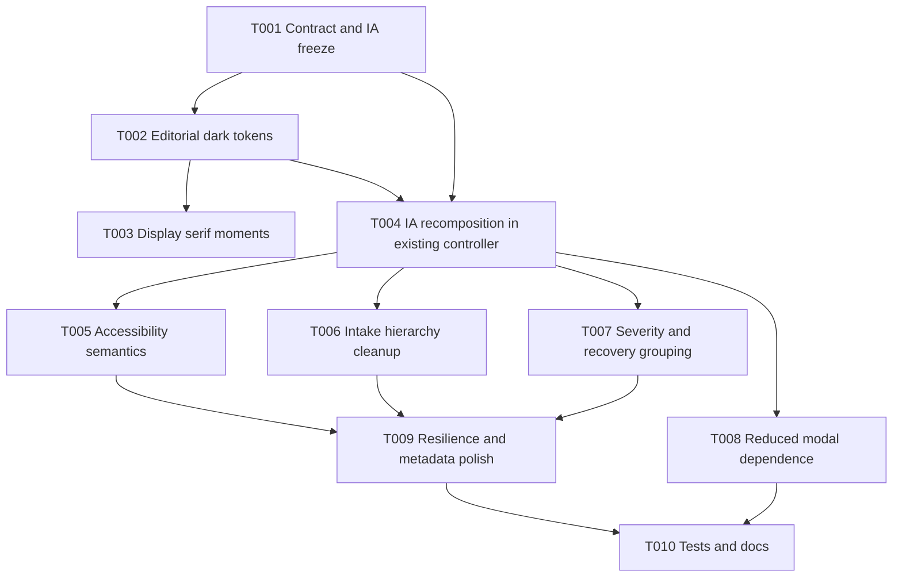

# Plan A — Conservative

## Executive summary

This plan delivers a desktop-first editorial utility refresh with minimal architectural change. It preserves the current frameworkless, controller-centric implementation and limits work to markup reorganization, CSS token/surface revision, accessibility remediation, and targeted interaction improvements.

The plan is appropriate if the primary objective is to replace the current generic dark-glass identity, correct known accessibility and desktop ergonomics gaps, and improve trust/capability messaging without refactoring the current application architecture.

### Approach characteristics

- Minimal file proliferation
- Low structural risk
- Preserves current worker and state contracts
- Accepts continued controller concentration as a temporary trade-off

## Task breakdown

| ID | Title | Effort | Risk | Files to modify |
|---|---|---:|---|---|
| T001 | Freeze redesign contract, IA, and copy hierarchy | 0.5-1 day | Low | `docs/local-web-execution/user-guide.md`, `docs/local-web-execution/support-matrix.md` (reference only for alignment), new implementation notes |
| T002 | Replace dark-glass tokens with editorial dark token set | 1-1.5 days | Low | `web/src/styles.css`, `web/index.html` |
| T003 | Introduce display serif for hero and section entry points only | 0.5 day | Low | `web/index.html`, `web/src/styles.css` |
| T004 | Recompose current markup into target IA inside existing controller | 1-1.5 days | Medium | `web/src/app/controller.ts`, `web/src/styles.css` |
| T005 | Add skip link, status live region, and table caption/description | 0.5-1 day | Low | `web/index.html`, `web/src/app/controller.ts`, `web/src/styles.css` |
| T006 | Tighten upload and attachment-path hierarchy without changing underlying flow | 0.5-1 day | Low | `web/src/app/controller.ts`, `web/src/styles.css` |
| T007 | Improve warnings/errors with explicit severity labels and recovery/help grouping | 0.5-1 day | Medium | `web/src/app/controller.ts`, `web/src/styles.css` |
| T008 | Reduce modal dependence without removing modal review entirely | 1 day | Medium | `web/src/app/controller.ts`, `web/src/styles.css` |
| T009 | Expand resilience polish: reduced motion, zoom, large-text, theme metadata | 0.5-1 day | Low | `web/index.html`, `web/src/styles.css`, `web/src/app/controller.ts` |
| T010 | Update tests and docs to match the refreshed surface | 1-1.5 days | Medium | `web/src/app/controller.test.ts`, `web/tests/e2e/*.ts`, `docs/local-web-execution/*.md` |

## Dependency graph

## Execution notes

### T001 — Freeze redesign contract, IA, and copy hierarchy

- Confirm the target IA: hero/task, workflow strip, trust/proof, results area, recovery/help.
- Confirm non-goals: no hosted-job framing, no novelty navigation, no broad saturated semantics.
- Lock terminology for unsupported, degraded, warning, and recoverable conditions.

### T002 — Replace dark-glass tokens with editorial dark token set

- Retain dark desktop-first baseline.
- Reduce blur and translucency materially.
- Use deep slate/navy base and cool elevated surfaces.
- Reserve teal/cyan for primary action and restrained amber for accent/proof.

### T003 — Introduce display serif for hero and section entry points only

- Add `Playfair Display` or `Newsreader` for hero/section moments only.
- Keep `Inter` for controls, tables, body, metrics, and forms.

### T004 — Recompose current markup into target IA inside existing controller

- Reorder existing sections within `renderApp()` and `renderFileSelection()` / `renderConversionComplete()`.
- Add a workflow strip and a persistent trust/proof block.
- Preserve the current single-file render model.

### T005 — Add skip link, status live region, and table caption/description

- Add skip link in `web/index.html`.
- Add a proper live region for status/progress and result updates.
- Add caption/description to the exported-items table.

### T006 — Tighten upload and attachment-path hierarchy without changing underlying flow

- Keep ZIP-first baseline visually dominant.
- Move direct-folder capability explanation into secondary placement.
- Reframe attachment base path as an advanced/optional enhancement.

### T007 — Improve warnings/errors with explicit severity labels and recovery/help grouping

- Map current warning/error conditions into a simple user-facing taxonomy.
- Create persistent recovery/help guidance that remains visible in degraded states.

### T008 — Reduce modal dependence without removing modal review entirely

- Keep the modal for detailed review but add richer inline summary and preview context so the modal is not the only review affordance.

### T009 — Expand resilience polish

- Broaden reduced-motion handling.
- Verify zoom and large-text behavior.
- Add browser metadata theming (`theme-color`) and improve document polish.

### T010 — Update tests and docs

- Update Playwright expectations for new IA and semantics.
- Update user-facing docs to match the refreshed flow.

## Pros versus other approaches

### Pros

1. Lowest implementation risk.
2. Smallest file churn.
3. Least likely to disturb the existing worker/conversion pipeline.
4. Fastest route to visible UI improvement.

### Cons

1. Preserves `web/src/app/controller.ts` as a structural debt hotspot.
2. Limits how far staged progress and large-result ergonomics can be improved cleanly.
3. Risks a visually improved surface on top of a fragile presentation architecture.
4. Modal-heavy review remains only partially addressed.

## Comparison against other plans

| Criterion | Plan A | Plan B | Plan C |
|---|---|---|---|
| Structural change | Lowest | Moderate | Highest |
| UX improvement ceiling | Moderate | High | Very high |
| Delivery risk | Lowest | Moderate | Highest |
| Suitability for large-result review | Moderate | High | Very high |
| Maintainability improvement | Low | High | Very high |

## Open questions

1. Is it acceptable to preserve the single-file controller if the redesign visibly improves the experience?
2. Should the modal remain as the detailed review container, or is that already too limiting for the target state?
3. Is worker protocol expansion out of scope for a conservative pass?

## Risks

1. The plan may deliver insufficient structural improvement for future iteration.
2. Accessibility fixes may become awkward inside the current string-template architecture.
3. The resulting UI may still feel transitional rather than fully resolved.

## Dependencies

1. Requires no major protocol changes; depends mainly on controller/CSS changes.
2. Depends on careful test updates because current E2E coverage assumes the existing review modal and hierarchy.
3. Depends on maintaining alignment with existing browser-local contract docs.

## Testing strategy

1. Update Playwright smoke and browser-matrix tests for new labels/structure.
2. Add focused coverage for skip link, live region, table caption, and reduced-motion behavior.
3. Re-run existing parity and conversion tests unchanged.
4. Add manual desktop screenshot verification at common viewport sizes and at 200% zoom.

## Rollback plan

1. Revert `web/src/styles.css`, `web/src/app/controller.ts`, and `web/index.html` together as one wave if the refreshed IA degrades usability.
2. Preserve test additions even if visual changes are rolled back, because accessibility assertions remain useful.
3. Revert documentation changes independently if implementation is deferred.
