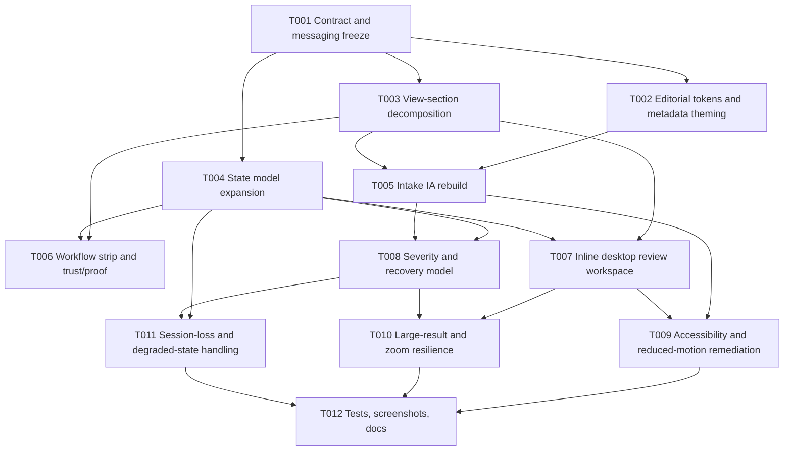

# Plan B — Balanced

## Executive summary

This plan delivers the requested desktop-first editorial utility redesign while performing a moderate presentation-layer refactor. It preserves the existing worker, normalization, and conversion contracts, but decomposes the current controller into smaller view sections, expands state semantics for staged progress and recovery, and replaces modal-dominant review with a primary desktop review workspace.

This plan provides the best balance between UX improvement, maintainability, and delivery risk.

### Approach characteristics

- Moderate structural evolution in the presentation layer
- Retains frameworkless implementation style
- Preserves worker and core conversion boundaries
- Creates room for stronger desktop review ergonomics, severity taxonomy, and staged progress UX

## Task breakdown

| ID | Title | Effort | Risk | Files to modify/create |
|---|---|---:|---|---|
| T001 | Freeze redesign contract, IA, and messaging vocabulary | 0.5-1 day | Low | docs + implementation notes |
| T002 | Introduce editorial token system and browser metadata theming | 1-1.5 days | Low | `web/index.html`, `web/src/styles.css` |
| T003 | Split the controller into view sections / render modules | 1.5-2 days | Medium | `web/src/app/controller.ts`, new `web/src/app/views/*` or similar |
| T004 | Expand state model for staged progress, severity, and recovery metadata | 1-1.5 days | Medium | `web/src/app/state.ts`, `web/src/types/export-result.ts` (if needed) |
| T005 | Rebuild intake IA around one primary action and one secondary capabilities rail | 1-1.5 days | Medium | `web/src/app/controller.ts` or new view files, `web/src/styles.css` |
| T006 | Add workflow strip and persistent trust/proof block | 1 day | Medium | `web/src/app/*`, `web/src/styles.css` |
| T007 | Replace modal-first result review with inline desktop review workspace and optional detail surface | 1.5-2 days | Medium | `web/src/app/*`, `web/src/styles.css` |
| T008 | Implement explicit severity taxonomy and richer recovery/help surfaces | 1 day | Medium | `web/src/app/*`, `web/src/styles.css` |
| T009 | Improve keyboard path, skip link, live status semantics, table caption/description, and reduced-motion behavior | 1-1.5 days | Medium | `web/index.html`, `web/src/app/*`, `web/src/styles.css` |
| T010 | Add large-result review strategy and zoom/large-text resilience | 1-1.5 days | Medium | `web/src/app/*`, `web/src/styles.css` |
| T011 | Add session-loss handling for refresh/interruption and unsupported/degraded capability states | 1-1.5 days | Medium | `web/src/app/state.ts`, `web/src/app/controller.ts`, optionally `web/src/adapters/browser-worker-client.ts` |
| T012 | Update automated tests, screenshot verification, and documentation | 1.5-2 days | Medium | `web/src/app/controller.test.ts`, `web/tests/e2e/*.ts`, `docs/local-web-execution/*.md` |

## Dependency graph

## Execution notes

### T001 — Freeze redesign contract, IA, and messaging vocabulary

- Confirm the requested mood and IA.
- Define severity vocabulary: informational, degraded, warning, recovery required, terminal failure.
- Lock non-goals: no hosted-job framing, no novelty interaction, no false attachment promises.

### T002 — Introduce editorial token system and browser metadata theming

- Replace soft-glass tokens with sharper editorial dark tokens.
- Add browser metadata theming in the document head.
- Add serif display moments with restrained scope.

### T003 — Split the controller into view sections / render modules

- Keep the frameworkless runtime.
- Extract render functions into view modules such as `hero`, `intake`, `workflow`, `results`, `recovery`.
- Leave worker/core pipeline untouched.

### T004 — Expand state model for staged progress, severity, and recovery metadata

- Add explicit stage semantics beyond `converting`.
- Add state slots for capability degradation, recovery guidance, and session-loss markers.

### T005 — Rebuild intake IA around one primary action and one secondary capabilities rail

- Make ZIP-first the visually dominant CTA.
- Move folder-picker and attachment-link path configuration into secondary rail or advanced controls.
- Clarify unsupported/degraded capability states without cluttering the main action surface.

### T006 — Add workflow strip and persistent trust/proof block

- Introduce a visible workflow strip showing preparation/conversion/review/export stages.
- Add a proof block communicating local processing, supported baseline, attachment policy, and desktop fallback.

### T007 — Replace modal-first result review with inline desktop review workspace and optional detail surface

- Promote results to a primary desktop area.
- Use a non-blocking detail surface (drawer, expandable panel, or secondary dialog only when necessary).
- Support large-result review better than the current modal table.

### T008 — Implement explicit severity taxonomy and richer recovery/help surfaces

- Map warning and error codes into a controlled semantic model.
- Surface trust-preserving recovery actions and degraded-state messaging.

### T009 — Accessibility and reduced-motion remediation

- Add skip link, live status semantics, captioned table/list, keyboard-first review flow, and broader reduced-motion handling.

### T010 — Large-result and zoom resilience

- Make review surfaces resilient at desktop widths, 200% zoom, and enlarged text.
- Introduce layout rules that preserve action visibility and reading order for larger result sets.

### T011 — Session-loss and degraded-state handling

- Add explicit behavior for refresh interruption, lost in-memory state, and recoverable versus non-recoverable outcomes.
- Avoid storing sensitive data beyond what the local-only contract allows.

### T012 — Tests, screenshots, and documentation

- Update E2E tests to the new IA.
- Add accessibility and resilience assertions.
- Update browser-local user-guide/troubleshooting copy to match the new flow.

## Pros versus other approaches

### Pros

1. Meaningful maintainability improvement without a full rewrite.
2. High fit for the requested desktop-first IA.
3. Stronger path to large-result review and staged progress.
4. Preserves the proven worker/core pipeline.

### Cons

1. Requires moderate refactor and test churn.
2. Slower than a surface-only restyle.
3. Requires disciplined scope control to avoid drifting into Plan C.

## Comparison against other plans

| Criterion | Plan A | Plan B | Plan C |
|---|---|---|---|
| Structural change | Low | Moderate | High |
| UX improvement ceiling | Moderate | High | Very high |
| Delivery risk | Low | Moderate | High |
| Maintainability improvement | Low | High | Very high |
| Compatibility with current pipeline | High | High | Medium |

## Open questions

1. Should the results workspace use a table, card-list, or hybrid split-view model on desktop?
2. Does staged progress require worker protocol changes, or can state expansion alone produce sufficiently honest UX?
3. Should session-loss handling preserve only descriptive state or also derived results where feasible?
4. How far should the view decomposition go before diminishing returns begin?

## Risks

1. Moderate file churn may create short-term instability in controller behavior and E2E tests.
2. Inline results workspace design choices may underperform if large-result strategy is underspecified.
3. State-model expansion may become inconsistent if severity/progress vocabulary is not frozen early.
4. Scope creep toward full component-system redesign may threaten schedule.

## Dependencies

1. Depends on moderate presentation-layer refactoring under `web/src/app/`.
2. Depends on updated test coverage and documentation in the same delivery sequence.
3. Session-loss or staged-progress work may depend on optional changes to worker messaging.

## Testing strategy

1. Preserve existing conversion/parity unit tests unchanged where possible.
2. Add render-level tests for new view sections and state transitions.
3. Expand Playwright to cover keyboard path, skip link, live status, large-text behavior, and inline results review.
4. Add screenshot verification for the desktop-first dark layout at representative widths.
5. Revalidate browser-matrix baseline and degraded capability messaging.

## Rollback plan

1. Roll back presentation refactor files in one wave while preserving worker/core files.
2. If inline results workspace underperforms, restore modal review temporarily while keeping accessibility and token improvements.
3. Preserve new tests that assert contract-critical semantics even if visual structure is reverted.
4. Revert documentation updates independently if implementation is postponed.
