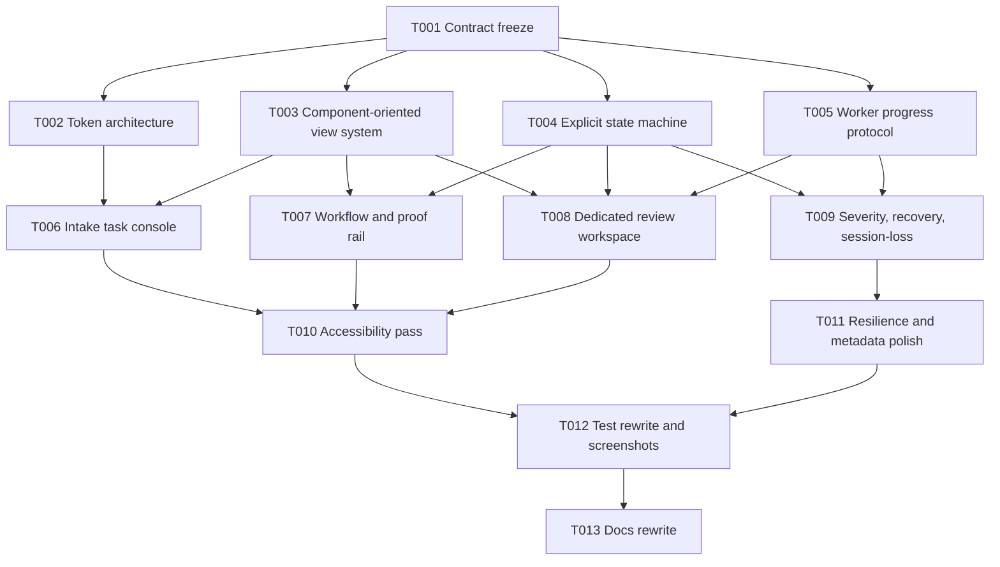

# Plan C — Aggressive

## Executive summary

This plan treats the UI/UX refresh as a full presentation-architecture reset. It introduces a formal internal component system, a more capable state machine, worker-stage progress messaging, a dedicated desktop results workspace, and a design-token architecture that can support future surfaces beyond the current browser-local page.

This plan offers the highest UX ceiling and the strongest maintainability outcome, but it also carries the greatest delivery risk.

### Approach characteristics

- High presentation-layer restructuring
- Explicit state machine and richer worker protocol
- Strongest support for large-result review and resilience features
- Highest test and migration cost

## Task breakdown

| ID | Title | Effort | Risk | Files to modify/create |
|---|---|---:|---|---|
| T001 | Freeze redesign contract, IA, semantic vocabulary, and non-goals | 0.5-1 day | Low | docs + implementation notes |
| T002 | Create design-token architecture and font delivery strategy | 1-1.5 days | Medium | `web/index.html`, `web/src/styles.css`, new token files if desired |
| T003 | Replace monolithic controller with component-oriented view system | 2-3 days | High | `web/src/app/controller.ts`, new `web/src/ui/**/*` or `web/src/app/views/**/*` |
| T004 | Replace simple phase model with explicit state machine | 1.5-2 days | High | `web/src/app/state.ts`, related tests |
| T005 | Extend worker protocol with staged progress and early query-preview events | 1.5-2 days | High | `web/src/types/worker.ts`, `web/src/adapters/browser-worker-client.ts`, `web/src/worker/export-worker.ts` |
| T006 | Rebuild intake and capability messaging as a desktop task console | 1.5 days | Medium | `web/src/ui/**/*`, `web/src/styles.css` |
| T007 | Implement workflow strip, proof rail, and supported/degraded capability matrix in the UI | 1-1.5 days | Medium | `web/src/ui/**/*`, `web/src/styles.css` |
| T008 | Build dedicated desktop review workspace with scalable result handling | 2-3 days | High | `web/src/ui/**/*`, `web/src/styles.css`, optionally helper modules |
| T009 | Implement severity taxonomy, structured recovery center, and session-loss model | 1.5-2 days | High | `web/src/app/state.ts`, `web/src/ui/**/*`, maybe storage helpers |
| T010 | Full accessibility pass: skip link, live status, semantic review regions, keyboard-first navigation | 1-1.5 days | Medium | `web/index.html`, `web/src/ui/**/*`, `web/src/styles.css` |
| T011 | Full resilience pass: reduced motion, zoom, large text, browser metadata theming | 1 day | Medium | `web/index.html`, `web/src/styles.css` |
| T012 | Rewrite tests around new architecture and add screenshot-based validation | 2-3 days | High | `web/src/**/*.test.ts`, `web/tests/e2e/*.ts` |
| T013 | Rewrite user docs and release verification guidance for the new experience | 1 day | Medium | `docs/local-web-execution/*.md`, `README.md` |

## Dependency graph

## Execution notes

### T003 — Replace monolithic controller with component-oriented view system

- Introduce a clear view architecture under new files.
- Keep frameworkless rendering if desired, but formalize section boundaries.
- Remove string-template concentration from the current controller.

### T004 — Replace simple phase model with explicit state machine

- Model preparation, query preview, conversion, degraded success, terminal failure, review-ready, export-ready, and session-loss states explicitly.

### T005 — Extend worker protocol with staged progress and early query-preview events

- Emit progress/state events from the worker.
- Allow the UI to show honest staged feedback rather than a generic spinner.

### T008 — Build dedicated desktop review workspace with scalable result handling

- Replace the current modal with a first-class workspace.
- Add scalable result handling for larger libraries (filtering, chunking, or progressive rendering).

### T009 — Severity, recovery, and session-loss model

- Implement controlled semantic categories.
- Add explicit guidance for lost state and interrupted sessions.

## Pros versus other approaches

### Pros

1. Strongest long-term maintainability outcome.
2. Strongest fit for desktop-first results review and staged progress.
3. Best foundation for future UI iteration and richer features.
4. Most complete response to the task’s additional planning targets.

### Cons

1. Highest implementation and migration cost.
2. Highest risk of destabilizing the currently working UI.
3. Largest test rewrite burden.
4. Most likely to exceed a narrowly scoped refresh budget.

## Comparison against other plans

| Criterion | Plan A | Plan B | Plan C |
|---|---|---|---|
| Structural change | Low | Moderate | High |
| UX ceiling | Moderate | High | Very high |
| Delivery risk | Low | Moderate | High |
| Test churn | Low | Moderate | High |
| Future extensibility | Low | High | Very high |

## Open questions

1. Is a full state-machine and worker-protocol expansion justified for the current product scope?
2. Should the repository accept a larger UI architecture footprint for a single browser-local page?
3. How much new infrastructure is acceptable without adopting a frontend framework?
4. What is the acceptable schedule risk for a planning target that is primarily UX-focused rather than feature-expanding?

## Risks

1. High probability of schedule expansion.
2. High probability of large E2E and unit test churn.
3. Protocol changes could introduce subtle regressions in conversion orchestration.
4. The work may solve long-term architecture at the expense of short-term delivery confidence.

## Dependencies

1. Depends on willingness to refactor state, worker protocol, and presentation architecture together.
2. Depends on significant test updates and likely new helper abstractions.
3. Depends on disciplined contract alignment so architectural ambition does not imply broader browser capability promises.

## Testing strategy

1. Rewrite controller/view tests around the new architecture.
2. Add worker protocol tests for staged progress and preview events.
3. Expand Playwright to cover multi-stage workflows, session interruption, and large-result review.
4. Add screenshot baselines for the redesigned desktop workspace.
5. Preserve fixture-backed parity tests as a hard regression boundary.

## Rollback plan

1. Stage the refactor so the old controller and new view system can coexist temporarily behind a narrow integration boundary.
2. If worker-protocol changes destabilize conversion, revert protocol work first while preserving visual token/view improvements where possible.
3. If the full results workspace proves too heavy, downgrade to the balanced inline-results model rather than reverting to the original UI immediately.
4. Preserve new accessibility and resilience tests even if architecture work is scaled back.
