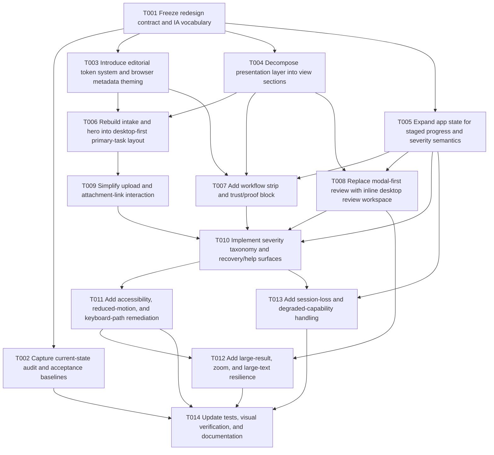

# Web UI/UX Refresh Consolidated Plan

**Date:** 2026-03-18
**Status:** Implemented
**Scope:** Consolidated plan plus implementation progress and closure record

## Executive summary

### Goals and objectives

This initiative targets a **desktop-first UI/UX redesign** of the browser-local web application in `web/`, without changing the underlying browser-local product contract.

The redesign goals are:

1. Replace the current generic dark-glass visual identity with a **desktop-first editorial utility dark** presentation.
2. Align the application information architecture to the target sequence:
   - hero / primary task
   - workflow strip
   - trust / proof block
   - results area
   - recovery / help
3. Correct the known product-surface gaps:
   - missing live feedback semantics
   - missing skip link
   - modal-heavy results review
   - incomplete reduced-motion handling
   - weak keyboard-path clarity
   - weak desktop/table ergonomics
   - missing table caption/description
   - upload and attachment-link interaction complexity
   - limited metadata/browser theming polish
4. Add planning coverage for the additional targets:
   - trust/capability messaging
   - staged progress UX
   - severity taxonomy
   - desktop-specific review ergonomics
   - unsupported/degraded capability states
   - large-result review strategy
   - zoom/large-text resilience
   - session-loss behavior
   - test coverage and visual verification
5. Preserve the browser-local runtime truth:
   - served-mode baseline
   - ZIP-first baseline
   - direct-folder intake remains capability-gated
   - attachment-path behavior remains narrower than desktop unless the user supplies a base path

### Chosen approach

**Chosen approach: hybrid centered on Plan B (Balanced)**

The recommended plan uses **Plan B** as the base, constrained by **Plan A’s contract discipline** and borrowing only selective, justified elements from **Plan C**.

#### Included from Plan A

- preserve the worker, normalization, and conversion core unless specific redesign needs require small boundary changes
- keep scope concentrated in `web/`
- maintain browser-local contract fidelity and conservative support messaging

#### Included from Plan B

- moderate presentation-layer refactor
- decomposition of the current controller into smaller view sections/modules
- IA rebuild around the requested desktop-first structure
- inline desktop review workspace as the primary results surface
- state expansion for severity, recovery, and staged progress representation

#### Included selectively from Plan C

- only the subset required to support honest staged progress and session-loss messaging
- no default commitment to a full state-machine rewrite
- no default commitment to worker progress-event streaming unless the redesigned IA cannot be implemented honestly without it

### Justification

The reviews converge on the same conclusion:

1. **Plan A** is feasible but under-corrects the most important structural and ergonomic issues.
2. **Plan C** is coherent but disproportionately broad for a redesign whose implementation surface is concentrated in `web/`.
3. **Plan B** best matches the research corpus because it changes the presentation layer at the correct depth without disturbing the proven conversion core unnecessarily.

### Constraints and dependencies

#### Constraints

1. The browser-local application is already governed by a conservative contract documented in `docs/local-web-execution/contracts.md`, `support-matrix.md`, and `attachment-policy.md`.
2. The current application architecture is frameworkless and controller-centric (`web/src/app/controller.ts`).
3. The existing worker/conversion pipeline is already functional and well tested; it should not be destabilized casually.
4. The redesign must remain honest about local-only processing, served-mode requirements, and attachment-link limitations.
5. The task explicitly excludes novelty-first interaction patterns from `samuelmok.cc` such as radial navigation and rotated labels.

#### Dependencies

1. Agreement on the redesign vocabulary for severity, progress, proof, and degraded states.
2. Agreement on the view decomposition depth acceptable for the repository.
3. Continued alignment between implementation, Playwright coverage, and browser-local documentation.
4. Stress-fixture-based validation of any new results workspace for larger result sets.

## Dependency graph

### Critical path

Likely critical path:

**T001 → T003 → T004 → T006 → T008 → T010 → T011 → T012 → T014**

This is the most likely critical path because:

1. the redesign vocabulary and IA must be frozen before section decomposition begins
2. visual/token work must be established before section rebuilds stabilize
3. the results workspace is the highest-value desktop ergonomics change and depends on the decomposed presentation layer
4. accessibility and resilience work depends on the new IA and results surface being in place
5. tests and documentation must be updated last against the actual final structure

## Wave planning

### Wave 1 — Contract freeze and baseline capture

**Objective:** Freeze design language, IA vocabulary, and acceptance baselines before UI structure changes begin.

Included tasks:

- **T001** Freeze redesign contract and IA vocabulary
- **T002** Capture current-state audit and acceptance baselines

**Exit criteria:**

- redesign vocabulary is frozen
- before/after acceptance criteria exist for IA, accessibility, and visual intent
- screenshot and behavior baselines exist for comparison

### Wave 2 — Visual system and presentation-layer restructuring

**Objective:** Replace the visual system and establish maintainable section boundaries in the presentation layer.

Included tasks:

- **T003** Introduce editorial token system and browser metadata theming
- **T004** Decompose presentation layer into view sections
- **T005** Expand app state for staged progress and severity semantics

**Exit criteria:**

- editorial dark token system is in place
- presentation sections are no longer concentrated entirely in one monolithic render path
- state model can represent redesigned workflow semantics

### Wave 3 — IA rebuild and primary workflow redesign

**Objective:** Rebuild the primary task flow around desktop-first hierarchy and proof-oriented framing.

Included tasks:

- **T006** Rebuild intake and hero into desktop-first primary-task layout
- **T007** Add workflow strip and trust/proof block
- **T008** Replace modal-first review with inline desktop review workspace
- **T009** Simplify upload and attachment-link interaction

**Exit criteria:**

- target IA is materially present in the UI
- review is no longer modal-first
- ZIP-first primary action is visually dominant
- trust/capability messaging is persistent and non-duplicative

### Wave 4 — Degraded-state clarity, accessibility, and resilience

**Objective:** Make the redesigned surface robust under degraded, large-text, reduced-motion, and interrupted-use conditions.

Included tasks:

- **T010** Implement severity taxonomy and recovery/help surfaces
- **T011** Add accessibility, reduced-motion, and keyboard-path remediation
- **T012** Add large-result, zoom, and large-text resilience
- **T013** Add session-loss and degraded-capability handling

**Exit criteria:**

- severity and recovery semantics are explicit
- skip link, live status semantics, and captioned review structures exist
- review workspace remains usable at higher zoom and with larger datasets
- session-loss behavior is documented and surfaced honestly

### Wave 5 — Verification and documentation closure

**Objective:** Make the redesign supportable and release-ready from a validation/documentation standpoint.

Included tasks:

- **T014** Update tests, visual verification, and documentation

**Exit criteria:**

- Playwright and unit coverage reflect the new IA
- visual verification steps are documented
- user-guide/troubleshooting/support wording matches the redesigned experience
- final quality gates and release-readiness notes are recorded

## Detailed task list

### T001 — Freeze redesign contract and IA vocabulary

- **Dependencies:** None
- **Files to modify/create:**
  - `docs/web-ui-ux-refresh_PLAN.md`
  - optional implementation note under `docs/web-ui-ux-refresh/`
- **Description:**
  - Freeze the redesign-specific IA, severity vocabulary, progress semantics, proof/capability terminology, and non-goals.
  - Confirm the exact translation of the requested mood cues into implementation constraints.
- **Complexity:** Low
- **Acceptance criteria:**
  - IA is explicitly defined.
  - Severity and degraded-state terms are frozen.
  - Non-goals are explicit: no novelty navigation, no hosted-job metaphors, no false attachment promises.

### T002 — Capture current-state audit and acceptance baselines

- **Dependencies:** T001
- **Files to modify/create:**
  - `docs/web-ui-ux-refresh/` baseline notes or screenshots references
- **Description:**
  - Capture current screenshots, baseline UX observations, and concrete acceptance targets derived from the research corpus.
  - Record before-state references for hero, intake, results modal, warnings, and error surfaces.
- **Complexity:** Low
- **Acceptance criteria:**
  - Baseline observations exist for each major surface.
  - Acceptance criteria cover IA, accessibility, review ergonomics, and browser-local contract fidelity.

### T003 — Introduce editorial token system and browser metadata theming

- **Dependencies:** T001
- **Files to modify/create:**
  - `web/index.html`
  - `web/src/styles.css`
- **Description:**
  - Replace the current soft dark-glass presentation with a sharper editorial utility token set.
  - Add display-serif support for hero/section moments only.
  - Add browser metadata theming such as `theme-color` aligned with theme state.
- **Complexity:** Medium
- **Acceptance criteria:**
  - Blur/glass treatment is materially reduced.
  - Typography uses serif display moments and sans operational UI.
  - Browser metadata theming is present and coherent.

### T004 — Decompose presentation layer into view sections

- **Dependencies:** T001, T003
- **Files to modify/create:**
  - `web/src/app/controller.ts`
  - new view files under `web/src/app/` or `web/src/ui/`
- **Description:**
  - Split rendering into smaller view sections to support the new IA cleanly.
  - Keep the application frameworkless and preserve the worker/core boundaries.
- **Complexity:** Medium
- **Acceptance criteria:**
  - Major sections are no longer rendered in one monolithic block.
  - Event wiring remains coherent and testable.
  - Worker/conversion code remains unaffected except where explicitly required.

### T005 — Expand app state for staged progress and severity semantics

- **Dependencies:** T001
- **Files to modify/create:**
  - `web/src/app/state.ts`
  - optionally `web/src/types/export-result.ts`
- **Description:**
  - Expand the state model so the UI can represent preparation, conversion, degraded success, recovery guidance, and session-loss markers more explicitly.
- **Complexity:** Medium
- **Acceptance criteria:**
  - State can represent more than a terminal spinner-success-error model.
  - Severity and recovery surfaces have the state inputs they require.

### T006 — Rebuild intake and hero into desktop-first primary-task layout

- **Dependencies:** T003, T004
- **Files to modify/create:**
  - `web/src/app/*`
  - `web/src/styles.css`
- **Description:**
  - Rebuild the top of the application so one primary task dominates visually.
  - Keep ZIP-first as the supported baseline path and de-emphasize advanced capabilities.
- **Complexity:** Medium
- **Acceptance criteria:**
  - Hero and intake present one clear primary action.
  - Secondary explanations no longer crowd the initial decision point.
  - The visual hierarchy reflects desktop-first editorial utility goals.

### T007 — Add workflow strip and trust/proof block

- **Dependencies:** T003, T004, T005
- **Files to modify/create:**
  - `web/src/app/*`
  - `web/src/styles.css`
- **Description:**
  - Add a visible workflow strip and a persistent trust/proof block communicating local processing, support baseline, attachment policy, and desktop fallback.
- **Complexity:** Medium
- **Acceptance criteria:**
  - Workflow stages are visible and interpretable.
  - Trust/capability messaging is persistent rather than scattered only in tooltips.

### T008 — Replace modal-first review with inline desktop review workspace

- **Dependencies:** T004, T005
- **Files to modify/create:**
  - `web/src/app/*`
  - `web/src/styles.css`
- **Description:**
  - Promote result review into a primary desktop workspace.
  - Keep optional detail expansion as needed, but remove modal dependence as the dominant interaction.
- **Complexity:** Medium
- **Acceptance criteria:**
  - Review no longer requires opening a blocking modal as the primary path.
  - Result summaries and item review are visible in a desk-scale layout.
  - The design remains performant for larger result counts.

### T009 — Simplify upload and attachment-link interaction

- **Dependencies:** T006
- **Files to modify/create:**
  - `web/src/app/*`
  - `web/src/styles.css`
- **Description:**
  - Reduce intake complexity by separating the core upload action from advanced attachment-link configuration and capability-specific enhancements.
- **Complexity:** Medium
- **Acceptance criteria:**
  - ZIP-first upload is visually primary.
  - Direct-folder and PDF-link path input are clearer secondary concepts.
  - Unsupported/degraded capability states are understandable without clutter.

### T010 — Implement severity taxonomy and recovery/help surfaces

- **Dependencies:** T005, T007, T008, T009
- **Files to modify/create:**
  - `web/src/app/*`
  - `web/src/styles.css`
- **Description:**
  - Introduce a controlled severity model for notes, warnings, degraded success, and failures.
  - Add persistent recovery/help surfaces appropriate to each severity band.
- **Complexity:** Medium
- **Acceptance criteria:**
  - Warning/error presentation is no longer only raw code strings.
  - Recovery/help is visible and structured in degraded states.

### T011 — Add accessibility, reduced-motion, and keyboard-path remediation

- **Dependencies:** T010
- **Files to modify/create:**
  - `web/index.html`
  - `web/src/app/*`
  - `web/src/styles.css`
- **Description:**
  - Add skip link, live status semantics, captioned review structures, stronger focus handling, and broader reduced-motion handling.
- **Complexity:** Medium
- **Acceptance criteria:**
  - Skip link exists.
  - Status/progress changes are announced appropriately.
  - Review structures are semantically described.
  - Reduced-motion mode removes non-essential motion rather than only slowing the spinner.

### T012 — Add large-result, zoom, and large-text resilience

- **Dependencies:** T008, T010, T011
- **Files to modify/create:**
  - `web/src/app/*`
  - `web/src/styles.css`
- **Description:**
  - Make the desktop review workspace resilient at higher zoom, larger text sizes, and larger result sets.
- **Complexity:** Medium
- **Acceptance criteria:**
  - Primary actions remain visible at 200% zoom.
  - Review surfaces remain legible and navigable.
  - Large-result review does not collapse into modal-only fallback.

### T013 — Add session-loss and degraded-capability handling

- **Dependencies:** T005, T010
- **Files to modify/create:**
  - `web/src/app/state.ts`
  - `web/src/app/controller.ts`
  - optionally `web/src/adapters/browser-worker-client.ts`
- **Description:**
  - Define and surface behavior for interrupted sessions, refreshes, and unsupported/degraded capability states.
  - Keep persistence conservative and privacy-aligned.
- **Complexity:** Medium
- **Acceptance criteria:**
  - Session-loss behavior is explicit and honest.
  - Degraded capability states are visible and actionable.
  - The design does not imply hidden persistence guarantees that do not exist.

### T014 — Update tests, visual verification, and documentation

- **Dependencies:** T002, T011, T012, T013
- **Files to modify/create:**
  - `web/src/app/controller.test.ts`
  - additional view tests as needed
  - `web/tests/e2e/*.ts`
  - `docs/local-web-execution/user-guide.md`
  - `docs/local-web-execution/troubleshooting.md`
  - `docs/local-web-execution/support-matrix.md` (if wording changes are required)
  - `README.md` (if browser-local summary requires refresh)
- **Description:**
  - Update automated tests and documentation to match the redesigned experience.
  - Add explicit visual verification steps for desktop-first layout and dark-theme presentation.
- **Complexity:** Medium
- **Acceptance criteria:**
  - Test coverage reflects the new IA and semantics.
  - Documentation matches the implemented experience.
  - Visual verification procedure is defined and repeatable.

## Risk areas

### 1. Presentation-layer refactor drift

The largest implementation risk is uncontrolled expansion of the presentation-layer refactor. If view decomposition is not bounded, the redesign may drift into a broader architecture rewrite.

**Mitigation:** keep decomposition focused on view sections and leave worker/core pipeline unchanged by default.

### 2. Results workspace under-specification

Replacing modal-first review without a clear large-result strategy may produce a visually improved but operationally weaker review surface.

**Mitigation:** make large-result ergonomics and zoom resilience first-class acceptance criteria in T008 and T012.

### 3. Contract drift between UI and documented product behavior

A more polished UI could accidentally imply broader runtime capability than the browser-local contract allows.

**Mitigation:** keep trust/proof messaging derived from existing contract docs; review wording against `docs/local-web-execution/*.md`.

### 4. Accessibility remediation treated as polish rather than structure

If accessibility work is postponed until late styling passes, skip-link, live-region, keyboard-path, and caption issues may remain partially unresolved.

**Mitigation:** treat T011 as a structural wave, not visual polish.

### 5. Test lag

The current E2E suite encodes parts of the old IA, especially modal review. If test updates lag behind implementation, regressions may become harder to detect.

**Mitigation:** reserve T014 as mandatory closure work and update tests alongside each structural wave where possible.

## Testing strategy

### Unit and component-level testing

1. Preserve current normalization, mapping, attachment, and parity tests.
2. Add render/state tests for new view sections and severity/progress state transitions.
3. Add tests for new session-loss or degraded-state helpers if introduced.

### Integration testing

1. Keep fixture-backed browser-local conversion tests intact.
2. Add integration coverage where UI state depends on worker responses or new severity mapping.
3. If worker protocol changes are introduced, add adapter/worker integration tests before UI dependency is added.

### End-to-end testing

1. Update Playwright smoke coverage for the new IA.
2. Add assertions for:
   - skip link
   - keyboard-only intake → convert → review → download flow
   - live status semantics
   - trust/proof messaging visibility
   - inline desktop review workspace
   - degraded capability and recovery messaging
   - zoom / large-text desktop behavior where feasible
3. Preserve browser-matrix coverage for the served ZIP-first baseline.

### Visual verification

1. Capture before/after screenshots at representative desktop widths.
2. Validate dark-theme hierarchy, typography, contrast, and surface precision manually or through snapshot comparisons.
3. Validate reduced-motion behavior under `prefers-reduced-motion`.

### Quality gates

1. `npm run typecheck` in `web/`
2. `npm run test` in `web/`
3. `npm run test:e2e:chromium` or equivalent smoke suite
4. Browser-matrix verification for the supported/best-effort baseline
5. Manual desktop visual review at standard zoom and at 200% zoom

## Progress tracking section

| Task ID | Status | Notes | Completed Date |
|---|---|---|---|
| T001 | COMPLETE | Contract freeze completed in `docs/web-ui-ux-refresh/contract-freeze.md` after an in-progress update during implementation. | 2026-03-18 |
| T002 | COMPLETE | Baseline audit captured in `docs/web-ui-ux-refresh/baseline-audit.md` after an in-progress update during implementation. | 2026-03-18 |
| T003 | COMPLETE | Editorial token system and browser metadata theming applied in `web/index.html` and `web/src/styles.css`. | 2026-03-18 |
| T004 | COMPLETE | Controller rendering decomposed into named view/status helper modules under `web/src/app/`. | 2026-03-18 |
| T005 | COMPLETE | App state expanded for workflow stage, severity, and recovery semantics in `web/src/app/state.ts`. | 2026-03-18 |
| T006 | COMPLETE | Hero and intake were rebuilt into a two-column desktop-first primary-task layout with ZIP-first emphasis and reduced top-level clutter. | 2026-03-18 |
| T007 | COMPLETE | Added a persistent workflow strip plus trust/capability proof cards for local processing, ZIP-first support, attachment policy, and desktop fallback. | 2026-03-18 |
| T008 | COMPLETE | Removed modal-first review as the default path and promoted exported-item review into an inline desktop workspace with summary, warnings, and table review. | 2026-03-18 |
| T009 | COMPLETE | Simplified upload and attachment-link interaction by making attachment path and direct-folder intake clearly secondary to the primary ZIP upload path. | 2026-03-18 |
| T010 | COMPLETE | Added structured severity taxonomy, grouped warning summaries, and a persistent recovery/help surface in `web/src/app/view-sections.ts` plus supporting helpers in `web/src/app/view-helpers.ts`. | 2026-03-18 |
| T011 | COMPLETE | Added skip link, live-status semantics, stronger focus targeting, table review description, and broader reduced-motion handling across `web/index.html`, `web/src/app/controller.ts`, `web/src/app/view-sections.ts`, and `web/src/styles.css`. | 2026-03-18 |
| T012 | COMPLETE | Improved inline review resilience for larger text, higher zoom, and larger result sets with stacked action-rail behavior, capped scrollable table review, and responsive copy/layout adjustments in `web/src/app/view-sections.ts` and `web/src/styles.css`. | 2026-03-18 |
| T013 | COMPLETE | Added conservative session-loss notices and explicit degraded-capability messaging without restoring private data, using transient session markers in `web/src/app/controller.ts` and recovery/help surfaces in `web/src/app/view-sections.ts`. | 2026-03-18 |
| T014 | COMPLETE | Added render/status helper tests, expanded Playwright coverage for inline review, skip-link, reduced-motion, large-text, and session-loss behaviour, and updated browser-local user docs/release guidance to match the implemented UI. | 2026-03-19 |

## Final closure

### Implementation status

Wave 5 is complete. The browser-local UI refresh is implemented and documented as the current repository state.

### Closure notes

- user-facing browser-local docs now describe the inline review workspace, workflow strip, trust/capability messaging, optional attachment-path behaviour, and privacy-aligned session-loss handling
- final validation was rerun on 2026-03-19 with `npm run typecheck`, `npm run test`, `npm run build`, `CI=true npm run test:e2e:chromium`, and `CI=true npm run test:matrix` from `web/`
- typecheck, unit tests, production build, and Chromium smoke passed cleanly; the best-effort browser matrix passed for Chromium/Firefox coverage but remained blocked for WebKit on the current Linux host because required Playwright system dependencies were missing
- a served local preview pass confirmed the desktop-first intake hierarchy, workflow strip, trust/capability block, and secondary attachment-path treatment visually; Chromium smoke coverage was used to validate the inline review workspace, reduced-motion checks, and privacy-aligned session-loss messaging end-to-end
- atomic git commits remain feasible, but the working tree is not yet commit-ready because the Wave 5 implementation and documentation files are still unstaged in the current repository state

### Closure execution record

| Check | Result | Notes |
|---|---|---|
| `npm run typecheck` | PASS | Completed in `web/` on 2026-03-19. |
| `npm run test` | PASS | 12 files passed; 60 tests passed. |
| `npm run build` | PASS | Production build completed successfully in Vite. |
| `CI=true npm run test:e2e:chromium` | PASS | 10 Playwright smoke tests passed, including inline review and session-loss coverage. |
| `CI=true npm run test:matrix` | PARTIAL | 4 tests passed; 2 WebKit runs failed because the Linux host is missing Playwright WebKit system dependencies, not because of repository assertions. |
| Served local visual review | PASS (partial live + automated corroboration) | Live preview confirmed intake/workflow/trust layout; smoke coverage corroborated post-conversion inline review behaviour. |

### Git state at closure

- branch: `main`
- upstream status: up to date with `origin/main`
- working tree: dirty, with unstaged Wave 5 implementation/doc changes and untracked new plan/support files
- commit feasibility: feasible after staging; not executed during this closure retry

## Rollback plan

### Wave 1 rollback

- Revert only planning/baseline artifacts if acceptance criteria need to be redefined.
- Preserve research documents because they remain valid repository observations.

### Wave 2 rollback

- Revert token and presentation-layer decomposition changes together if the new section structure destabilizes the UI.
- Preserve any non-invasive browser metadata theming or token cleanup if it is independently sound.

### Wave 3 rollback

- If the inline review workspace proves weaker than the current modal flow, fall back temporarily to the existing modal review while keeping IA and token improvements.
- Keep ZIP-first intake simplification even if the results workspace is partially rolled back.

### Wave 4 rollback

- If session-loss or staged-progress semantics create confusion, revert the advanced semantics first while preserving accessibility fixes.
- Do not roll back skip link, live-region, caption, or reduced-motion improvements unless they are demonstrably faulty.

### Wave 5 rollback

- If test or documentation updates reveal unresolved UX issues, hold release and revert only the unstable UI wave rather than the entire browser-local surface.
- Keep additional tests where possible even if UI structure is reverted, provided they assert still-desirable accessibility or contract behavior.

## Open questions

1. Should the results workspace remain strictly tabular, or should a split summary/detail model be preferred for desktop review?
2. Does honest staged progress require worker protocol expansion, or can the existing state model be extended sufficiently without protocol change?
3. How much session-loss handling is appropriate before privacy or complexity costs exceed the value?
4. Should `Playfair Display` or `Newsreader` be chosen as the display serif for implementation?

## Final recommendation

Proceed with a **balanced hybrid redesign plan**:

1. Refactor only the presentation layer deeply enough to support the requested IA and desktop review ergonomics.
2. Preserve the worker, normalization, and conversion core as stable infrastructure.
3. Treat inline results review, accessibility remediation, and severity/recovery clarity as mandatory outcomes.
4. Treat worker protocol expansion and deeper state-machine behavior as optional escalations, not baseline commitments.

This plan provides the strongest balance between UX impact, maintainability improvement, and delivery confidence while remaining faithful to the existing browser-local contract.
